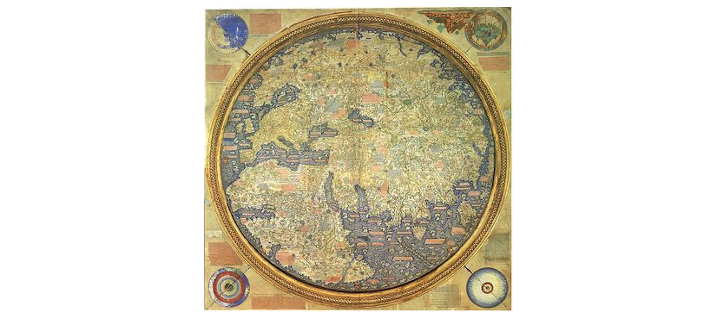

## **What is the Mauro Data Mapper?**
Collecting accurate and reliable data takes a huge amount of time, money and resource. Therefore, it’s vital that researchers are able to extract the maximum value from this data for both current and future research projects. This is why the National Institute for Health Research has collaborated with Universities to develop the Mauro Data Mapper, formerly known as the Metadata Catalogue.

The Mauro Data Mapper, is a toolkit for combining, developing and standardising data, helping users to effectively record and analyse contextual data. This central hub of clinical informatics allows users to easily access the metadata they require, avoiding the need to repeat research tasks; saving time, reducing costs and boosting productivity. Furthermore, by employing standard definitions and data models, the data can be accurately interpreted. Therefore, users can reliably compare datasets from different sources increasing the sample size of their investigations and consequently the validity of their conclusions. 

<iframe src="https://player.vimeo.com/video/186242194" width="640" height="360" frameborder="0" allow="autoplay; fullscreen" allowfullscreen></iframe>

---

## **Who is Mauro?**
The Mauro Data Mapper is named after Fra Mauro who was a 15th century Venetian Monk and also a famous cartographer. He created the most detailed map of the world at the time, which featured thousands of texts and illustrations.

Unlike other explorers who would embark on expeditions to gather their own data about the world, Mauro adopted a different approach and based himself at the port in Venice. He interviewed travellers who would give their detailed interpretations of the countries they had visited. Mauro then merged this information together to generate maps which were rich with contextual data. 

This philosophy lies at the heart of the Mauro Data Mapper, which not only aims to be a hub of detailed **metadata**, but also allows users to make and share their own perceptions.

The Fra Mauro map of the world. Source: https://en.wikipedia.org/wiki/Fra_Mauro_map#/media/File:FraMauroDetailedMap.jpg

---
