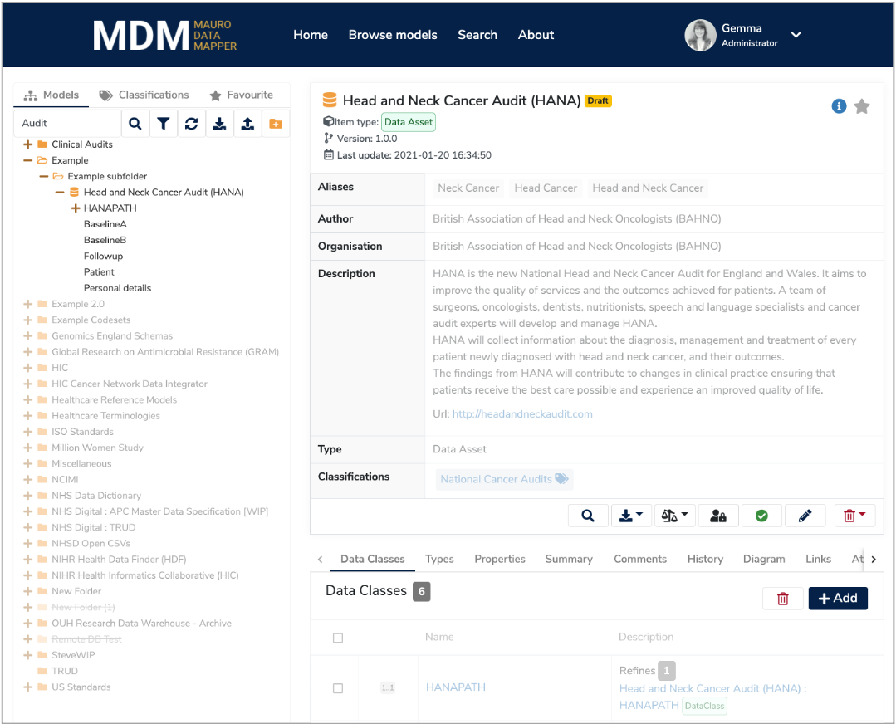
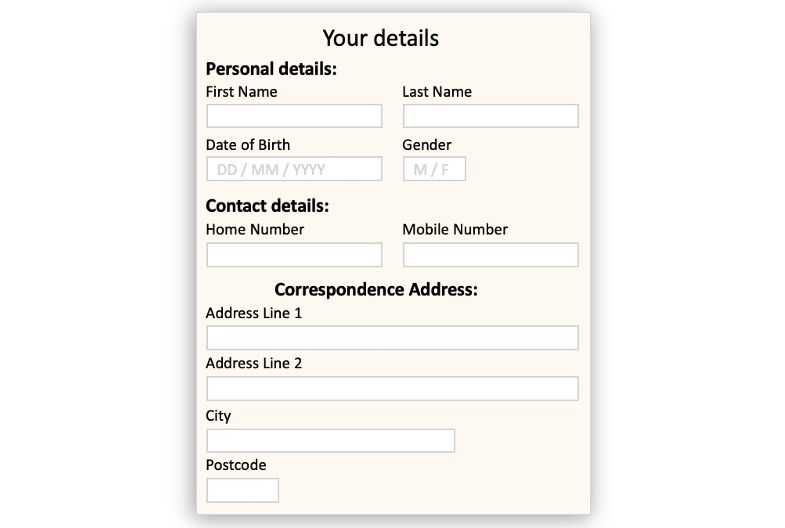
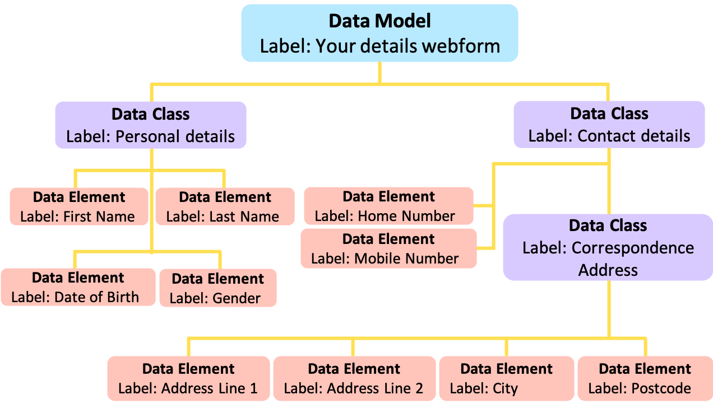

**Mauro Data Mapper** is a toolkit that provides a single, structured place to describe your data: what it means, how it is used,
and where it comes from.

## Why use Mauro?

Data is at its most useful when people can trust and understand it, and Mauro makes that possible by allowing you to:

* Document your data models and metadata in a structured and searchable way
* Safely version and share your data models
* Collaborate through a web interface
* Link datasets and data standards together, connecting data definitions, code lists, and meanings
* Trace provenance through dataflows
* Maintain data governance standards
* Curate catalogues of metadata

Anyone who needs to make data understandable, reusable, or standardised can benefit from Mauro, such as:

* Data managers and stewards who maintain data quality and governance
* Researchers and analysts who need clear definitions and provenance for the data they use
* Modellers creating and evolving data models
* Policy makers and domain experts who need to review, approve, and publish data assets

Use **Mauro Data Mapper** for the design and documentation of
databases, data flows, and data standards, as well as related software
artefacts such as data schemas and data forms.  It was originally
developed for the description of data in clinical research, but it is
equally applicable in other settings.

Data and software artefacts can be described as linked, versioned
[Data Models](../glossary/data-model/data-model.md).  The links let us
re-use and relate data definitions, recording and reasoning about
semantic interoperability.  The versioning lets us keep track of
changes in design, in implementation, or in understanding.

<iframe src="https://player.vimeo.com/video/186242194" width="640" height="360" frameborder="0" allow="autoplay; fullscreen" allowfullscreen></iframe>

---

## Why is metadata important?

To fully understand the meaning of data, first we need to know some further information about its context, known as metadata. 

For example, consider a blood pressure reading. Although this has standard units, the method and state of the patient at the time the measurement was taken will affect the recorded value. Therefore, by outlining this additional information, the reading can be understood and interpreted more accurately. In this way, metadata allows data to be more searchable, comparable and standardised enabling further interoperability.

---

## How does Mauro Data Mapper work?

The **Mauro Data Mapper** is a web based tool that stores and manages descriptions of data. These can be descriptions of data already collected, such as databases or csv files. Or these can be descriptions of data you wish to collect or transfer between organisations, such as a specification for a webform or an XML schema. 

**Mauro Data Mapper** represents both types of descriptions of data as **Data Models**. These are defined as a structured collection of metadata and effectively model the data that they describe.

Each **Data Model** consists of several [Data Classes](../glossary/data-class/data-class.md), which are groups of data that are related in some way. For example, a group of data that appears in the same table of a database or the same section of a form. **Data Classes** can sometimes also contain **Nested Data Classes**.

Within each **Data Class** is then a number of [Data Elements](../glossary/data-element/data-element.md) which are the descriptions of an individual field or variable.

For example, a webform where patients enter their details would be a **Data Model**. This form could consist of two separate sections such as **'Personal details'** and **'Contact details'** which would each be a **Data Class**. The individual entries within each of these sections, such as **'First Name'**, **'Last Name'**, **'Date of Birth'** etc, would each be a **Data Element**.

However, there might be a section within another section on the webform, such as **'Correspondence Address'** which lies within **'Contact details'**. In this case, **'Correspondence Address'** would become a **Nested Data Class**, where the **'Contact details' Data Class** would be the parent. 

 

By organising metadata in this way, **Mauro Data Mapper** allows users to easily search data but also automatically import database schemas and export forms; helping to record data in standardised formats.

---

## Application areas

There are many possible, and yet to be discovered, applications for **Mauro Data Mapper**; here are a few examples.
Please feel free to contact us or engage with the Mauro community if you have an questions about using Mauro.

* **System integrators, enterprise architects, API designers, digital transformation teams** need a clear,
shared model of what data means across multiple systems or services. Mauro becomes a data contract space / the source of
truth for how systems exchange information. E.g. defining a model for a data warehouse or API gateway so everyone knows
which fields mean what and how they relate.
* **Knowledge engineers, semantic web specialists, librarians, ontology builders** need structured vocabularies, taxonomies,
or concept hierarchies. Mauro supports versioning, relationships, and visual exploration of metadata models, making it
ideal for evolving controlled vocabularies. E.g. maintaining and publishing domain-specific terminology sets or
linked-data ontologies
* **Regulators, compliance officers** define and maintain standards that multiple organisations
adhere to. Mauro provides a transparent way to publish and update official data definitions,
schemas, and validation rules. E.g. an open register of government data standards or reporting schemas
* **Research data managers, lab information system owners, academic consortia** need to record precisely what data
structures were used in a study or experiment. Mauro preserves model versions, relationships, and provenance.
E.g. tracking changes in a data model across research projects or between collaborating institutions
* **Data engineers, analytics platform teams, product managers** for data-as-a-service treat datasets as products and
need to document, version, and communicate what each dataset contains. Mauro provides the metadata catalogue and
documentation backbone for internal or customer-facing data products. E.g. a company publishing standardised analytics
datasets with clear metadata and definitions
* **Universities, data literacy trainers, open data educators** need to understand how data is structured and described,
not just used. Mauro acts as an educational sandbox for exploring and comparing data models.
E.g. teaching data modelling, metadata standards, or FAIR data principles interactively
* **Engineers, urban planners, environmental scientists** build systems that depend on well-defined data structures and
relationships. Mauro manages the data models behind complex systems, ensuring that
"the digital version of the real world" stays consistent.
E.g. managing evolving schemas for smart city or environmental monitoring platforms
* **Chief Data Officers, data strategists, consultants** need visibility into what data exists, where it lives,
and how it connects. Mauro provides an inventory of data assets and models.
E.g. using Mauro as the metadata layer beneath a wider data governance platform or data mesh initiative

---

## An open-source community

The Mauro platform and plugins are distributed under an open source [Apache 2.0 license](http://oss-watch.ac.uk/resources/apache2). We are keen 
to build an active community of users and developers, and encourage contributions to our code and documentation, and facilitate model sharing.  

---   

## Support

The development of **Mauro Data Mapper** has been funded by the [NIHR Oxford Biomedical Research Center](https://oxfordbrc.nihr.ac.uk) as part of the [NIHR Health Informatics Collaborative (HIC)](https://hic.nihr.ac.uk). 

The **NIHR HIC** is a partnership of 28 NHS trusts and health boards, including the 20 hosting **NIHR Biomedical Research Centres (BRCs)**, working together to facilitate the equitable re-use of NHS data for translational research. 

The **NIHR HIC** has established cross-site data collaborations in areas such as cardiovascular medicine, critical
care, renal disease, infectious diseases, and cancer. **Mauro Data Mapper**, and its previous incarnation, the Metadata Catalogue, has been used for
collaboratively editing **Data Models** for research, and for generating software artefacts such as XML Schema.

---

<!--  LocalWords:  iframe src frameborder fullscreen allowfullscreen
 -->
<!--  LocalWords:  csv webform mdm png etc plugins NIHR HIC BRCs
 -->
