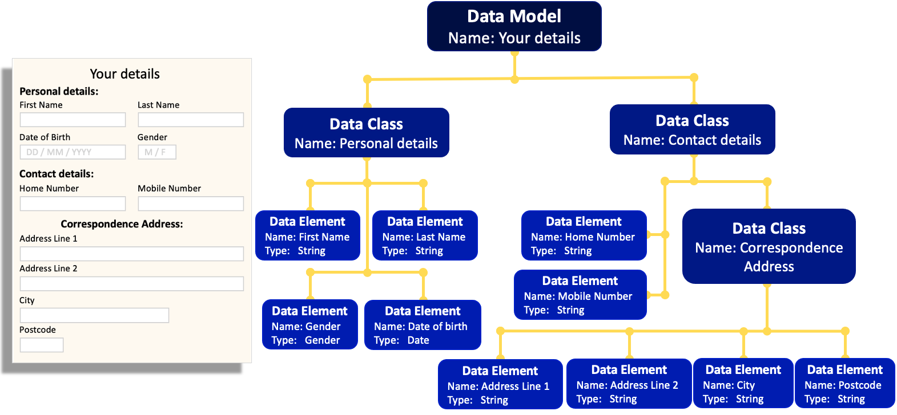

## **What is the Mauro Data Mapper?**
Collecting accurate and reliable data takes a huge amount of time, money and resource. Therefore, it’s vital that researchers are able to extract the maximum value from this data for both current and future research projects. This is why the National Institute for Health Research has collaborated with Universities to develop the Mauro Data Mapper, formerly known as the Metadata Catalogue.

The Mauro Data Mapper, is a toolkit for combining, developing and standardising data, helping users to effectively record and analyse contextual data. This central hub of clinical informatics allows users to easily access the metadata they require, avoiding the need to repeat research tasks; saving time, reducing costs and boosting productivity. Furthermore, by employing standard definitions and data models, the data can be accurately interpreted. Therefore, users can reliably compare datasets from different sources increasing the sample size of their investigations and consequently the validity of their conclusions.

<iframe src="https://player.vimeo.com/video/186242194" width="640" height="360" frameborder="0" allow="autoplay; fullscreen" allowfullscreen></iframe>

---

## **Why is metadata important?**

To fully understand the meaning of data, first we need to know some further information about its context, known as metadata. For example, consider a blood pressure reading. Although this has standard units, the method and state of the patient at the time the measurement was taken, will affect the recorded value. Therefore, by outlining this additional information, the reading can be understood and interpreted more accurately. In this way, metadata allows data to be more searchable, comparable and standardised, enabling interoperability.

---

## **How does Mauro Data Mapper work?**

The Mauro Data Mapper is a web based tool which stores and manages descriptions of data. These can be descriptions of data already collected, such as databases or csv files. Or these can be descriptions of data you wish to collect or transfer between organisations, such as a specification for a webform or an XML schema. The Mauro Data Mapper represents both types of descriptions of data as **[Data Models](../glossary/data-model/data-model.md)**. These are defined as a structured collection of **metadata** and effectively model the data that they describe.

Each **[Data Model](../glossary/data-model/data-model.md)** consists of several **[Data Classes](../glossary/data-class/data-class.md)**, which are groups of data that are related in some way. For example, a group of data that appears in the same table of a database or the same section of a form. **[Data Classes](../glossary/data-class/data-class.md)** can sometimes also contain **Nested Data Classes**.

Within each **[Data Class](../glossary/data-class/data-class.md)** is then a number of **[Data Elements](../glossary/data-element/data-element.md)** which are the descriptions of an individual field or variable.

In the example below, the entire Webform is the **[Data Model](../glossary/data-model/data-model.md)** and this is made up of two **[Data Classes](../glossary/data-class/data-class.md)**: Personal details and Contact details. Within Contact details there is a **Nested Data Class**, called the Correspondence Address. Each **[Data Class](../glossary/data-class/data-class.md)** consists of several **Data Elements** which give the various details of the patient.

By organising metadata in this way, the Mauro Data Mapper allows users to easily search data but also automatically import database schemas and export forms; helping to record data in standardised formats.

## An open-source community

The Mauro platform and plugins are distributed under an open source [Apache 2.0 license](http://oss-watch.ac.uk/resources/apache2).  We are keen 
to build an active community of users and developers, and encourage contributions to our code and documentation, and facilitate model sharing.     

## Support

The development of Mauro Data Mapper has been primarily funded by the [NIHR Oxford Biomedical Research Center](https://oxfordbrc.nihr.ac.uk), as part
of the [NIHR Health Informatics Collaborative](https://hic.nihr.ac.uk) (HIC). The NIHR Health Informatics Collaborative (HIC) is a partnership of 27
NHS trusts and health boards, including the 20 hosting NIHR Biomedical Research Centres (BRCs), working together to facilitate the equitable re-use of
NHS data for translational research. The NIHR HIC has established cross-site data collaborations in areas such as cardiovascular medicine, critical
care, renal disease, infectious diseases, and cancer.  Mauro, and its previous incarnation, the Metadata Catalogue, has been used for
collaboratively editing data models for research, and for generating software artefacts such as XML Schema.

