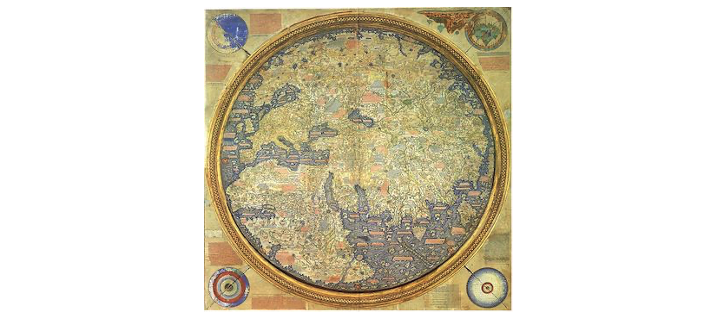

## **Who is Mauro?**
Mauro Data Mapper is named after Fra Mauro who was a 15th century Venetian Monk and also a famous cartographer. A scholar, similar to the ancient greek 
geographer [Ptolemy](https://en.wikipedia.org/wiki/Ptolemy), Mauro created the most detailed map of the world at the time, featuring 
thousands of texts and illustrations.

Unlike other explorers who would embark on expeditions to gather their own data about the world, Mauro adopted a different approach and based himself 
at the port in Venice. He interviewed travellers who would give their detailed interpretations of the countries they had visited. 
Mauro then merged this information together to generate maps which were rich with contextual data. Unusually for the time, these maps were based 
on authoritative sources and proofs of existence, rather than religion and superstition.  

This philosophy lies at the heart of Mauro Data Mapper, which not only aims to be a hub of detailed metadata, but also allows users to make 
and share their own insights, understanding and experience.

The Fra Mauro map of the world, shown above (source: Wikipedia), was produced between 1448 and 1459 as a commission for King Alfonso V of Portugal.
Containing thousands of texts and illustrations, the map would have measured over five square metres.  For a higher-resolution version, 
[click here](https://upload.wikimedia.org/wikipedia/commons/1/1b/FraMauroDetailedMap.jpg). 

Fra Mauro's Mappa Mundi along with a copy dated 1804 are stored in the British Library. To find out more about these historic items, watch the video below, courtesy of the British Library.

<iframe width="640" height="357" src="https://www.youtube-nocookie.com/embed/Vae-ieh5heI" title="YouTube video player" frameborder="0" 
allow="accelerometer; autoplay; clipboard-write; encrypted-media; gyroscope; picture-in-picture" allowfullscreen></iframe>

---

## Further reading

* [Wikipedia](https://en.wikipedia.org/wiki/Fra_Mauro)
	
	Wikipedia entry on Fra Mauro
  
* [A Mapmaker's Dream: The Meditations of Fra Mauro, Cartographer to the Court of Venice](https://www.amazon.co.uk/Mapmakers-Dream-Meditations-Cartographer-Venice/dp/0446673382/ref=tmm_pap_swatch_0?_encoding=UTF8&qid=&sr=)
	
	*James Cowan*, 1997

* [Fra Mauro and the Modern Globe](https://www.jstor.org/stable/23993566?seq=1#metadata_info_tab_contents)
  
  	*Klaus A. Vogel*, No. 57/58, Papers, Read at the 11TH Coronelli Symposium, Venice 2007, and other papers (2011 (for 2009/2010)), pp. 81-92, *JSTOR.org*

* [Fra Mauro's Mappa Mundi](https://www.google.co.uk/url?sa=t&rct=j&q=&esrc=s&source=web&cd=&ved=2ahUKEwin4YSliYbwAhVMu3EKHQI4CvgQFjAMegQIAxAD&url=https%3A%2F%2Fartsandculture.google.com%2Fstory%2Ffra-mauro-s-mappa-mundi%2F6wLizVkYn-sMLA&usg=AOvVaw0caj78xGW2p0dBj-xzhZas)
	
	Google Arts & Culture

---

<!--  LocalWords:  fra mauro png
 -->
