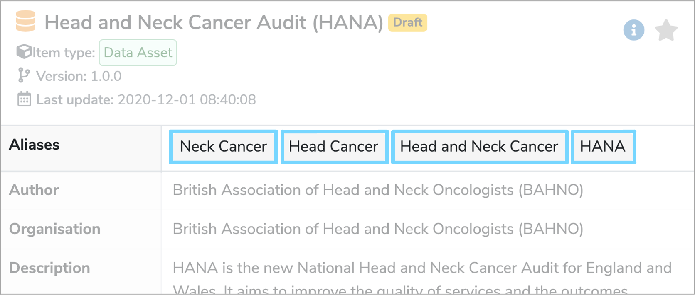
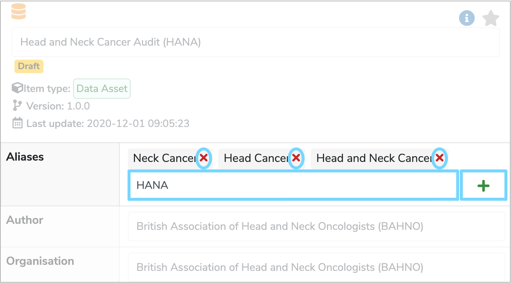

##**What is an Alias?**

An **Alias** is an alternative name for a catalogue item which helps to locate it when searched for. **[Data Models](../data-model/data-model.md)**, **[Data Classes](../data-class/data-class.md)** and **[Data Elements](../data-element/data-element.md)** must have one primary **[Label](../label/label.md)**, but can have many **Aliases**. 

---

##**How are Aliases used?**

**Aliases** appear in the first row of the details panel when an item is selected in the **Model Tree**. An example of some suitable **Aliases** for the **[Data Model](../data-model/data-model.md)** labelled **‘Head and Neck Cancer Audit (HANA)’** could be **‘Neck Cancer’**, **‘Head Cancer’**, **‘Head and Neck Cancer’** and **‘HANA’**. Therefore, if one of these items is searched for the **‘Head and Neck Cancer Audit (HANA)’** **[Data Model](../data-model/data-model.md)** will appear in the search results. 

This helps users access the catalogue item they need, without having to know the exact **[Label](../label/label.md)**.
 

---

##**How do you edit an Alias?**

To add ore remove **Aliases** click the **‘Edit’** pencil icon at the bottom right of the details panel. You can now edit the **'Aliases'** row at the top of the details panel.  

Type the name of the new **Alias** and click the green **'+'** sign on the right to add it. To delete an **Alias**, click the red **'x'** to the right of the **Alias** you wish to remove. 

Once you have finished editing, click **'Save changes'** at the bottom right of the details panel. A green box should then appear at the bottom right of the screen, confirming that the catalogue item has been successfully updated.

---