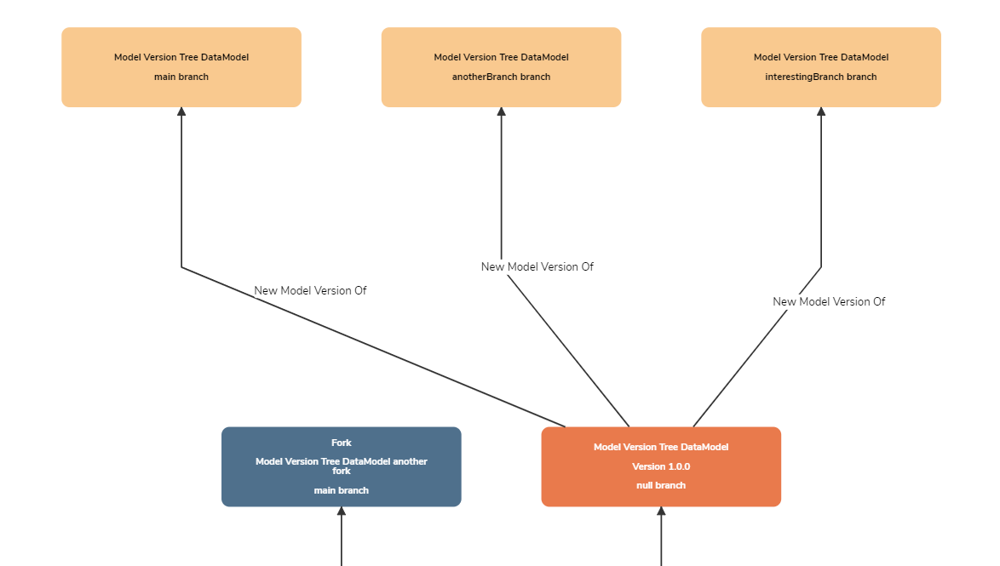

## What is a Branch?

A **Branch** is a method of diverging from the _main line_ of a model to continue further changes without interferring with the rest of the model. The name _branch_ can be likened to that of a tree structure; a tree has a main _trunk_, while _branches_ extend from that _trunk_.

The simplest way to understand **Branches** in Mauro is to view the **Merge Graph** of a model:

In this example, notice that **Model Version Tree DataModel (1.0.0)** has been branched into three:

* **main** - this is the name given to all default branches. Every new version of a model automatically has a **main** branch created, acting as the _main line_, or _trunk_, of the model's changes.
* Two separate branches have also been created. These are branched _from_ the original model but may now include different changes compared to **main** (or each other).

## Why are Branches useful?

**Branches** allow for more complex model editing and versioning scenarios. If a single editor is working on updates to a data model, then simple versioning may be sufficient to increment each update/version of that data model. If, however, there are multiple editors working on the same model at the same time, this could cause _conflicts_; for example, one editor could accidentally lose changes made by another editor.

The solution for this scenario is to create one (or more) **Branches** of a model, allowing multiple editors or teams to make their own changes to the model in question without directly interfering or conflicting with other editors. Once an editor is happy that their **Branch** is complete, they may then _merge_ it with another branch to ensure that everyones changes are pulled together into one place.

An alternative to branching is called [Forking](../fork/form.md), whereby a model is cloned to make new changes.

## How to create a Branch

To create one or more **Branches** of a model, please refer to the user guide [How to version and merge Data Models](../../user-guides/version-data-models/version-data-models.md).