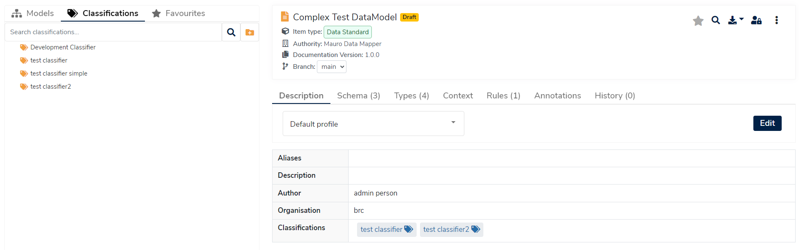

## What is a Classification?

A **Classification** is a container which acts like a _tag_ on a catalogue item, allowing you to categorise and group together related catalogue items, such as models. A **Classification** is a list-based method of collecting models when compared to [Folders](../folder/folder.md), allowing a catalogue item to be linked to more than one **Classification** if necessary.

## Why use Classifications?

**Classifications** are a useful method of organising your catalogue items in a "many-to-many" relationship - a catalogue item may related to many **Classifications**, and a **Classification** may relate to many catalogue items.