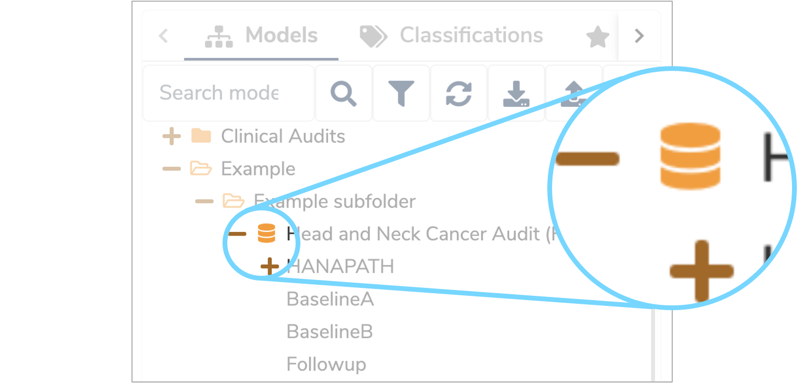
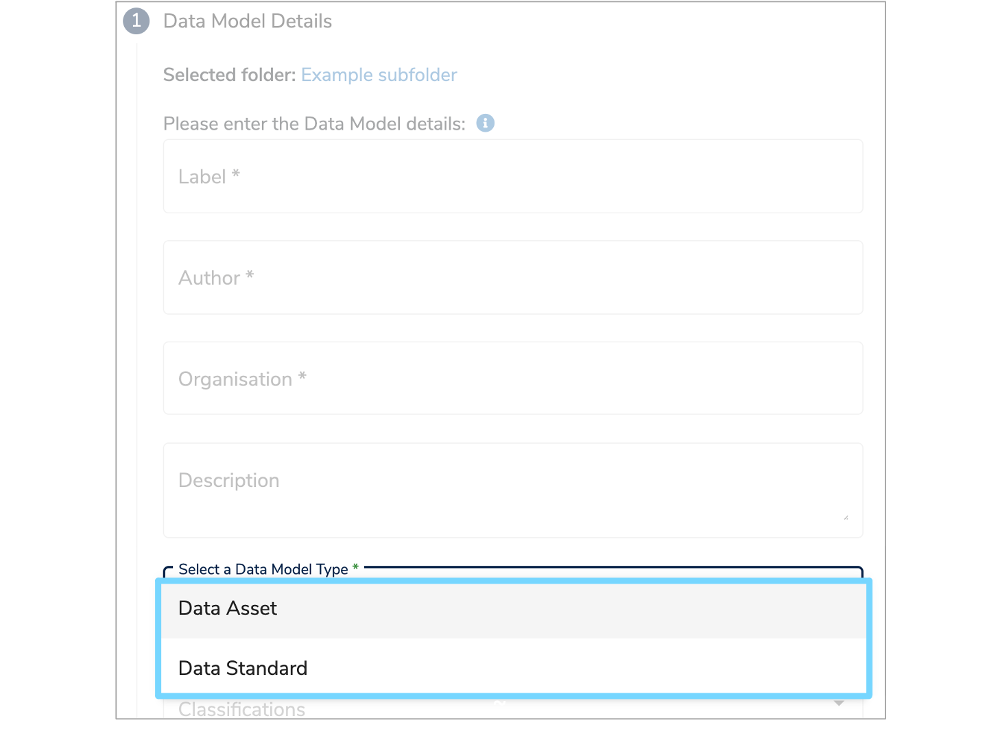

##What is a Data Asset?

There are two types of **[Data Models](../data-model/data-model.md)** within **[Mauro Data Mapper](https://modelcatalogue.cs.ox.ac.uk/mdm-ui/#/home)**: a **Data Asset** and a **[Data Standard](../data-standard/data-standard.md)**. 
A **Data Asset** contains existing data. This can be in the form of a database, dataset or a number of completed forms. 

---
##How are Data Assets used?

A **[Data Model](../data-model/data-model.md)** which is a **Data Asset** is represented by a database icon, as shown below. This helps to quickly identify the type of **[Data Model](../data-model/data-model.md)** in the **Model Tree** view. 

**Data Assets** may also include summary metadata within its properties and its data can also be populated from other **Data Assets** via a **Data Flow**. 

You will need to assign a **[Data Model](../data-model/data-model.md)** type whenever you are adding or importing a **[Data Model](../data-model/data-model.md)**. 

When adding a **[Data Model](../data-model/data-model.md)**, you will need to select its type on the **'Data Model Details form'** from the dropdown menu. For further information on this, visit our **['Create a Data Model user guide'](../../user-guides/create-a-data-model/create-a-data-model.md)**. 

When importing a **[Data Model](../data-model/data-model.md)** using Excel, you will need to specify the type in the relevant column of the **[Data Model listing sheet](../../user-guides/import-data-model-from-excel/import-data-model-from-excel.md#listing-sheet)**. For further information on this, please see our **['Import a Data Model from Excel user guide'](../../user-guides/import-data-model-from-excel/import-data-model-from-excel.md)**. 

---

