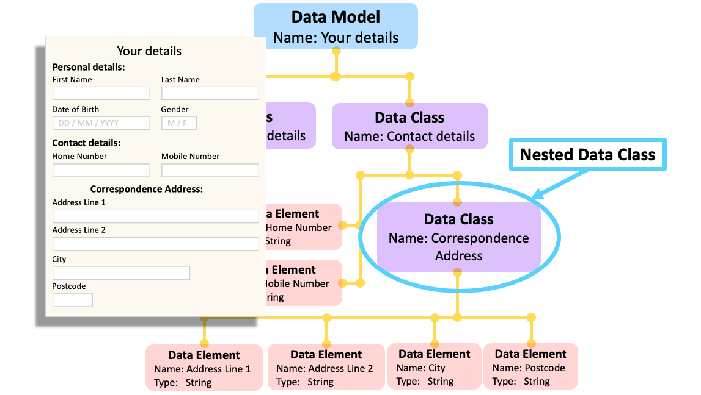

##**What is a Data Class?**

A **Data Class** is a collection of data, also known as **Data Elements**, that are related to each other in some way. For example, each **Data Element** could appear in the same table of a database, or the same section within a form.

---
##**How are Data Classes used?**

**Data Classes** are the building blocks of a **[Data Model](../data-model/data-model.md)**. Within each **Data Class** lies several **Data Elements** and these are the descriptions of an individual field, variable, column or property. 

You can also have a **Data Class** within a **Data Class**, known as a **Nested Data Class**, which can be a useful way of managing complex sets of data. There is no limit on the number of **Nested Data Classes** you can include. 

Each **Data Class** has a:

* **Label** - the name of the **Data Class** which has to be unique within the **[Data Model](../data-model/data-model.md)** or parent **Data Class**.

* **Aliases** - alternative names that can help locate this **Data Class** when searched for. A **Data Class** must have one primary **Label**, but can have many **Aliases**.

* **Description** - a textual definition which explains the types of data items that are grouped together within the **Data Class**, as well as any contextual details.

* **Parent** - this can either be the **[Data Model](../data-model/data-model.md)** itself, in which case it is described as a ‘top level data class’. Or, if it is a **Nested Data Class**, its parent **Data Class**.

* **Multiplicity** - this specifies the minimum and maximum number of times the **Data Class** appears within its parent. For example, optional data may have a minimum multiplicity of 0 and a maximum of 1, whereas mandatory data may have a minimum multiplicity of 1. Data which occurs any number of times is given by a multiplicity of ‘*’ which represents ‘-1’ internally.

* **Classifications** – tags that you can apply to the **Data Class**. 

The above are all shown in the main box of the details panel, when the **Data Class** is selected, as highlighted in blue below. While other characteristics are displayed in the tabs highlighted in red.

* **Content** - this refers to the various **Data Elements** and **Nested Data Classes** within the selected **Data Class**.

* **Properties** – arbitrary additional metadata about this **Data Class**.

* **Comments** – any relevant comments or notes. 

* **Links** – **Semantic links** between relevant data classes.

* **Summary** – further metadata information on the nature of the **Data Elements** within the **Data Class**. This can include aggregate data such as the number of entries or distribution information as well as textual information detailing aspects like the geographic representation of the data set or the duration of collection. 

* **Attachments** – files can be added to the **Data Class**, providing additional information and context. 

---

