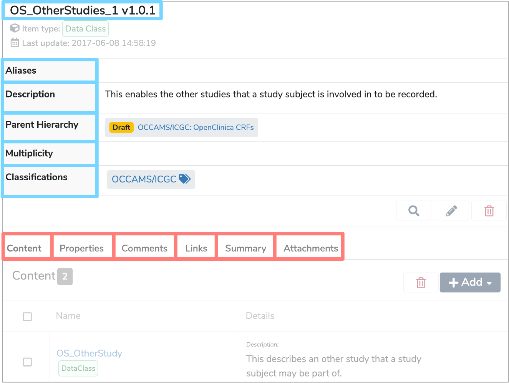

##**What is a Data Class?**

A **Data Class** is a collection of data, also known as **Data Elements**, that are related to each other in some way. For example, each **Data Element** could appear in the same table of a database, or the same section within a form.

---
##**How are Data Classes used?**

**Data Classes** are the building blocks of a **[Data Model](../data-model/data-model.md)**. Within each **Data Class** lies several **Data Elements** and these are the descriptions of an individual field, variable, column or property. 

You can also have a **Data Class** within a **Data Class**, known as a **Nested Data Class**, which can be a useful way of managing complex sets of data. There is no limit on the number of **Nested Data Classes** you can include. 

For example, in a webform, there may be a section called **'Contact details'**, which would be one **Data Class**. Within that section however, there may be another labelled **'Correspondence Address'**, which would be a **Nested Data Class**.  

Each **Data Class** has a:

* **[Label](../label/label.md)**  
	This is the name of the **Data Class** which has to be unique within the **[Data Model](../data-model/data-model.md)** or parent **Data Class**.

* **[Aliases](../aliases/aliases.md)**  
	Alternative names that can help locate the **Data Class** when searched for.

* **Description**  
	A definition either written in html or plain text which explains the types of data items that are grouped together within the **Data Class**, as well as any contextual details.
	
* **Parent Hierarchy**  
	The **Parent** of a **Data Class** can either be the **[Data Model](../data-model/data-model.md)** itself, in which case it is described as a ‘top level data class’. Or, if it is a **Nested Data Class**, its parent **Data Class**.
	
* **Multiplicity**  
	This specifies the minimum and maximum number of times the **Data Class** appears within its parent. Optional data may have a minimum **Multiplicity** of 0 and a maximum of 1, whereas mandatory data has a minimum **Multiplicity** of 1. Data which occurs any number of times is given by a **Multiplicity** of ‘*’ which represents ‘-1’ internally.

* **Classifications**  
	These are effectively tags that you can apply to the **Data Class**. 

The above are all shown within the details panel, when the **Data Class** is selected in the **Model Tree**.

Other characteristics are displayed in the tabs underneath the details panel, when the **Data Class** is selected in the **Model Tree**.

* **Content**  
	This refers to the various **Data Elements** and **Nested Data Classes** within the selected **Data Class**.
	
* **Properties**  
	Arbitrary additional metadata about this **Data Class**.

* **Comments**  
	Any relevant comments or notes. 

* **Links**  
	**Semantic links** between relevant data classes.

* **Summary**  
	Further metadata information on the nature of the **Data Elements** within the **Data Class**. This can include aggregate data such as the number of entries or distribution information as well as textual information detailing aspects like the geographic representation of the data set or the duration of collection. 

* **Attachments**  
	Files can be added to provide additional information and context. 

---

