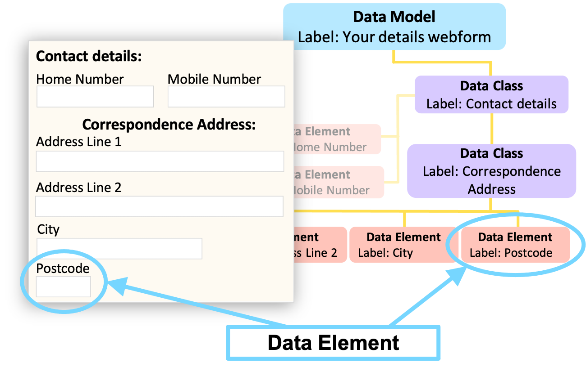
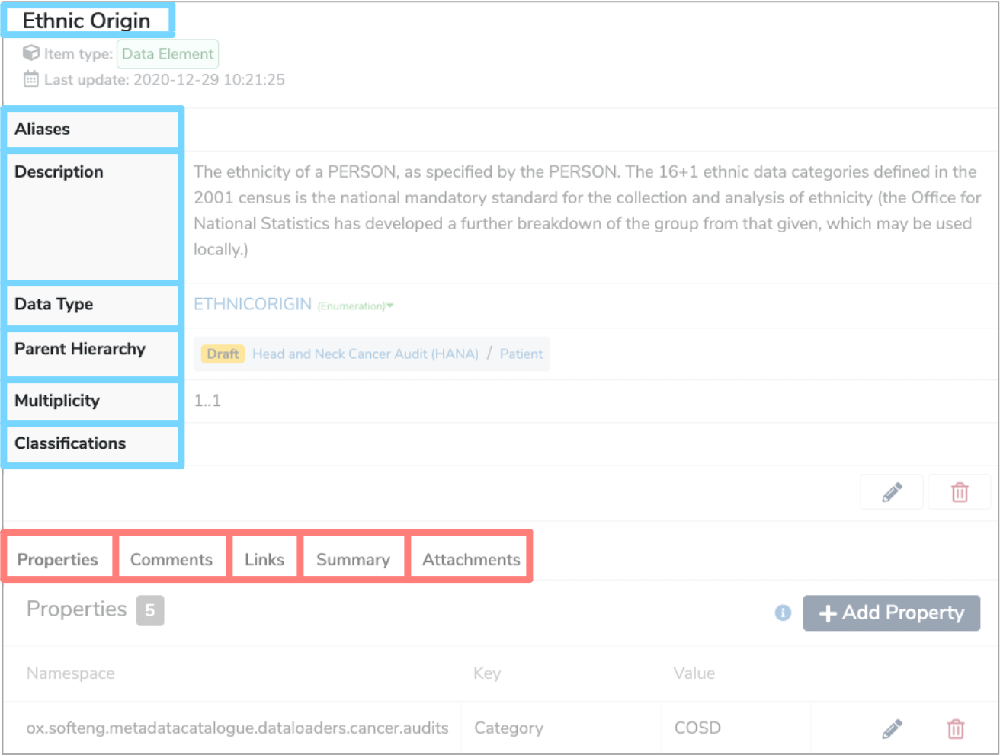

##**What is a Data Element?**

A **Data Element** is a description of an individual field, variable, column or property of a data item. Each **Data Element** has a name and a **Data Type**. 

---
##**How are Data Elements used?**

**Data Elements** that are related to each other in some way are grouped together in [Data Classes](../data-class/data-class.md). These [Data Classes](../data-class/data-class.md) are the building blocks of [Data Models](../data-model/data-model.md). For example, a **Data Element** could be an individual field such as **‘Postcode’** within a webform. 

Each **Data Element** has a:

* [Label](../label/label.md)  
	This is the name of the **Data Element** which has to be unique within its parent [Data Class](../data-class/data-class.md).

* [Aliases](../aliases/aliases.md)  
	Alternative names that can help locate the **Data Element** when searched for.

* **Description**  
	A definition either written in html or plain text which explains any contextual details relating to the **Data Element**.
	
* **Data Type**  
	The **Data Type** describes the range of possible values that the **Data Element** may take. The **Data Types** stored within [Data Models](../data-model/data-model.md) are: 

	* **Enumeration:** A constrained set of possible values. Each **Enumeration Type** defines a number of **Enumeration Values** which have a coded key and a human-readable value.

	* **Primitive:** A string, date or integer.

	* **Reference:** Data with detailed properties which is used to describe relationships between different [Data Classes](../data-class/data-class.md) within the same [Data Model](../data-model/data-model.md).

	* **Terminology:** A structured collection of **Enumerated Values** which has relationships between different data terms.
	
* **Parent Hierarchy**  
	Details the parent [Data Class](../data-class/data-class.md) and [Data Model](../data-model/data-model.md) of the **Data Element**.
	
* **Multiplicity**  
	This specifies the minimum and maximum number of times the **Data Element** appears within its parent. Optional data may have a minimum **Multiplicity** of 0 and a maximum of 1, whereas mandatory data has a minimum **Multiplicity** of 1. Data which occurs any number of times is given by a **Multiplicity** of ‘*’ which represents ‘-1’ internally.

* **Classifications**  
	These are effectively tags that you can apply to the **Data Element**. 

The above are all shown within the details panel, when the **Data Element** is selected in the **Model Tree**.

Other characteristics are displayed in the tabs underneath the details panel, when the **Data Element** is selected in the **Model Tree**.
	
* **Properties**  
	Additional metadata about this **Data Element**. This can include technical information such as where the data is located, as well as information for users such as the type of data, coverage, geography and accessibility.

* **Comments**  
	Any relevant comments or notes. 

* **Links**  
	**Semantic links** between relevant **Data Elements**.

* **Summary**  
	Further metadata information on the nature of the **Data Elements**. This can include aggregate data such as the number of entries or distribution information as well as textual information detailing aspects like the geographic representation of the data set or the duration of collection. 

* **Attachments**  
	Files can be added to provide additional information and context. 

---
