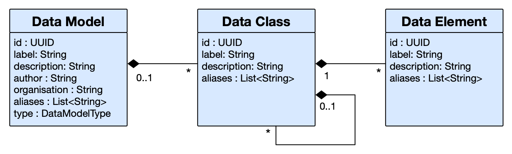

##**What is a Data Model?**

A **Data Model** is a description of an existing collection of metadata, or a specification of data that is to be collected. Models which contain existing data are known as a **Data Asset**, while models which contain templates for data collection are known as a **Data Standard**. Both are called models as they are effectively representations of the data that they describe. 

---
##**How are Data Models used?**

**Data Models** make the connection between the names of columns, fields or variables and our understanding of how the corresponding data is acquired, managed and interpreted. The Mauro Data Mapper acts as a directory for these **Data Models** and allows us to create, search and share these data descriptions.

Each **Data Model** has a unique label to identify it within the Mauro Data Mapper as well as a description, a number of alternate names, or aliases as well as an author and an organisation.

Within each **Data Model** lies several **Data Classes** which are groups of data that are related in some way. **Data Classes** contain **Data Elements** which are the descriptions of an individual field or variable.  

