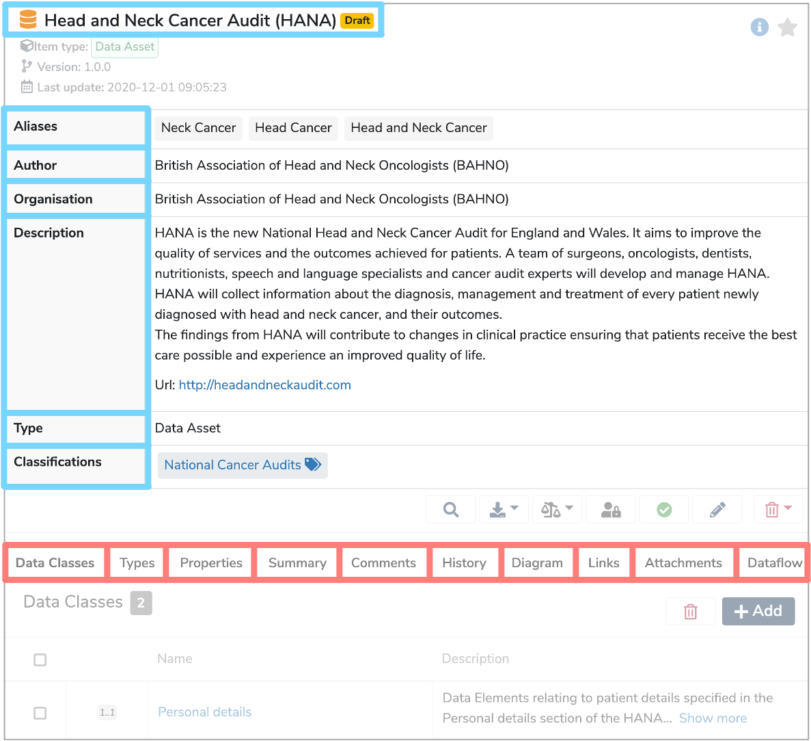

##What is a Data Model?

A **Data Model** is a description of an existing collection of metadata, or a specification of data that is to be collected. **Data Models** which contain existing data are known as a [Data Asset](../data-asset/data-asset.md), while models which contain templates for data collection are known as a [Data Standard](../data-standard/data-standard.md). Both are called models as they are effectively representations of the data that they describe. 

---
##How are Data Models used?

**Data Models** make the connection between the names of columns, fields or variables and our understanding of how the corresponding data is acquired, managed and interpreted. **Mauro Data Mapper** acts as a directory for these **Data Models** and allows us to create, search and share these data descriptions.

Within each **Data Model** lies several [Data Classes](../data-class/data-class.md) which are groups of data that are related in some way. **Data Classes** contain [Data Elements](../data-element/data-element.md) which are the descriptions of an individual field or variable. 

For example, a webform where patients enter their details would be a **Data Model**. The **'Personal details'** and **'Contact details'** sections within the webform would each be a **Data Class**. While the individual entries such as **'First Name'**, **'Last Name'**, **'Date of Birth'** etc, would each be a **Data Element**. 

The **'Correspondence Address'** section is within the **'Contact details'** section and would therefore be a **Nested Data Class**.

 

Each **Data Model** has a:

* [Label](../label/label.md)  
	This is the unique name of the **Data Model**.
	
* [Aliases](../aliases/aliases.md)  
	Alternative names that can help locate the **Data Model** when searched for.

* **Organisation**  
	Details of who is responsible for creating the **Data Model**. 

* **Description**  
	A definition either written in html or plain text which explains the types of data items that are grouped together within the **Data Model**, as well as any contextual details.

* **Type**  
	This defines whether the **Data Model** is a **Data Asset**, which contains existing data, or a **Data Standard**, which contains templates for data collection. 

* **Classifications**  
	These are effectively tags that you can apply to the **Data Class**. 

The above are all shown within the details panel, when the **Data Model** is selected in the **Model Tree**.

Other characteristics are displayed in the tabs underneath the details panel, when the **Data Model** is selected in the **Model Tree**.

* **Data Classes**  
	 This is a list of all the **Data Classes** within the **Data Model**.

* **Types**  
	The [Data Type](../data-type/data-type.md) describes the range of possible values that the **Data Element** may take. The **Data Types** stored within **Mauro Data Mapper** are: 

	* [Enumeration Data Type](../enumeration-data-type/enumeration-data-type.md)  
	This is a constrained set of possible **Enumeration values**, which are typically used to describe lists of data.  
	 For example, an ethnicity **Enumeration Data Type** would include a list of different ethnic categories, each defined by a coded key and a human readable description.

	* [Primitive Data Type](../primitive-data-type/primitive-data-type.md)  
	Data without further details on structure or referencing. **Primitive Data Types** include **‘String’**, **‘Integer’** or **‘Date’**.
	
	* [Reference Data Type](../reference-data-type/reference-data-type.md)  
	Data which refers to another **Data Class** within the same **Data Model**. 

	* [Terminology Data Type](../terminology-data-type/terminology-data-type.md)  
	A structured collection of **Enumerated Values** which have relationships between different data terms.

* **Properties**  
	Additional metadata about this **Data Model**. This can include technical information such as where the data is located, as well as information for users such as the type of data, coverage, geography and accessibility.

* **Summary**  
	Further metadata information on the nature of the **Data Classes** within the **Data Model**. This can include aggregate data such as the number of entries or distribution information as well as textual information detailing aspects like the geographic representation of the data set or the duration of collection. 
	
* **Comments**  
	Any relevant comments or notes. 
	
* **History**  
	A detailed record of user, date, time and description of all the changes made to the **Data Model**. 

* **Diagram**  
	A UML diagram which is a graphical way of summarising the **Data Classes** and **Data Elements** within the **Data Model**. 

* **Links**  
	[Semantic links](../semantic-links/semantic-links.md) between relevant **Data Models**.

* **Attachments**  
	Files can be added to provide additional information and context. 
	
* [Dataflow](../dataflow/dataflow.md)  
	A diagram illustrating where the data within the **Data Model** has come from and how it has moved across different databases and organisations. This gives users valuable information on the history of each data point and how it has been manipulated.  

---