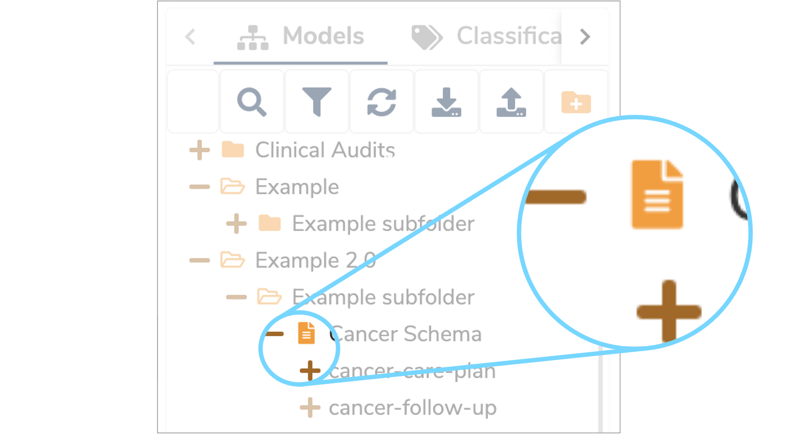
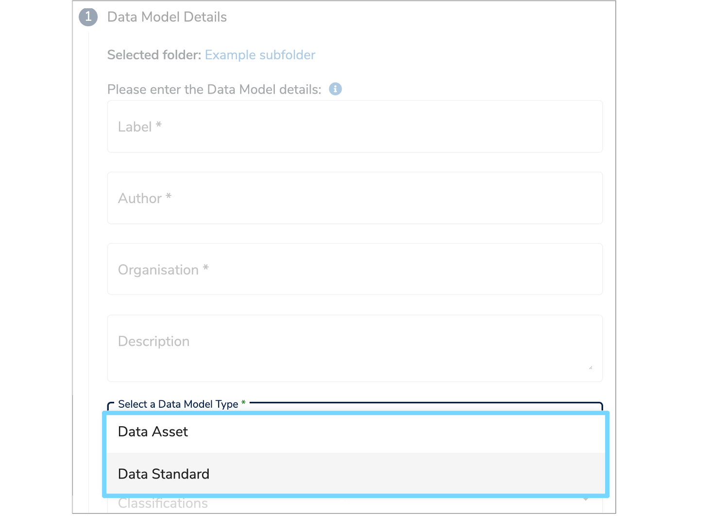

##What is a Data Standard?

There are two types of [Data Models](../data-model/data-model.md) within [Mauro Data Mapper](https://modelcatalogue.cs.ox.ac.uk/mdm-ui/#/home): a [Data Asset](../data-asset/data-asset.md) and a **Data Standard**. A **Data Standard** is essentially a template for collecting new data. This can be a form, schema or a specification for distributed data collection.

---
##How are Data Standards used?

A [Data Model](../data-model/data-model.md) which is a **Data Standard** is represented by a document icon, as shown below. This helps to quickly identify the type of [Data Model](../data-model/data-model.md) in the **Model Tree** view. 

As a **Data Standard** does not contain any collected data, there will be no summary metadata properties or **Data Flows** associated with this type of model. 

You will need to assign a [Data Model](../data-model/data-model.md) type whenever you are adding or importing a [Data Model](../data-model/data-model.md). 

When adding a [Data Model](../data-model/data-model.md), you will need to select the type on the **'Data Model Details form'**. For further information on how to do this, visit our ['Create a Data Model user guide'](../../user-guides/create-a-data-model/create-a-data-model.md). 

When importing a [Data Model](../data-model/data-model.md) using Excel, you will need to specify the type in the relevant column on the [Data Model listing sheet](../../user-guides/import-data-model-from-excel/import-data-model-from-excel.md#listing-sheet). Again, for further information on this, please see our ['Import a Data Model from Excel user guide'](../../user-guides/import-data-model-from-excel/import-data-model-from-excel.md). 

---
