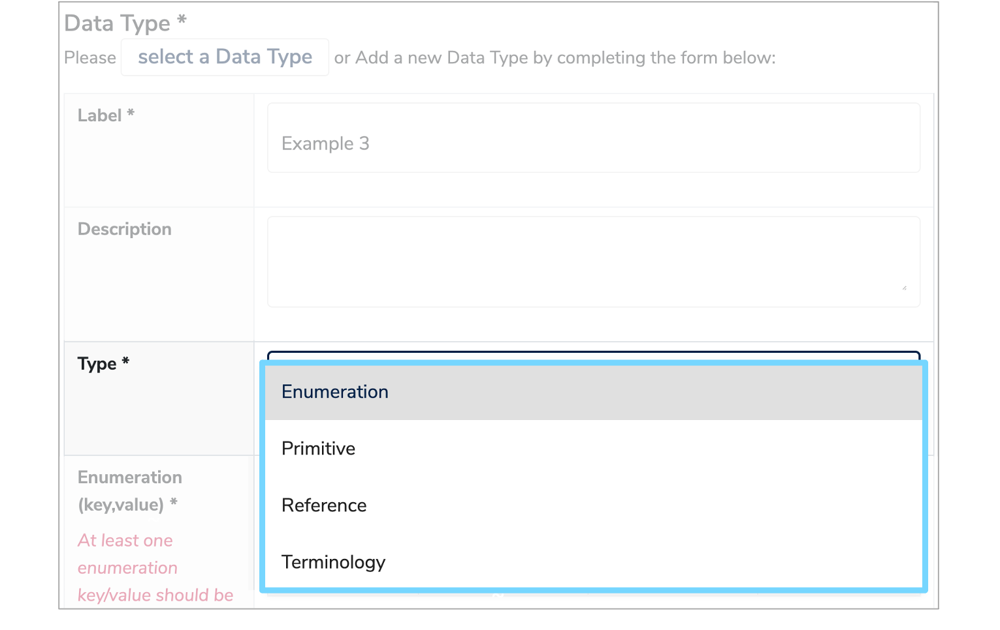
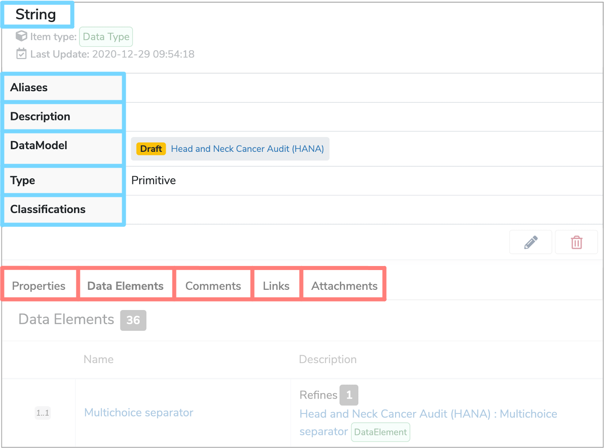

##What is a Data Type?
A **Data Type** describes the range of possible values that each [Data Element](../data-element/data-element.md) may take. 

---

##How are Data Types used?
There are four different **Data Types** stored within [Data Models](../data-model/data-model.md) of [Mauro Data Mapper](https://modelcatalogue.cs.ox.ac.uk/mdm-ui/#/home):

* **Enumeration**  
	This is a constrained set of possible **Enumeration values**, which are typically used to describe lists of data.  
	For example, an ethnicity **Enumeration Data Type** would include a list of different ethnic categories, each defined by a coded key and a human readable description.

* **Primitive**  
	Data without further details on structure or referencing. **Primitive Data Types** include ‘String’, ‘Integer’ or ‘Date’.
	
* **Reference**  
	Data which refers to another [Data Class](../data-class/data-class.md) within the same **Data Model**. 
	
* **Terminology**  
	A structured collection of **Enumerated Values** which have relationships between different data terms.
	
When adding a new **Data Type** to a **Data Element**, you will need to select the relevant **Data Type** from the dropdown menu on the **'Data Element Details'** form. For more information on how to do this, go to step **'5.1 Add Data Elements'** on our ['Document a Health Dataset user guide'](../../user-guides/document-a-health-dataset/document-a-health-dataset.md#create-a-new-data-element)

 
 
Each **Data Type** has a:
 
* **[Label](../label/label.md)**  
	This is the unique name of the **Data Type**.

* **[Aliases](../aliases/aliases.md)**  
	Alternative names that can help locate the **Data Type** when searched for.

* **Description**  
	A definition written in either html or plain text which explains any contextual details relating to the **Data Type**.

* **DataModel**  
	The **Data Model** that the **Data Type** belongs to.

* **Type**  
	The **Data Type** (Enumeration, Primitive, Reference or Terminology).
	
* **Classifications**  
	These are effectively tags that you can apply to the **Data Type**.
	
 

Other characteristics are displayed in the tabs underneath the details panel, when the **Data Type** is selected in the **Model Tree**.

* **Properties**  
	Arbitrary additional metadata about this **Data Type**.

* **Data Elements**  
	The **Data Elements** that use the selected **Data Type**.

* **Comments**  
	Any relevant comments or notes.

* **Links**  
	**Semantic links** between relevant **Data Types**.

* **Attachments**  
	Files can be added to provide additional information and context.

---

