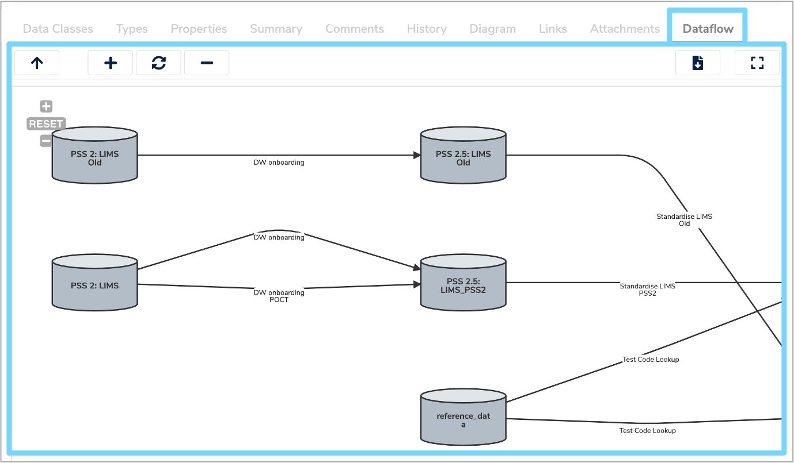
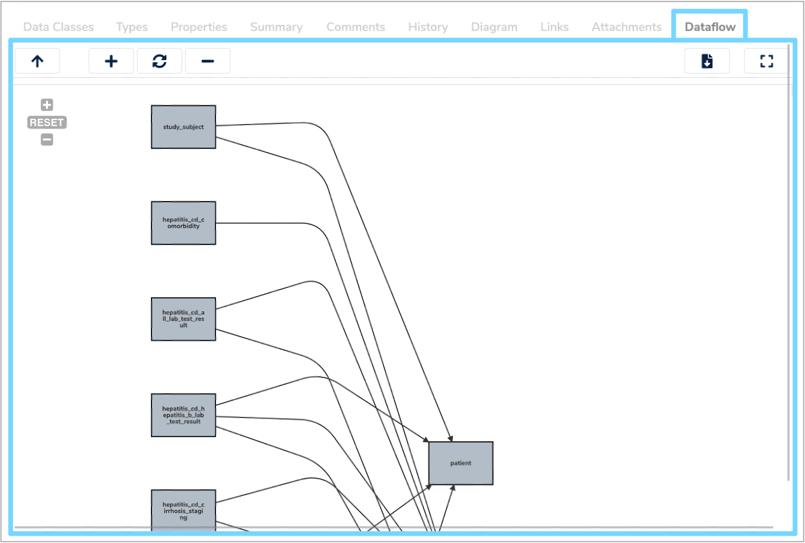
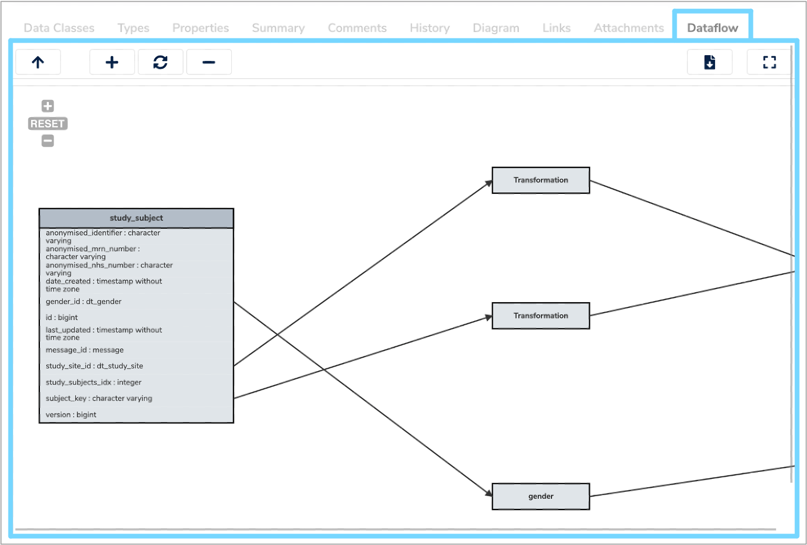
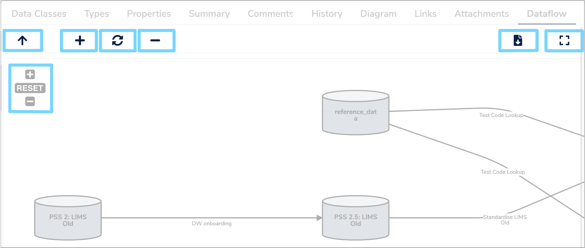

##What is a Dataflow?

A **Dataflow** is a way of describing the meaning of data. It is a visual representation of how data flows from one [Data Model](../data-model/data-model.md), typically a [Data Asset](../data-asset/data-asset.md), to another. This helps users to understand where data has been extracted from, how it has been extracted and the series of transformations it has gone through.  

Each **Dataflow** has a source **Data Model**, which is where the data originated from, and a target **Data Model**, which is where the final data will be located. The transformations in between define how the data from one or more [Data Elements](../data-element/data-element.md) within the source **Data Model** flow into one or more **Data Elements** within the target **Data Model**.  

---

##How are Dataflows used?

The **Dataflows** relating to each **Data Asset** can be found in the **Dataflows** tab at the bottom of the details panel, when the relevant **Data Model** is selected in the **Model Tree**. 

The **Dataflows** tab displays a diagram which consists of a series of annotated grey blocks connected by annotated arrows. This tab allows you to view the **Dataflows** at a **Data Model** level, a [Data Class](../data-class/data-class.md) level and a **Data Element** level. Therefore, the grey blocks can represent **Data Assets**, **Data Classes** or **Data Elements**, depending on the selected view. The arrows represent the relevant transformations that have occurred and are annotated with human readable descriptions.

### Data Model view

When you first click the **Dataflows** tab, the **Data Model** view will initially be displayed. This gives a high level overview of how data flows from one **Data Asset** to another. The grey blocks represent **Data Assets** which can be databases, lab systems or modules of data.

### Data Class view

To find out information on the different components of a particular **Dataflow** and how tables of data flow from one place to another, you can access the **Data Class** view. 

To do this, hover over one of the transformation arrows until the hand icon appears and double click. The **Data Class** view will then be displayed with each **Data Class** represented by a grey rectangle.

### Data Element view

To find out more details on the specific fields of a data product and how they have been derived, you can access the **Data Element** view. 

Again, hover over a transformation arrow until the hand icon appears and double click. Here, you will find the various fields grouped together and the relationships between them. This is particularly useful for end users as it explains how data has been manipulated. 

### Zoom
In all three views, you can zoom in and out by scrolling on your mouse, or by clicking the **‘+ Zoom in'** and **‘- Zoom out'** buttons at the top left of the **Dataflows** view and in the header bar. 

### Reset
To reset the view, select **‘RESET’** at the top left of the **Dataflows** view or click the circular arrow **‘Reset zoom and canvas’** button in the header bar. 

### Fullscreen
You can also view the **Dataflow** tab in fullscreen mode by clicking the **'Popup in full screen'** icon on the top right of the header bar.

### Download image
To download an image of the **Dataflow** select the **'Download as image'** icon at the top right of the header bar. This will download a png image of the current view displayed in the **Dataflow** tab to your downloads folder.

 
### Navigating through Dataflows

To navigate between the three different views, hover and double click over the transformation arrows in each view to access the next level. For example, to move from the **Data Model** view to the **Data Class** view. 

To navigate up a level of hierarchy, select the upwards arrow **‘Move up a level of hierarchy’** icon in the top left of the header bar. For example, to move from the **Data Class** view to the **Data Model** view.

In all three views you can move the blocks and transformation arrows by clicking and holding the left mouse button which will allow you to drag them to the desired position. This can be helpful to visualise the **Dataflows** in a clearer manner.  

<iframe src="https://player.vimeo.com/video/511929888" width="640" height="397" frameborder="0" allow="autoplay; fullscreen" allowfullscreen></iframe>

---

