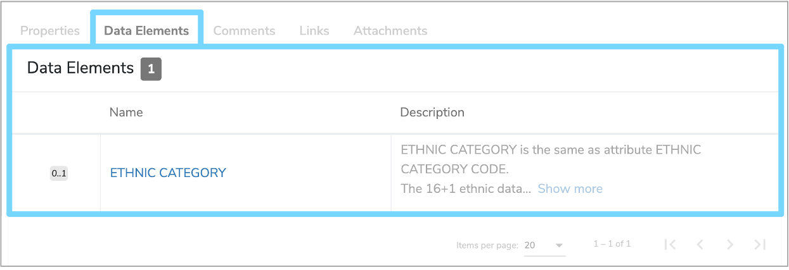

##What is an Enumeration Data Type?

An **Enumeration Data Type** is one of the four possible [Data Types](../data-type/data-type.md) within [Mauro Data Mapper](https://modelcatalogue.cs.ox.ac.uk/mdm-ui/#/home). Each **Enumeration Data Type** describes a constrained set of possible Enumeration values. Enumerations are typically used for describing simple lists of data.

---

##How are Enumeration Data Types used?
Each Enumeration value has an associated label, or a coded key, and a textual description, or human-readable value. These key-value pairs can be used to describe a list of data. For example, one **Enumeration Data Type** could be **'Ethnic category'**, where each Enumeration value describes a specific ethnicity. 

Further details of the particular **Enumeration Data Type** can be found in its details panel.

 

The individual Enumeration values, along with their corresponding **'Key'** and **'Value'** are displayed in an **‘Enumerations’** table below the details panel. These can be edited by clicking the pencil icon to the right of each row. Enumerations can also be removed by clicking the red bin icon to the right of each row. 

To add an Enumeration, click **‘+Add Enumeration’** at the top right of the **'Enumerations'** table. This will add a row to the bottom of the table, where you can then populate the **‘Group’**, **‘Key’** and **‘Value’** fields. Once completed, click the green tick to the right of the row, and the new Enumeration will be added.

 

You can also view all the [Data Elements](../data-element/data-element.md) that use that **Enumeration Data Type** by selecting the **‘Data Elements’** tab underneath the details panel. This will display the [Multiplicity](../multiplicity/multiplicity.md), **'Name'** and **'Description'** of each **Data Element**. 

 

---

