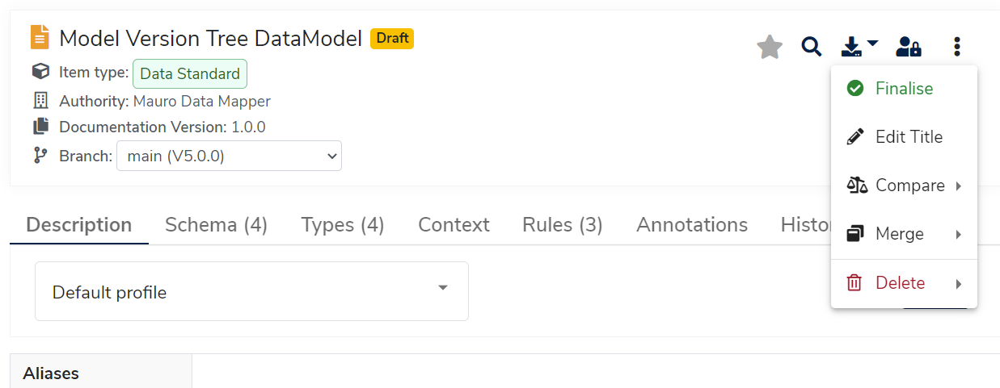

## What is a Finalised model?

When a model is **Finalised**, it may not be edited any further, locking it into a **Version number** and making it _read only_. The act of **Finalising** makes it clear that a model is ready leave its _Draft_ state and be considered finished, or ready for use.

When working with models, they can be in one of two states:

* **Draft** state, meaning an editor may make changes to the model.

* **Finalised** state, meaning the model is finished and ready for consumption.

## Why Finalise a model?

**Finalisation** is tied to **Versions** and version control - once a model is **Finalised**, it is locked into a particular **Version number**. The only way to make further changes to a **Finalised** model is to start a new version of the model, once again entering it into a _draft_ state.

By locking a version of a model, this prevents further unintended changes being made and definitively states that this model contains a set contents.

## How to Finalise models

To **Finalise** a model, please refer to the user guide [How to Finalise a Data Model](../../user-guides/finalise-data-models/finalise-data-models.md).