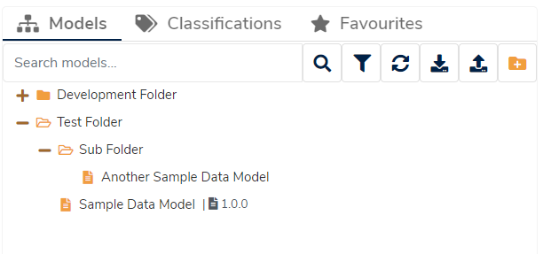

## What is a Folder?

A **Folder** is a container for organising your data models, functioning very similar to a folder stored on a computer. A **Folder** may contain data models and other sub-folders to manage and organise your catalogue.

Catalogue items may only be stored in one folder at a time, because **Folders** use a hierarchical-structure. If a catalogue item should be linked to more than one container, consider using [Classifications](../classification/classification.md) instead.

## Why use Folders?

**Folders** are a useful method of organising your catalogue, especially as it gets larger in scope. **Folders** are also subject to the same access rights as any other catalogue item, such as making them:

* Publicly readable, 
* Readable by authenticated users, or
* Restricted to certain user groups.

**Folders** are simply containers though; for more complex workflow and organisational scenarios, consider [Versioned Folders](../versioned-folder/versioned-folder.md)