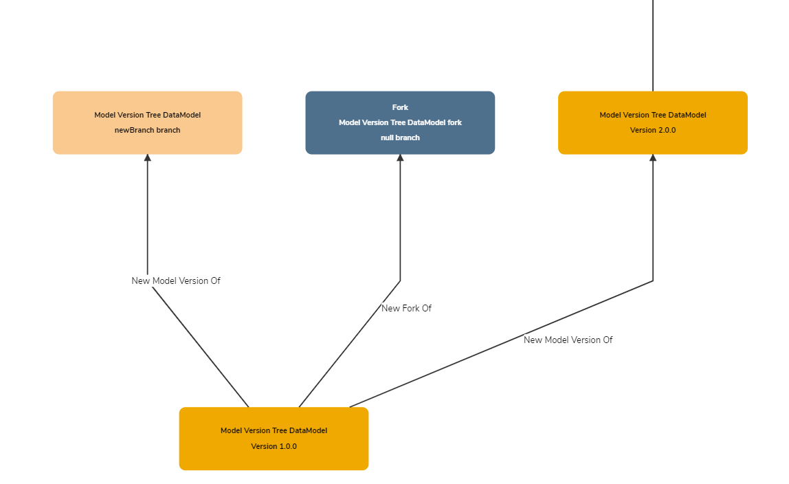

## What is a Fork?

A **Fork** is a copy of an existing **Version** of a model, with the intention of freely making many alterations to that model without affecting the original.

The simplest way to understand **Forks** in Mauro is to view the **Merge Graph** of a model:

In this example, **Model Version Tree DataModel (1.0.0)** has progressed to version **2.0.0**. However, a separate **Fork** has also been created, with its own **main** branch, which will not follow the same versioning history as the original. This allows the **Fork** to make many changes and not refer back to the original version history.

## Why are Forks useful?

**Forks** are useful for two reasons:

1. They allow a simple starting point for creating a new model which may start similar but will deviate greatly once finished.
2. **Forks** allow an existing model to be directed under a new **Authority**.

## Differences with Branches

At first glance, a **Fork** and a **Branch** may seem to serve the same purpose, but the key difference between them are:

* A **Branch** is designed to be a _temporary_ deviation from the _main line_ of a model, with the intention of eventaully _merging_ it back into the _main line_ later.
* A **Fork** is designed to be a _permanent_ deviation from the _main line_ of a model, acting as the starting point for a new version history. **Forks** are not intended to be merged back into their original starting point.

## How to create a Fork

To create a **Fork** of a model, please refer to the user guide [How to version and merge Data Models](../../user-guides/version-data-models/version-data-models.md).