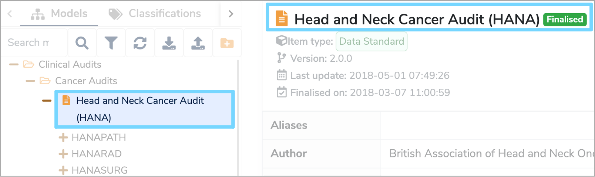
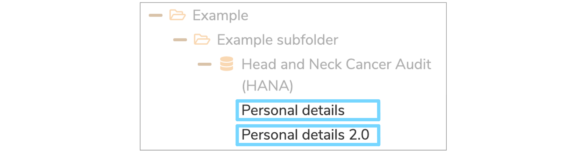
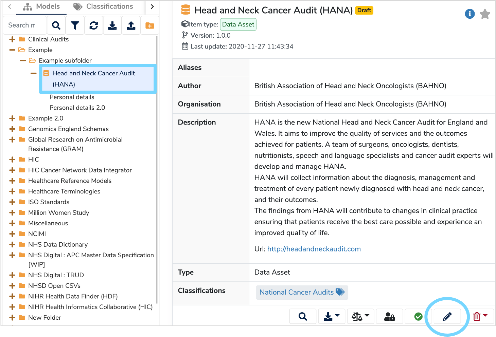

##**What is a Label?**
A **Label** is a name that describes and uniquely identifies each item within the Mauro Data Mapper. This **Label** will appear in the **Model Tree** on the left hand side of the catalogue and at the top of the page when the item is selected. The **Label** is also used to identify the item when searched for. 

---

##**How are Labels used?**
The **Label** of each item must be unique within its parent group so that no two items share the same **Label**. Therefore, each **[Data Model](../data-model/data-model.md)** must have a unique **Label**. Each **[Data Class](../data-class/data-class.md)** must have a unique **Label** within its parent **[Data Model](../data-model/data-model.md)**. Each **Data Element** must have a unique **Label** within its parent **[Data Class](../data-class/data-class.md)**. 

For example, there can only be one **[Data Class](../data-class/data-class.md)** called **‘Personal details’** within a particular **[Data Model](../data-model/data-model.md)**. Therefore, if you need to add a similar **[Data Class](../data-class/data-class.md)**, include version information within the **Label** such as **‘Personal details 2.0’** to uniquely identify it. 

It is likely that two different **[Data Models](../data-model/data-model.md)** within the catalogue could consist of a **[Data Class](../data-class/data-class.md)** with the same **Label**, such as **'Personal details'**. However, because these two **[Data Classes](../data-class/data-class.md)** are each associated with their own unique parent **[Data Model](../data-model/data-model.md)**, then this is acceptable. Only when two items are within the same parent must they each have a unique **Label**.  

---

##**How do you edit a Label?**

You can edit the **Label** of any item by selecting it in the **Model Tree** and clicking the **‘Edit’** pencil icon which is located at the bottom right of the details panel. 

---
