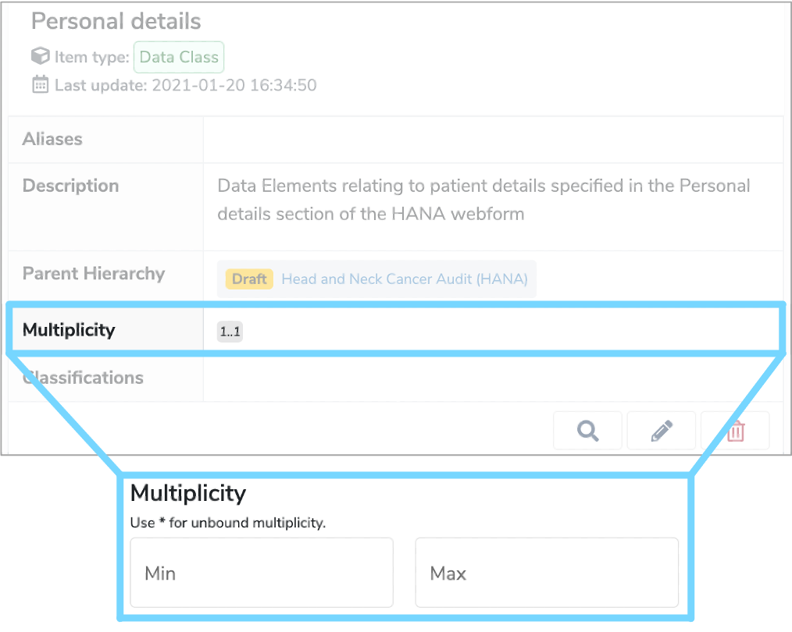

##What is Multiplicity?

An item's **Multiplicity** refers to the minimum and maximum number of times it can appear within its parent in **Mauro Data Mapper**. 
For example, the number of instances a particular [Data Element](../data-element/data-element.md) appears within a [Data Class](../data-class/data-class.md). 

---

##How is Multiplicity used?

Every **Data Class** and **Data Element** is assigned a **Multiplicity**. Typically, the **Multiplicity** is written in the form **‘minmax**’, where **min** and **max** are integers representing the minimum and maximum number of times an item will appear within its parent. The symbol * represents an unbounded maximum.

* Using this notation:
	* Mandatory data has a minimum **Multiplicity** of 1 and a maximum **Multiplicity** of a specific integer or if there is no upper bound, then '*' (which is represented by '-1' internally).  
	* Optional data has a minimum **Multiplicity** of 0 and a maximum **Multiplicity** of 1 or if there is no upper bound, *.
 
For example, each person in a [Data Model](../data-model/data-model.md) only has one date of birth and if you want to record this, then the corresponding **Multiplicity** will be 1..1. However, each person may have many prescription records, which may or may not be relevant. In this case, the **Multiplicity** would be 0..*. 

Furthermore, each person will only have one date of death, which again you may or may not want to record, so the **Multiplicity** for this would be 0..1.

---

##How do you edit an item's Multiplicity?

The **Multiplicity** can be found in the details panel of **Data Classes** and **Data Elements**. It is a mandatory field when adding or importing a **Data Class** or **Data Elements**, as explained in the ['Document a Health Datatset user guide'](../../user-guides/document-a-health-dataset/document-a-health-dataset.md)  and ['Import a Data Model from Excel user guide'](../../user-guides/import-data-model-from-excel/import-data-model-from-excel.md). 

You can edit the **Multiplicity** of an item by selecting it in the **Model Tree** and clicking the **‘Edit’** pencil icon at the bottom right of the details panel. You will then be able to amend the **min** and **max** values of that item's **Multiplicity**.

---