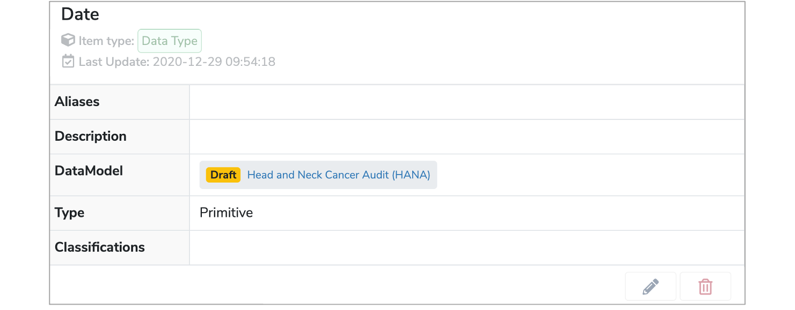
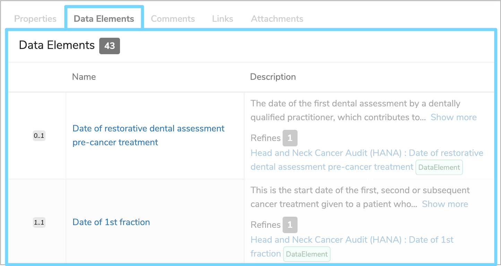

##What is a Primitive Data Type?

A **Primitive Data Type** is one of the four possible [Data Types](../data-type/data-type.md) within **Mauro Data Mapper**. It describes data which has no further details about structure or referencing. 

For example, if a [Data Element](../data-element/data-element.md) is a name, then it’s **Primitive Data Type** would be **‘String’**. Whereas, if a **Data Element** is a number, then it’s **Primitive Data Type** would be **‘Integer’**.

---

##How are Primitive Data Types used?

**Primitive Data Types** are typically used for data which are strings or integers such as names, dates or times. 

Further details of the particular **Primitive Data Type** can be found in its details panel.

 

You can also view all the **Data Elements** that use that **Primitive Data Type** by selecting the **‘Data Elements’** tab underneath the details panel. This will display the [Multiplicity](../multiplicity/multiplicity.md), **Name** and **Description** of each **Data Element**. 

 

---