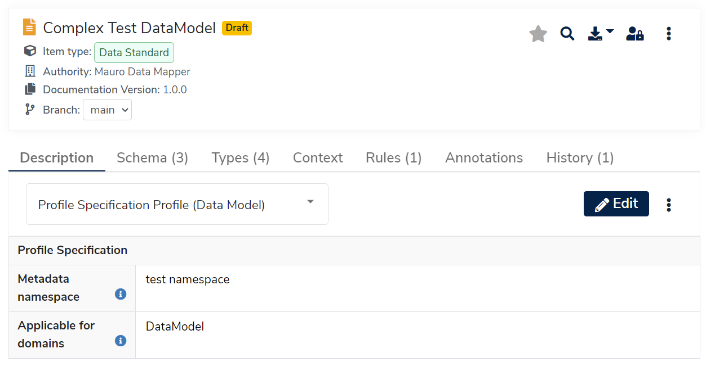

## What is a Profile?

A profile is a group of related metadata properties, typically sharing the same namespace. A profile allows these metadata properties to be grouped into sections and for each defined key may add a description, a default value and a validation constraint. For more details, see the [Properties and Profiles tutorial](../../../tutorials/properties-profiles).

## Why use Profiles?

Grouping related properties together into a profile is useful for cleanly representing data entry, otherwise manually editing metadata becomes more verbose and laborious. The Mauro user interface is able to present profiles in a clean data entry view and uses profile information to allow for:

* Type-specific data entry controls - such as text fields, data pickers, checkboxes, and so on.
* Validation of fields.

Profiles can be _statically_ defined via Mauro plugins in code, or _dynamically_ defined using the same Mauro Data Models, Classes and Elements as any other model. The [Dynamic Profiles user guide](../../../user-guides/dynamic-profiles/dynamic-profiles) explains how this can be achieved.