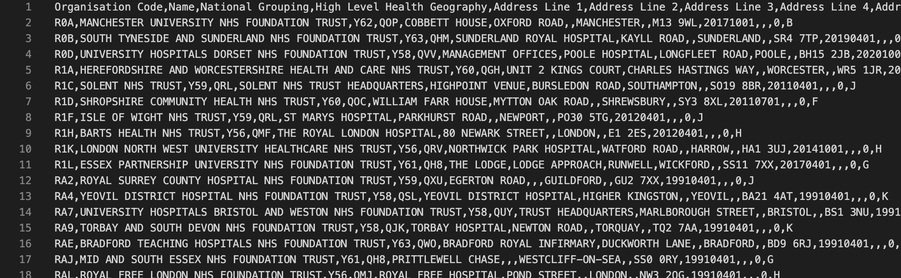
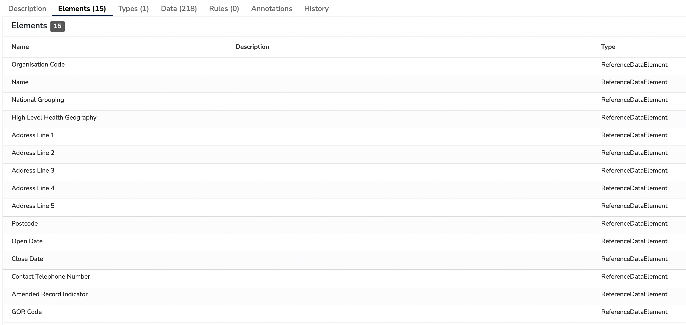
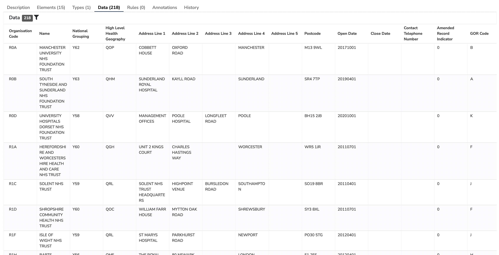

##What is a Reference Data Model?

A **Reference Data Model** is a collection of tabular data together with a description of that data; it can be thought of as both the data and metadata of information strutured as rows and columns, for example Comma-Separated Values (CSV).

---
##How are Reference Data Models used?

**Reference Data Models** are a useful way to represent lookup data which are less structured than a **Terminology** but with more information (rows or columns) than can be easily represented in an [Enumeration Data Type](../enumeration-data-type/enumeration-data-type.md). They make the connection between the names of columns, the values stored, and our understanding of how the corresponding data is acquired, managed and interpreted. 

**Mauro Data Mapper** acts as a directory for these **Reference Data Models** and allows us to create, search and share these data descriptions and data.

A **Reference Data Model** is structured as Reference Data Elements, Reference Data Types and Reference Data Values.

For example, the CSV file etr.csv contains a list of NHS Trusts. 

In this example, the column headings (Organisation Code, Name etc....) are each stored in Mauro Data Mapper as a Reference Data Element. 

Each Reference Data Element is typed, with that type stored as a Reference Data Type. (Disambiguation: note that Reference Data Type
described here is different to the [Reference Data Type which links similar Data Classes in a Data Model](../reference-data-type/reference-data-type.md) ).

Every value is stored as a Reference Data Value.

When this file is imported into Mauro Data Mapper, the Reference Data Elements are shown as follows:

And the Reference Data Values thus:

Note that when a CSV file is imported as a **Reference Data Model** all Reference Data Elements are given a Reference Data Type of the primitive 'string'.

Each **Reference Data Model** has a:

* [Label](../label/label.md)  
	This is the unique name of the **Reference Data Model**.
	
* [Aliases](../aliases/aliases.md)  
	Alternative names that can help locate the **Reference Data Model** when searched for.

* **Organisation**  
	Details of who is responsible for creating the **Reference Data Model**. 

* **Description**  
	A definition either written in html or plain text which explains the types of data items that are grouped together within the **Reference Data Model**, as well as any contextual details.

* **Classifications**  
	These are effectively tags that you can apply to the **Reference Data Model**. 

The above are all shown within the description panel, when the **Reference Data Model** is selected in the **Model Tree**.

---