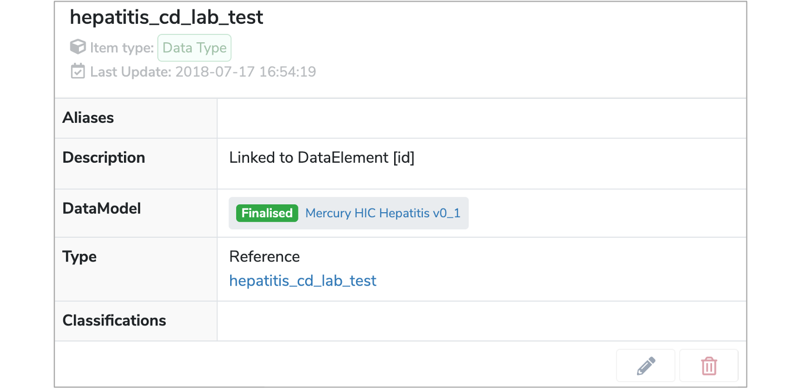
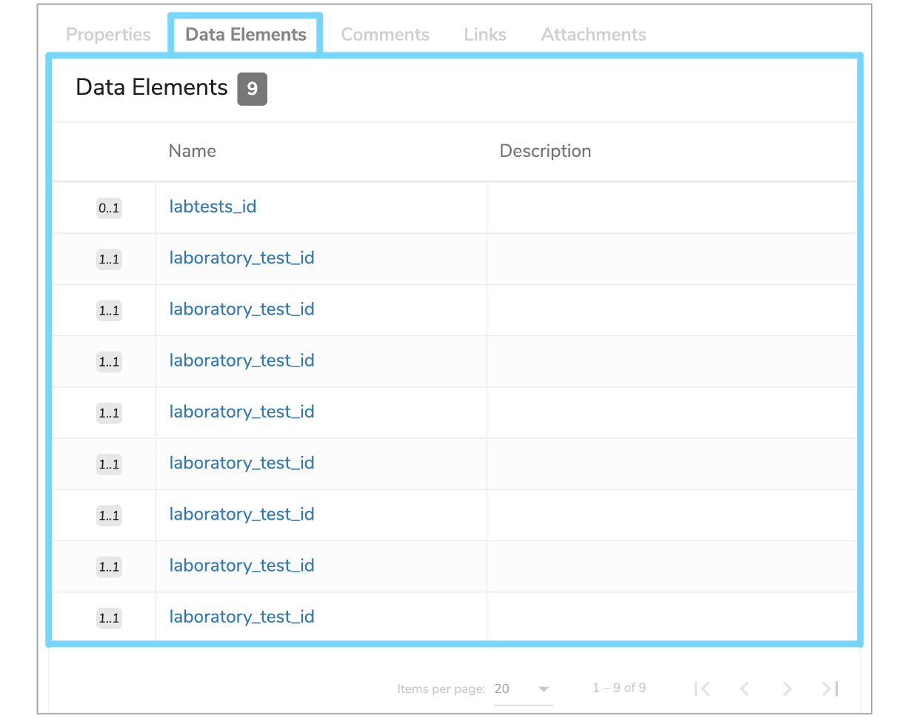

##What is a Reference Data Type?

A **Reference Data Type** is one of the four possible [Data Types](../data-type/data-type.md) within [Mauro Data Mapper](https://modelcatalogue.cs.ox.ac.uk/mdm-ui/#/home). It is used to describe relationships between different [Data Classes](../data-class/data-class.md) within the same [Data Model](../data-model/data-model.md). Typically, **Reference Data Types** ‘refer’ and consequently link to another specified **Data Class**.  

---

##How are Reference Data Types used?

By using **Reference Data Types** to link similar **Data Classes** together, users don’t have to repeatedly add in new **Data Classes**, if a similar version already exists. 

For example, consider a **Data Model** where you have a **‘Patient’ Data Class** and a **‘GP’ Data Class**. Within the **‘Patient’ Data Class**, there may be a [Data Element](../data-element/data-element.md) called **‘registeredGP’**. This **Data Element** refers to the **‘GP’ Data Class**, and therefore it is a **Reference Data Type**. 

In the details panel of a **Reference Data Type**, a link to the **Data Class** it refers to is displayed in the **‘Type’** field. Clicking this link will navigate you to the details panel of that particular **Data Class**, where you can view all its associated **Data Elements** in the **‘Content’** tab below the details panel.  

 

You can also view all the **Data Elements** that use that **Reference Data Type** by selecting the **‘Data Elements’** tab underneath the details panel. This will display the [Multiplicity](../multiplicity/multiplicity.md), **Name** and **Description** of each **Data Element**. 

 

---