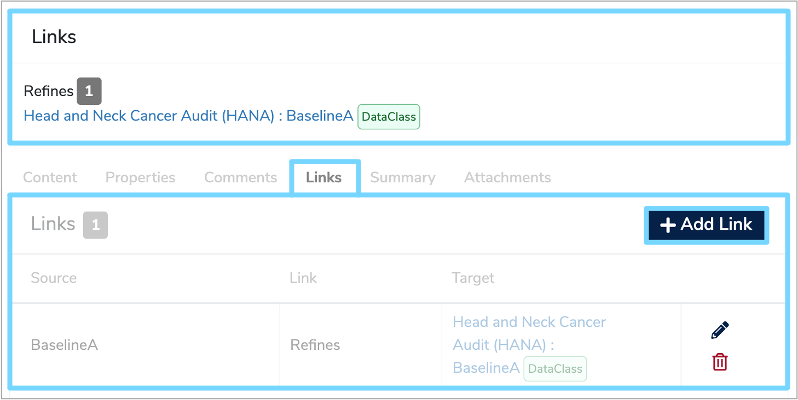

##What is a Semantic link?

The term semantics refers to the meaning of data. It is essential that whenever data is produced in one system and used in another, it’s meaning remains consistent between the two systems. This is known as semantic interoperability. 

Therefore, a **Semantic link** indicates that there is some sort of relationship between two descriptions of data. 

---

##How are Semantic links used?

There are two types of **Semantic links** used within [Mauro Data Mapper](https://modelcatalogue.cs.ox.ac.uk/mdm-ui/#/home). 

### Refines

The most common type of semantic relationship is a **‘Refines’** link. Refine means to improve and in this context it signifies improving the quality and amount of information provided. Consequently, when one description refines another, it means that everything that is true about one description is also true about the other description, whilst often adding more information or context. 

For example, if a description of a column in a database specification refines an item in a [Data Standard](../../glossary/data-standard/data-standard.md), then everything the **Data Standard** says about that data item applies to the column. The rest of the database specification may contain more information about that column, such as specific conditions or constraints, but the description in the **Data Standard** still applies.

This type of **Semantic link** can be created between [Data Models](../../glossary/data-model/data-model.md), [Data Classes](../../glossary/data-class/data-class.md) and [Data Elements](../../glossary/data-element/data-element.md).

Similarly, you can also create a **‘does not refine’** link which is used to indicate that the present definition is not intended as a refinement of another. 

If a **Data Model**, **Data Class** or **Data Element** contain any **Semantic links**, these are summarised in a **'Links'** table below the details panel when the relevant data is selected in the **Model Tree**. This table displays a hyperlink to the target data the **Semantic link** refers to, as well as the type and total number of links.

Links can be edited, created or removed in the **'Links'** tab below the details panel. To edit the type of link or the target, click the **'Edit'** encil icon to the right. 

To add a link click **'+ Add Link'** and you will be able to specify the type of link and select the target. Click the green tick to confirm and save your changes. 

---