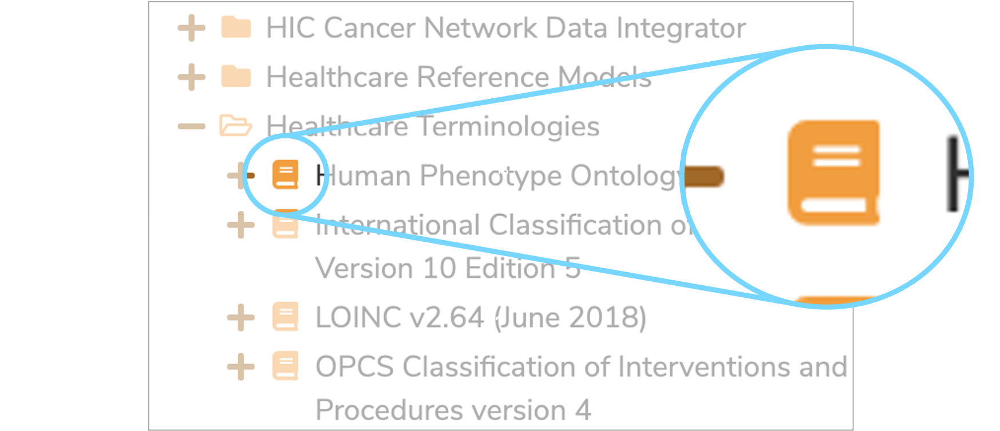
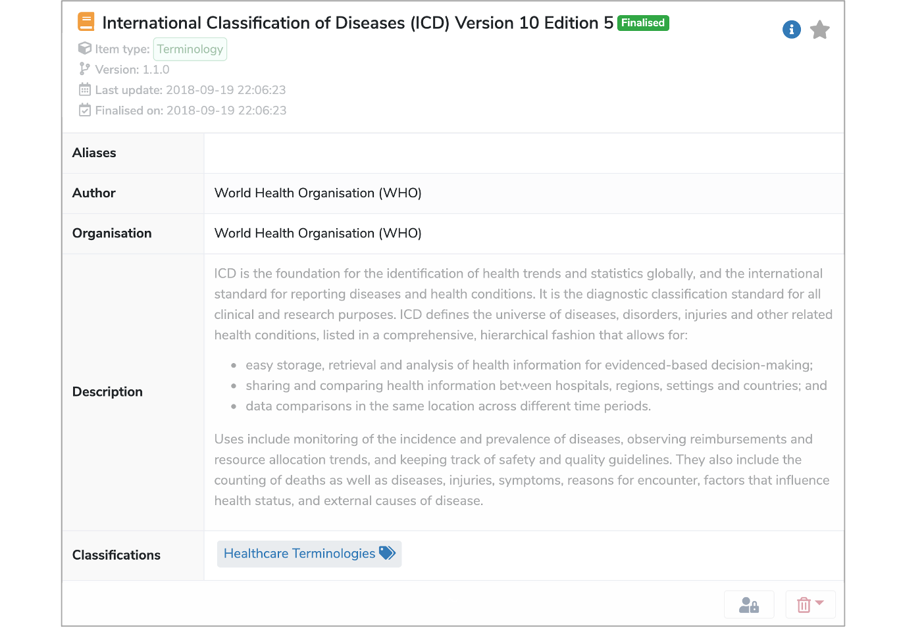
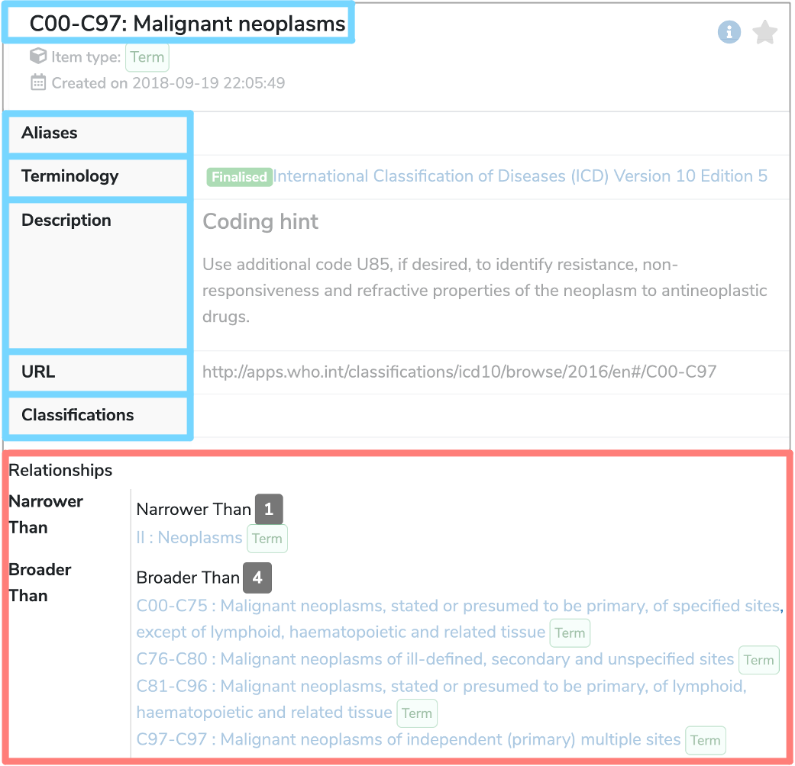

##What is a Terminology Data Type?

A **Terminology Data Type** is one of the four possible [Data Types](../data-type/data-type.md) within **Mauro Data Mapper**. It is used to describe a structured collection of **Enumerated Values** which have relationships between different data terms. 

---

##How are Terminology Data Types used?

**Terminology Data Types** have now been expanded in **Mauro Data Mapper** to **‘Model Reference’**. **Model References** can now point to a **Terminology**, a **CodeSet** or a **ReferenceDataModel**.

### Terminology

A **Terminology** is a vocabulary, or a collection of allowable **Terms** as well as any relationships between them. A **Term** typically has a coded key and a human-readable value, along with some other information. Any relationships between pairs of **Terms** can be defined, including the relationship stating that one **Term** has a broader or narrower meaning than another **Term**.  

For example, a hierarchy of **Terms** denoting patient diagnoses might include a general **Term** to indicate some form of Diabetes. This may be related to more specific **Terms** to indicate a particular form of Diabetes such as Type 1 Diabetes.

**Terminologies** are represented by a book icon in **Mauro Data Mapper** and you can browse through several different databases by selecting **‘Healthcare Terminologies’** in the **Model Tree**. 

 

Further details of the particular **Terminology** can be found in its details panel when selected.

 

To view information relating to a specific **Term**, select the relevant **Term** in the **Model Tree** and its corresponding details panel will be displayed. 

Each **Term** has a:

* [Label](../label/label.md)  
	This is the unique name of the **Term**.

* [Aliases](../aliases/aliases.md)  
	Alternative names that can help locate the **Term** when searched for.

* **Terminology**  
	The **Terminology** that this **Term** is associated with.

* **Description**  
	A definition either written in html or plain text which explains any contextual details relating to the **Term**.

* **URL**  
	A URL to the original definition of the **Term**.

* **Classifications**  
	These are effectively tags that you can apply to the **Term**.

Below the details panel, is a list of **Relationships** between the selected **Term** and other **Terms** within the specified **Terminology**. 

 

### CodeSet

A **CodeSet** is a selection of terms, which may be taken from one or more **Terminologies**. For example, a **CodeSet** would be all the **Terms** that describe the different variants of Diabetes. 

### ReferenceDataModel

**ReferenceDataModels** are similar to a large database containing lots of detailed information and properties that would be too difficult to accurately manage in an **Enumeration** list. 

For example, consider the NHS organisation codes. This list includes all the organisation codes that represent each hospital, GP surgery and other practices. Alongside this organisation code could also be a name, an address and the details of the main contact at each hospital or surgery. Therefore, each data item has many different properties associated with it.   

---