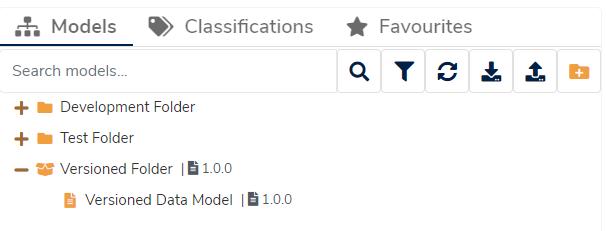

## What is a Versioned Folder?

A **Versioned Folder** shares the same traits as both a [Folder](../folder/folder.md) and a catalogue model. It is both:

* A [Folder](../folder/folder.md), in that it is a container for holding other catalogue items, and
* A catalogue item that can be finalised, versioned, branched and/or forked to make new draft versions.

A **Versioned Folder** is a _version controlled_ folder, allowing the entire contents of the folder to be finalised and set to particular versions in one operation. **Finalising** a **Versioned Folder** has the same effect as **Finalising** any other model, locking the folder (and its contents) to a set version.

## Why use Versioned Folders?

A **Versioned Folder** gives the benefits of both organisation _and_ workflow management in one go.

There are several scenarios where a **Versioned Folder** may be useful:

1. Your catalogue may be very large and contain many interconnected models that must be managed together.
2. Larger sections of your catalogue may need to be version controlled as a whole, rather than individually **Finalising** many smaller data models. Synchronisation of version numbers is also a big benefit to this approach.
3. A **Versioned Folder** may act as the repository for a large model collection which should be published as one collection. Using a **Versioned Folder** also allows for the more complex workflow strategies of branching and forking but across an entire collection.