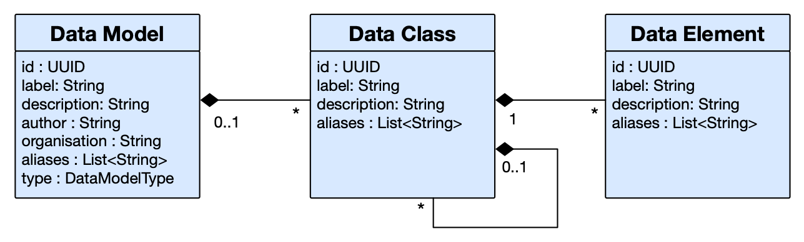
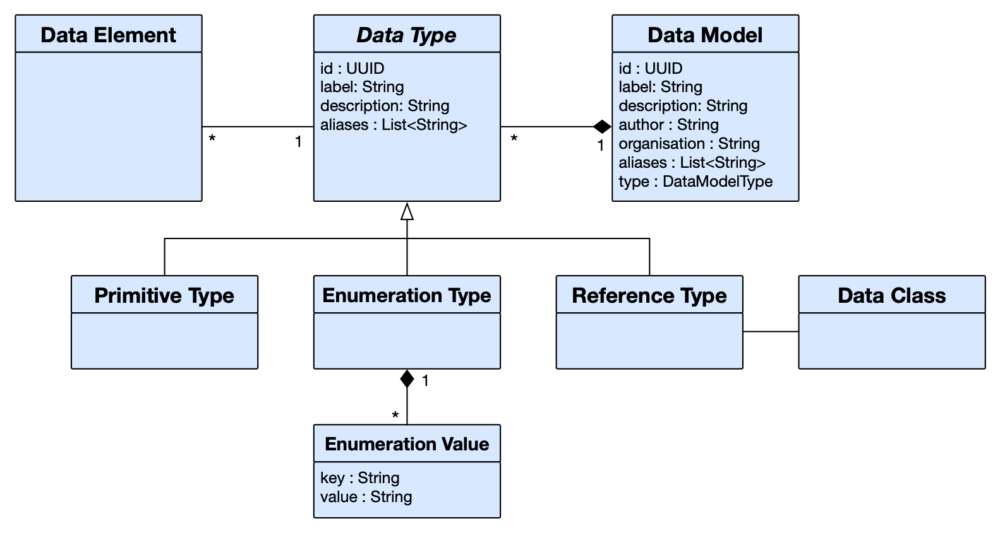
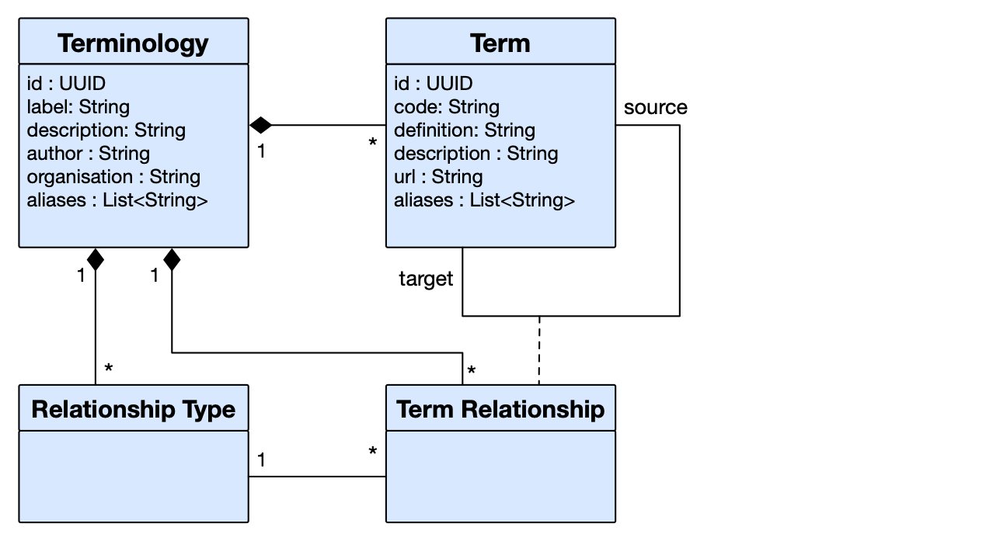
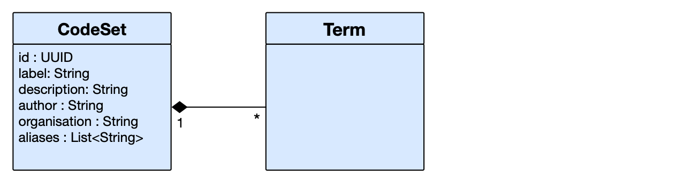
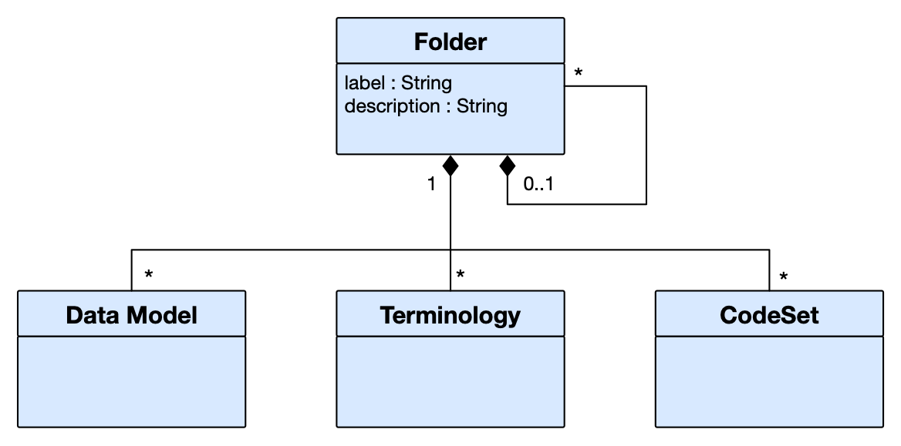
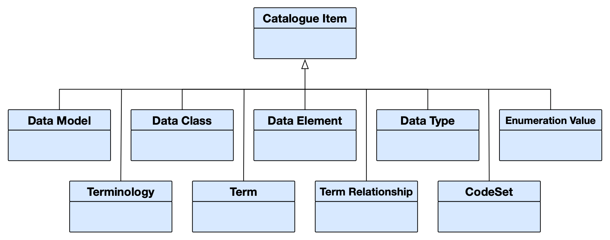
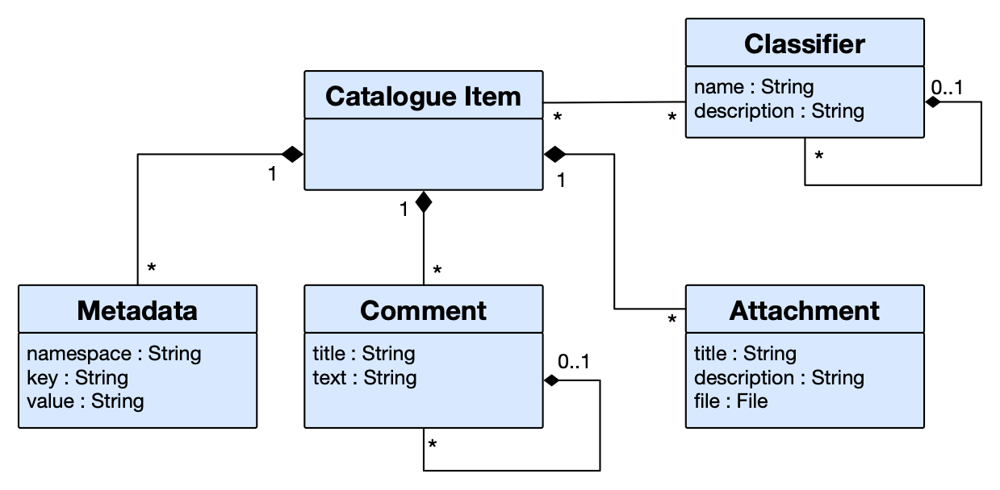

The Metadata Catalogue supports a variety of concepts which are not new, but are frequently referred to in different tools or applications by other
names, or with different semantics.  In this article we give definitions to the terms we use, and describe their intended usage.  This page may
also serve as a lightweight guide to the underlying data model - the UML diagrams provide guidance to those wishing to understand the underlying
data structures and relationships.

## Data Models

A **Data Model** is a description of an existing collection of data, or the specification of data that is to be collected.  We use the same
notation for both types, so that they may easily be compared or linked, and we annotate the Data Model to describe them as either a **Data Asset** 
or a **Data Standard** respectively.  A Data Model has a label, which is used to uniquely identify it within the catalogue.  It may also have a
description, a number of alternate names (aliases), an author, and an organisation.  

A Data Model contains a number of **Data Classes**: groupings or collections of data points that share some common context: for example appearing
in the same table of a database, or the same section in a form.  A data class has a name, a description, some aliases, and may contain further 
(sub-) data classes.  It has a maximum and minimum multiplicity, determining how many times data in this class may appear.  For example, optional
data may have a minimum multiplicity of 0 and a maximum multiplicity of 1; mandatory data may have a minimum multiplicity of 1; data which may
occur any number of times is given a multiplicity of '*' (represented as -1 internally). The name of a data class is unique within its
context (parent Data Model, or Data Class).

A data class contains a number of **Data Elements**: the description of an individual field, variable, column, or property.  A data element has a
label, which must be unique within its containing Data Class.  It has a description, some alternate names, and a multiplicity.  The range of
possible values that it may take are described within its data type: a reference to a Data Type stored within this model.

A **Data Type** may be one of three sorts:

- a **Primitive Type** such as a String, a Date or an Integer.
- an **Enumerated Type**: a constrained set of values such as you might see for a gender or an ethnicity.  Each Enumeration Type defines a number
 of **Enumeration Values**: a coded key, and a human-readable value.
- a **Reference Type** referring to another class within the same model - used to describe relationships between Data Classes within a model.  

## Terminologies

A **Terminology** can represent a complex ontology, a structured collection of enumerated values, or something inbetween.  A terminology is stored
in the catalogue in a similar manner to a Data Model: it has a unique label, a description, an author, an organisation, and some alternate
names.  A Terminology contains a number of **Terms** which themselves have a code, a human-readable definition, a URL which can be used to point
to a definitive definition, and a description, which may be more verbose than the stated definition.  

Pairs of terms inside a terminology may be related: within the Terminology we store a number of **Term Relationships** - each of which has a source
and target term.  The Term Relationship is annotated with the **Relationship Type** - one of a set of types which are defined separately for each
terminology.

## Codesets

A **CodeSet** is a named collection of terms which may be pulled from multiple terminologies.  It has similar fields to a Data Model: A label
(which must be unique within the system), a description, an author, organisation, and alternate names.

## Folders

A **Folder** is the principle mechanism for classifying and organising structures within the Metadata Catalogue.  Folders may contain sub-folders, 
and each folder may contain Data Models, Terminologies or Code Sets.   A folder has a label, which must be unique within its container (parent
 folder, or within the top-level of the folder hierarchy).   

## Data Flows

Currently undocumented

## Additional features

All items in the Metadata Catalogue conform to a simple notion of **Catalogue Item** which has additional properties.  These are outlined in the
following subsections.

### Metadata / Properties

Each Catalogue Item holds an extensible list of **Properties** (historically called Metadata), which can store arbitrary additional information 
about the Catalogue Item.  Each property is identified by a namespace, and a key, and stored a value.  

### Attachments

Each Catalogue Item can also hold **Attachments**: files relating to the item in question - potentially providing additional documentation or 
context.  Each attachment has a title, a description, and the file itself.       

### Comments

Any Catalogue Item may have **Comments** attached.  Each comment has a title and some text, and these comments may themselves have further comments
(replies in the sense of a forum or messageboard).  

### Classifiers

**Classifiers** provide a means for further classifying or tagging items within the catalogue.  Classifiers contain a label and a description, and
may hold further sub-classifiers.  These classifiers may be managed separately by users, having their own read/write permissions.   

## Semantic Links

Currently undocumented

## Summary Metadata

Currently undocumented

 
<!--  LocalWords:  UML dataModel png dataType inbetween Codesets
 -->
<!--  LocalWords:  CodeSets codeSet CodeSet catalogueItem
 -->
<!--  LocalWords:  messageboard
 -->
