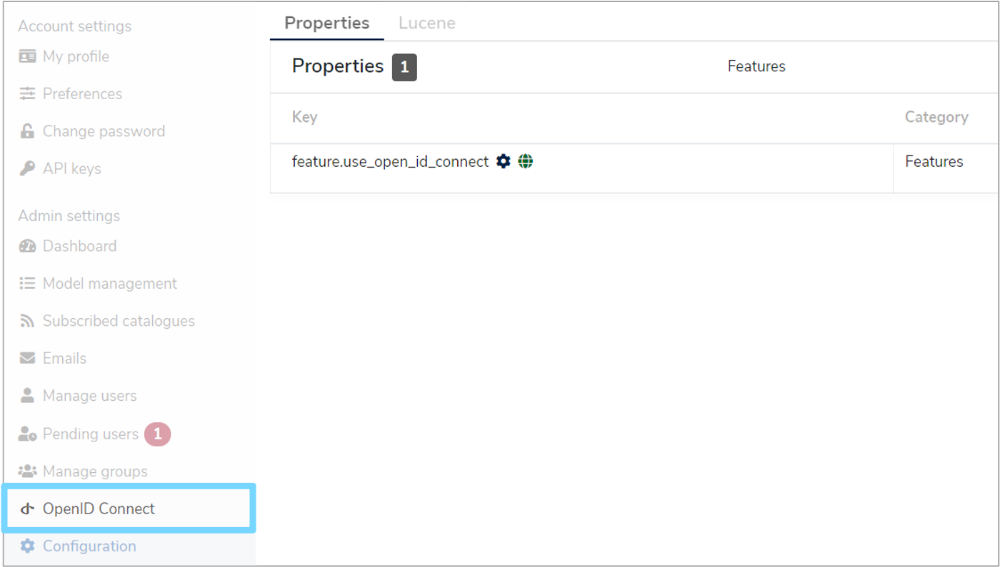
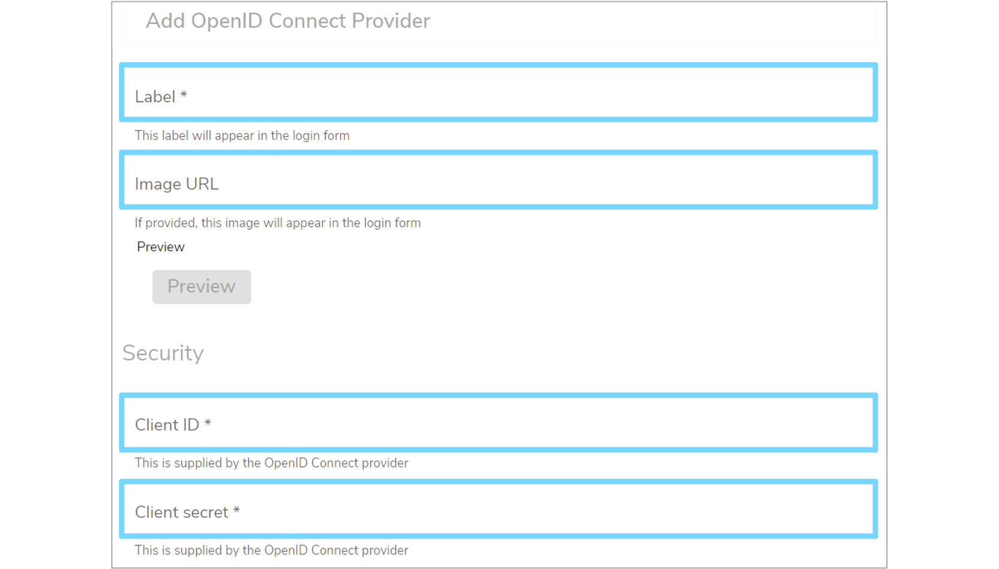
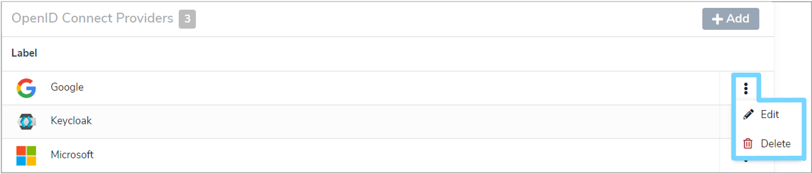
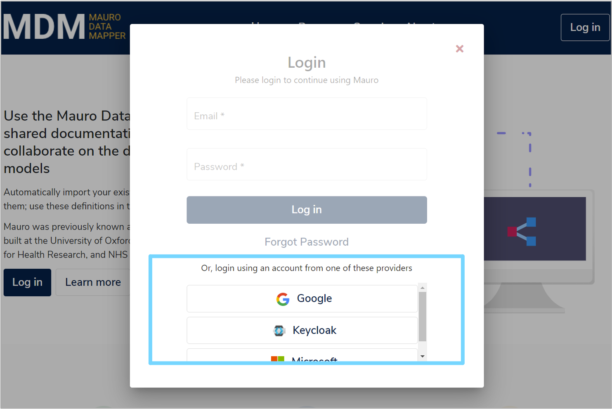

## 1. Overview

Using an optional plugin for Mauro security, it is possible to extend authentication of users in Mauro to also include [OpenID Connect](https://openid.net/) authentication. This allows administrators to:

* Configure external providers that support the OpenID Connect standard, such as Google, Microsoft, etc, to be included as **'sign-in'** options for Mauro
* Manage users of different account types to still be authenticated and authorized to use Mauro, using the existing user groups and permissions features

This allows users of Mauro to sign in, or register, using a non-Mauro account, such as a user's existing Google/Microsoft account, and still get access to the Mauro catalogue with suitable Mauro permissions assigned.

---

## 2. Administrator setup

!!! Note
	This section applies to administrators of Mauro only.

There are a number of steps an administrator must carry out before the OpenID Connect authentication can be used by users.

### 2.1 Install the plugin

The Mauro OpenID Connect Authentication must be installed on the Mauro instance. See the [instructions for installing plugins](https://maurodatamapper.github.io/installing/docker/#additional-backend-plugins), as well as the [GitHub repo README file](https://github.com/MauroDataMapper-Plugins/mdm-plugin-authentication-openid-connect).

### 2.2 Enable the feature

As this is an optional feature, the user interface will not show OpenID Connect configuration elements by default. To allow OpenID Connect to be used, you will first need to click the white arrow next to your user icon and then select **'Configuration'** from the dropdown menu.

This will bring up the **'Configuration'** panel. Click the **'Properties'** tab and then click **'+Add'**.

An **'Add Property'** form will appear which you will need to complete. Click the **'Select the property to add'** box and select **'feature.use_open_id_connect'** from the dropdown menu, which will automatically fill in additional fields. Select **'Yes'** from the **'Value'** dropdown menu and then click **'Add property'**.

A green notification box will appear at the bottom right of your screen confirming that the **'Property was saved successfully'** and the **OpenID Connect** option will now be available in the administration navigation menu.

### 2.3 Create OpenID Connect providers

Each OpenID Connect provider service must be created and configured via the site for each provider e.g. Google, Microsoft etc. There are three providers which can be bootstrapped (added automatically when the aplication starts up) using the build configuration files.

These three providers are: 

* **Keycloak**  
	Using `${openidConnectConfig.baseUrl}/realms/${openidConnectConfig.realm}/.well-known/openid-configuration`
	
* **Google**  
	Using https://accounts.google.com/.well-known/openid-configuration
	
* **Microsoft**  
	Using https://login.microsoftonline.com/common/.well-known/openid-configuration)

### 2.4 Add providers to Mauro

Once the OpenID Connect provider service has been configured, the details can be entered into Mauro. Remember that you can have more than one of each type of provider as long as each has a unique **Label**. Click the white arrow next to your user icon and then select **'OpenID Connect'** from the dropdown menu. This will bring up a list of **'Open ID Connect Providers'**. Click the **'+ Add'** button and a **'Add OpenID Connect Provider'** form will appear which you will need to complete. 

* **Label**  
	An identifying label for this provider. This will also be the text used when displaying the login button in the login form, so use a suitable name

* **Image URL** (optional)  
	The URL to a public image that can be used as an icon for the login button.
	A live preview button is available to test this field

* **Client ID**  
	The unique client ID that was provided by the OpenID Connect service to be used

* **Client Secret**  
	The unique client secret/password that was provided by the OpenID Connect service to be used

Next, enter the **'Discovery'** details for the OpenID Connect service. There are two **'Discovery'** forms:

* **Standard**  
	Providing a URL to a standardised **dicovery document** allows Mauro to automatically connect to the service and ascertain the necessary endpoints required for authorization, obtaining tokens etc

* **Non-Standard**  
	If the service does not provide a discovery document, then the alternative is to manually enter the endpoints required
	

Tick the **'Use discovery document for endpoints'** checkbox as appropriate and enter the necessary details.

Alternatively, you can enter **advanced** details by expanding the **'Authorization endpoint parameters'** section. If not explicitly defined, Mauro will pick suitable defaults for these values. Once finished, click the **'Add provider'** button to create the provider in Mauro.

### 2.5 Edit/delete providers

Once created, OpenID Connect providers can be edited or deleted in Mauro through the **'OpenID Connect'** administration page. Click the white arrow next to your user icon and then select **'OpenID Connect'** from the dropdown menu. This will bring up a list of **'Open ID Connect Providers'**. Click the vertical dot menu to the right of the provider you wish to edit or delete and select the relevant option from the dropdown menu. 

---

## 3. Testing

Once the OpenID Connect providers have been added to Mauro, they can be tested by viewing the login form. Click the **'Log in'** button at the top right of the navigation bar.

A login form will appear and will now show the standard email/password fields, plus a list of all OpenID Connect providers added to Mauro. Click on any of these provider buttons to be automatically redirected to that provider service and authenticate using their account.

If successfully authenticated, the user will be automatically redirected back to Mauro and signed in just like any other user.

---