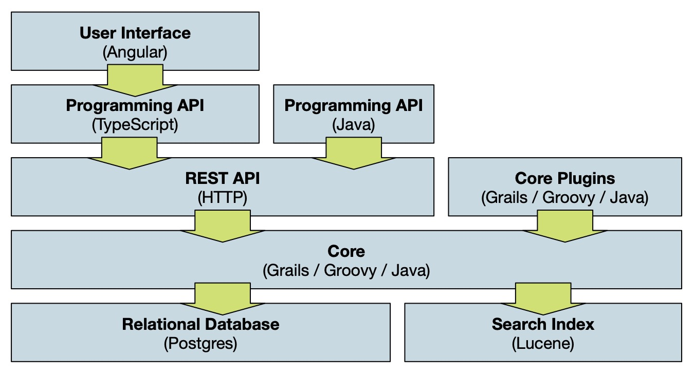

## Overview

**Mauro Data Mapper** is built using a fairly common layered design. At the heart is a standard, relational database where all data is primarily stored. 

All interaction with the database is controlled through business logic within the '[Core](#core)' layer. Interfaces around the core allow interaction at
different levels of abstraction

### Relational Database

**Mauro Data Mapper** has been built on top of [PostgreSQL](https://www.postgresql.org) and in particular is tried and tested against **PostgreSQL** version 12. However, we've taken care not to use any clever features or plugins so that the majority of the code _should_ run against any recent version of **PostgreSQL**.

Furthermore, since the interaction with the relational database is based upon the [Hibernate ORM](https://hibernate.org) it could even be possible to
rebuild against other database implementations, but we've yet to try. The only exception is during integration testing, in which an in-memory h2
database is used in order to speed up testing.

System administrators with access to the database can access the data directly, and this is the preferred route for
[taking backups](../../installing/administration#backing-up-the-database). However, editing or interpreting the data directly through the database is not recommended, as this will bypass the business logic in the core, with potential loss of system integrity.

---

## Core

The **Core** component is built using [Grails](https://grails.org) (version 4), which is a Java-based Model-View-Controller framework. Code is typically
written in **Groovy**, which itself compiles down to Java. Much of the **Grails** framework is built on top of the widely-used Spring components.

The **Core** codebase defines the object-oriented domain model, which specifies the structure and constraints on the underlying model. All program logic is contained within **Services** and **Controllers**, with **Views** defining the structure of any outputs to procedures or requests.

---

## REST API

The **REST API** is a logical layer, defined completely within the **Core** component and is the standard way of interacting with the platform. A
standard [REST](https://en.wikipedia.org/wiki/Representational_state_transfer)-style interface makes use of standard HTTP commands, for example
`GET`, `POST`, `PUT`, and `DELETE`. Each [REST endpoint](../../rest-api/introduction) is defined by a **Controller** and **View** within the **Grails
Core**. Some endpoints are aliased for ease of use, or backwards compatibility, and there is genericity built in to make programming against the API
easier. Plugins may extend the API with new endpoints.

Each endpoint typically receives and responds in JSON; some can use XML but this is less well tested. Custom data formats apply in particular
circumstances - for example when dealing with file attachments.

---

## Programming APIs

The programming APIs wrap **REST** commands in programming constructs to make it easier for programmers to interact with **Mauro Data Mapper** without being concerned with the technical details of the **REST API**. Of the three current APIs, the [Java library](../client/java) is most mature and is able to re-use components of the **Grails Core** for a faithful representation of the underlying object model. 

The Java API is suitable for programming complex import and export routines and has built in support for a number of batch operations that are not easily achieved through the web user interface. The Java client also supports connections to multiple instances, making it a good tool for implementing more sophisticated federation mechanisms.

The [Typescript API](../client/typescript) is a much simpler wrapper around those endpoints used by the web interface. It is hosted as a separate
component and can be installed using `npm`, the standard package manager for javascript applications.

---

## User Interface

The web-based user interface is defined in [Angular 9](https://angular.io) using the [Angular Material](https://material.angular.io) library for
look-and-feel. It is a self-contained, single-page web application which makes use of some additional typescript libraries (for rendering diagrams,
providing notifications, etc) on top of the standard ones provided by Angular. 

It *only* uses the **REST API** (via the typescript client library) to communicate with the **Core**, and is built in a modular fashion to allow easy extensibility. Many of the components can be easily re-used in the creation of other web interfaces.

---

## Grails Plugins

The **Grails Core** provides an easy mechanism for extension, through standard **Grails** plugins. A number of pre-defined extension points are available. For example, to implement new importers, exporters, profiles, or authentication mechanisms. However plugins may also arbitrarily extend the **REST API** with custom functionality, making use of the services and controllers defined within the core. 

A number of plugins are defined and made available through the central **GitHub** plugins organisation; developers may feel free to use and adapt those, or write their own, sharing if they wish. Note that some technical plugins such as the **SPARQL** or **Apache Freemarker** plugins allow users to perform their own queries against the database and arbitrarily
complex queries may affect the performance of the server.

The **Core** component is itself made up of a number of plugins, and can be disassembled for particular use cases. For example, it is possible to disable
support for API Keys by compiling a version of the **Core** with that plugin removed.

---

## Search Index

The search index improves the performance of searching, this content is stored in-memory (and persisted to files on disk at suitable intervals). In some places in the **Core**, it may also be used
to speed up access to particular model contents. 

The index is built using [Apache Lucene](https://lucene.apache.org) but managed in the code through Hibernate. This means that it is always kept in sync with the database contents, but it can be [re-indexed](../../installing/administration) if necessary.

The contents of the search index can be hard to inspect for debugging purposes! We use a tool called [Marple](https://github.com/flaxsearch/marple) but be sure to use a compatible version!

---
