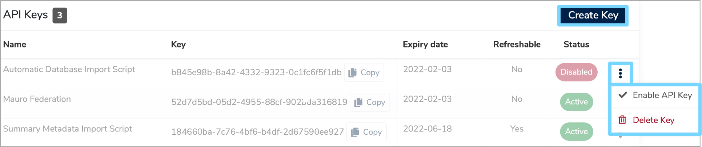

API keys offer an alternative way to authenticate to the **Mauro Data Mapper REST API** instead of logging in with a username and password and saving session cookies. This is the recommended method for authenticating when you:

* Have long-running processing scripts which could cause sessions to timeout between calls
* Need to store authentication details in clear text for an external application to use

Each user can create multiple API keys, and so when sharing with multiple applications, can disable access individually. API keys are also 
configured with a default expiry date for additional security.   

---

## Creating an API Key

API keys may be set up through the web interface or via the API. To generate a first API key, the user must be logged in using a username and 
password - either through the web interface, or through the REST API.  

On the top right of the menu header, click the white arrow next to your user profile and select **'API keys'** from the dropdown menu.


This will take you to a list of existing API keys that belong to you. Here, you can enable or re-enable existing keys by clicking the three vertical dots to the right of each item in the list. This dropdown menu also allows you to delete keys.



For each API belonging to the user, the list displays:

* **Name**  
  This is a human readable name for each API key, which must be unique for each user. Users can use the name to differentiate between different keys 
  used for different purposes.
 
* **Key**  
  This is the key itself, which is a UUID, unique to this user. Keys can be copied to your clipboard by clicking **'Copy'** on the right of the key box.

* **Expiry date**  
  This is the date from which the API key will no longer be valid. For security purposes, every API key is given an expiry date, but may be 
  **'refreshed'** before expiry.
  
* **Refreshable**  
  Specifies whether an API key can be refreshed once it has expired.

* **Status**  
  Details whether an API key is **'Active'** or **'Disabled'**.

To create a new API key, click the **'Create Key'** button at the top right of the list. This will open a **'Create an API Key'** form which you will need to complete.

Enter the human-readable name of the API key (as described above), choose a number of days before expiry and select whether the key is to be refreshable on expiry or not. Once completed, click **'Create Key'** to confirm your changes.


---

## Using an API Key

To use an API Key, simply add it into the headers of any REST API call.  

!!! info
    If you use API keys to authenticate, the session cookies are not used to persist identity and so the key should be passed with every call.

The header key should be `apiKey` and the value should be the UUID value of the API key itself.

---

## Using Postman

If you are using [Postman](../postman) as a client, there are two ways to configure the API key for a request, which both have the same result.  

Firstly, select the **'Authorization'** tab which will display several fields that you need to complete. From the **'TYPE'** dropdown menu, select **'API Key'**. In the **'Key'** box on the right hand side type `apiKey`. Enter the value of the API key in the **'Value'** field and select **'Header'** from the **'Add to'** dropdown menu.


The API key must be passed in the headers, not in the query parameters, which is the second method. This method sets the headers automatically, although you can also set them manually. Select the **'Headers'** tab which will display a list of **Keys** and **Values**. Again, set the **'Key'** field to `apiKey` and the **'Value'** field to the API key value.   


---

## Refreshing an expired API key

When an API key has expired and it has previously been marked as **'Refreshable'**, then it may be refreshed with a new expiry date. 

To do this, navigate to the list of **'API keys'** via your user profile. Identify which API keys have **'API Key expired'** in the **'Expiry date'** column. Click the three vertical dots to the right of the relevant API key and you will now have the option to **'Refresh API Key'** in the dropdown menu. Select this option and then enter a new number of days for expiry. 


---

## Revoking an API key

To revoke a particular API key, you can mark it as **'Disabled'**. Navigate to the **'API Keys'** list and click the three vertical dots to the right of the relevant API key. Select **'Disable'** from the dropdown menu. The same option will allow you to re-enable the key if necessary.

!!! info
    It is good practise to set up different API keys for each application. In this way it is easy to revoke access to a single application without having to recreate all other keys and update other application settings.

---

## Managing keys through the REST API

!!! info
    Note that API Keys can only be managed by the user that they belong to.


Once [authenticated](authentication.md), the endpoint for listing existing API keys is:

<endpoint class="get">/api/catalogueUsers/**{catalogueUserId}**/apiKeys</endpoint>

This returns a [paginated](pagination.md) list of API keys as follows:

=== "Response body (JSON)"
    ```json
    {
      "count": X,
      "items": [
        {
            "id": "b845e98b-8a42-4332-9323-0c1fc6f5f1db",
            "apiKey": "b845e98b-8a42-4332-9323-0c1fc6f5f1db",
            "name": "Test API Key",
            "expiryDate": "2022-02-03",
            "expired": false,
            "disabled": true,
            "refreshable": false,
            "createdDate": "2021-02-03"
        },
        ...
      ]
    }
    ```
The parameters are as described above. The `id` field is the global primary key identifer for the key.

To create a new API key, post to the following endpoint:

<endpoint class="post">/api/catalogueUsers/**{userId}**/apiKeys</endpoint>

The body of the post method should be structured as follows:

=== "Request body (JSON)"
    ```json
    {
      "name":"My Name",
      "expiresInDays":365,
      "refreshable":true
    }
    ```

Where the parameters are as described above.

To enable an existing, disabled API key, you can use it's ID (as described above), with the following endpoint:

<endpoint class="put">/api/catalogueUsers/**{catalogueUserId}**/apiKeys/**{apiKeyId}**/enable</endpoint> 

Similarly, to disable an existing, enabled API key, use the following:

<endpoint class="put">/api/catalogueUsers/**{catalogueUserId}**/apiKeys/**{apiKeyId}**/disable</endpoint>

To refresh an API key, provide the number of days before the next expiry with the following endpoint:

<endpoint class="put">/api/catalogueUsers/**{catalogueUserId}**/apiKeys/**{apiKeyId}**/refresh/**{expiresInDays}**</endpoint> 

Finally, to delete an API key identified by a particular UUID:

<endpoint class="delete">/api/catalogueUsers/**{catalogueUserId}**/apiKeys/**{id}**</endpoint>

---