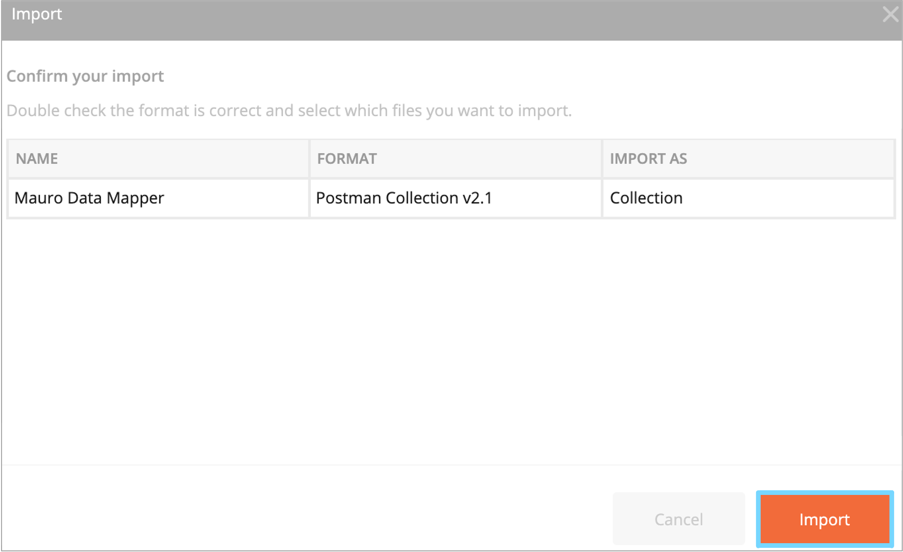
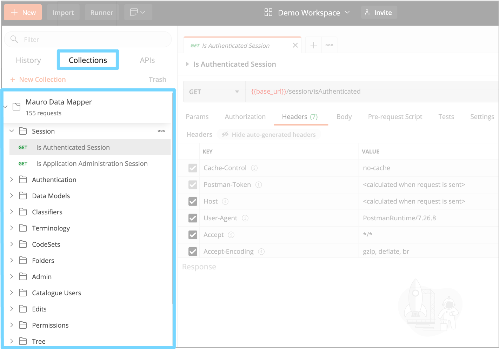
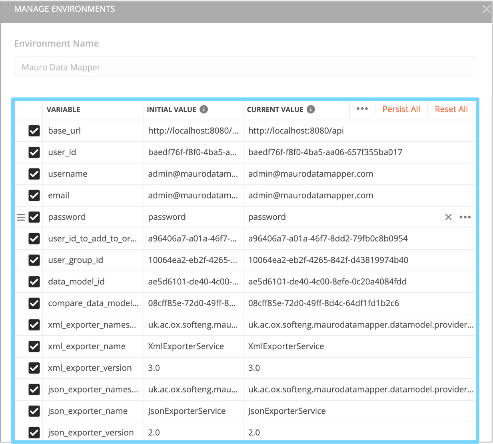

The [Postman app](http://www.postman.com) is a tool for working with external APIs. Originally a plugin for Google Chrome, it now comes as a desktop
app for all operating systems, as well as providing a web version.

## Downloading

The [Mauro Postman repository](https://github.com/MauroDataMapper/postman-library) provides definitions for Postman in order to test the Mauro APIs
and contains sample environment configurations. To use, simply clone the repository into your local system, or download the files as follows:

- Navigate to the [main branch of the GitHub repository](https://github.com/MauroDataMapper/postman-library/tree/main)
- Choose a folder to match the version of mdm-core that you intend to run against
- Download the two listed JSON files - one for the 'Collection' and another for the 'Environment'

## Using the collection

Within the Postman app, choose **File** -> **Import...** and under the **File** tab, choose **Upload Files**. Select the collection JSON file, and
click **Import** to import the new collection. If you've previously imported an older version of this collection, you are asked whether you wish to
import as a new copy, or overwrite the previous version.

In the **Collections** tab on the right-hand side, you can now see a number of folders (and sub-folders) containing configuration for Mauro API
endpoints. By clicking on each you can view the endpoint, and optionally execute it against a given server.

Parameters to the call, including the server name, are indicated by double braces `{{ ... }}` - e.g. `{{base_url}}` in the URL of the endpoint.  
To instantiate these parameters, you can either replace the text manually, or use an environment to provide consistent replacements across all
endpoints. The Mauro Postman Environment provides some default values which can be customised.

## Using the environment

To import the Mauro environment, choose **File** -> **Import...** and under the **File** tab, choose **Upload Files**. Select the environment JSON
file, and click **Import** to import the new environment

Once imported, the enviroment can be selected from the drop-down at the top-right of the screen.  To edit the environment, click **Manage 
Envronments**.  A number of parameters have been pre-set and can be edited here; new parameters can be added to suit your own usage.

## Swagger, OpenAPI

We are yet to create a description of our APIs compatible with Swagger, or OpenAPI.  However, there are tools that should automate the conversion of 
Postman collections to these formats - albeit in a manner specific to a particular environment or use-case.  Some example tools include:

- [APIMatic](https://www.apimatic.io/transformer/)
- [REST United](https://restunited.com)
- [APITransform](https://apitransform.com)

The Mauro team have limited experience with these tools and so would welcome feedback!

## Submitting changes

The Postman library is not yet complete; there are endpoints un-documented, and plenty of improvements that could be made to the environment, or 
particular usage scenarios we've not yet catered for.  If you've made changes to the postman library and think they would be of more general use, 
please do consider submitting a pull request, so we can make them more widely available.

