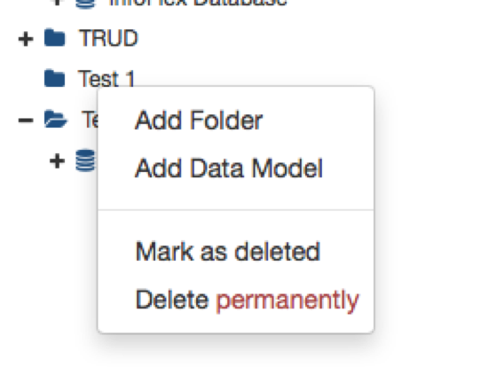
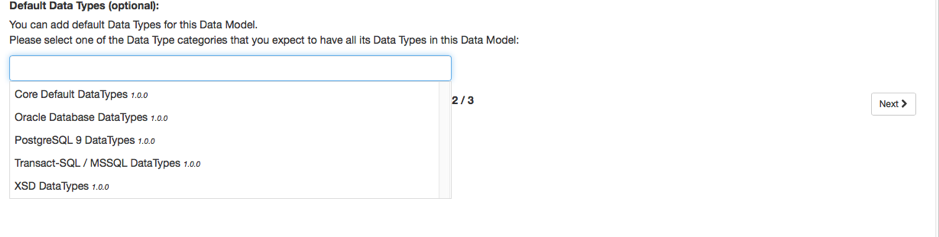
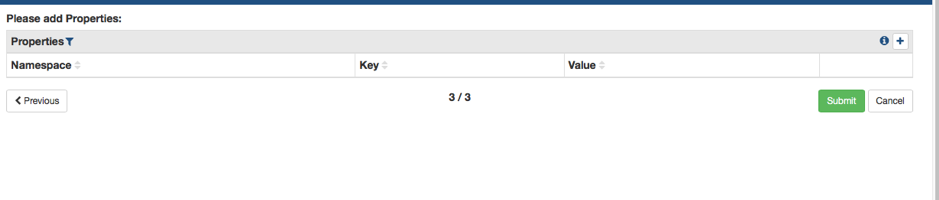

To create a new DataModel, you first need to [create a folder](creating-folder.md)

To create the model right click on the folder you’ve created and select Add data model.

Creating a data model requires the completion of some initial data:

**Label**  
The name of the data model, as it will appear in the Finder panel. This should include any asset version information, as no two models may be
 given the same label.
 
**Author**  
The name(s) of the authors of the model, or, alternatively, of the underlying data asset or specification

**Organisation**  
The name of the organisation responsible for the documentation, or the underlying data asset / specification.

**Description**  
A long-text description of the asset: this should include any information for users of the catalogue unfamiliar with the data asset or
  specification being described.

**Type**  
This will be either a Data Asset or a Data Standard.

**Classifier**  
Select from a list of existing classifiers, or type a new name to create a new classifier. You may enter multiple classifiers at this point.
All fields except description and classifications are mandatory; however we recommend completing all fields.

Once all this information has been populated, you want to click on next.

You will then have the option of selecting the default data types, once done click next.

Once you’ve added the relevant property’s click submit, and your Data model will be added to your folder and will appear in the right-hand panel if the catalogue.

