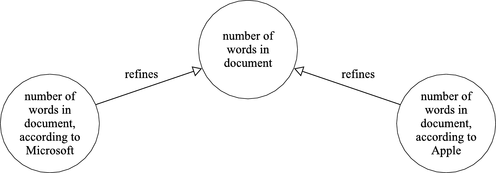
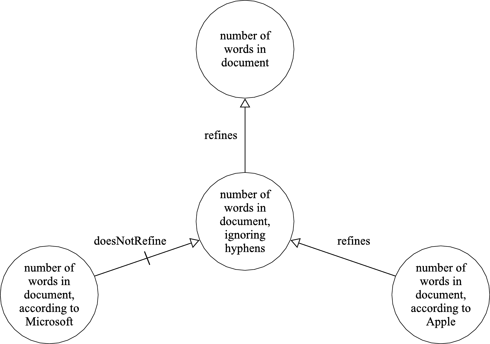

## Introduction

When defining the meaning of data, it can be helpful to point to definitions elsewhere that are already known or understood. For example, we might
like to consider that the 'Date of Birth' field in one dataset might mean exactly the same as 'Birth Date' in another. In practice, however, we rarely
find that two data elements share exactly the same context: measurements might be taken using different apparatus; answers to a question on a form may
differ depending on how the question is phrased or presented; the timing or ordering of data collection may alter the possible values.

To provide a more practical approach, in Mauro we may link two definitions to indicate that one _refines_ the other: it says everything that the other
definition says, and possibly more. In the general case, this allows us to define abstract definitions of data with minimal context - for example as a
dictionary or a data specification - and relate more concrete definitions - for example the design of a data collection form or the description of a
data asset.

We may go further and for any definitions A and B, indicate that both A _refines_ B and B _refines_ A. The two links together imply that the two
fields really are identical and share the exact same context. In practice, we've found this to be an overly strong statement and use it very rarely.

## Example

As an example, consider the three definitions given in the diagram below:

Here, we assume that the name of the Data Element - e.g. “Word Count” and the DataType - e.g. Positive Integer - is the same in each case, and we are
focusing simply on the explanatory text. The refinement arrows represent assertions that the definitions to the left and right are both refinements of
the definition at the centre. In the example, the description "number of words in document" defines a more abstract notion; the descriptions
"number of words in document according to Microsoft", and "number of words in document according to Apple" provide extra context about the means of
calculation.

Such assertions cannot be derived automatically from the explanatory text. These explanations may be subjective, and will only give a partial account
of the context. It may be that several people with expertise in how the data is captured, recorded and analysed may all need to be consulted to
provide an accurate assertion about the relationship between two descriptions.

Note that there may not be any link defined between two more concrete definitions: in this example, there is no direct relationship between the
Microsoft and Apple interpretations of the value - only that they both share some common abstract interpretation. Of course there may be some mapping
of values, or conversion algorithm, which allows data collected according to one definition to be converted into a form matching another definition -
in this case perhaps opening the document on another computer and re-running the word count. Simple mappings - for example when converting units of
measurement - can be uncontroversial, but in general they will also be subjective or suitable only for a particular purpose.

## Interpretation

There are two immediate practical applications of the linking information above. Considering the example above, first suppose that some data assets
exist for each of the two concrete definitions above - some documents whose word count has been calculated by either Microsoft of Apple software. If
the analysis only requires a value for the 'number of words in a document', then both types of data will be equally applicable and can be included in
the analysis. If, however, the requirement is for counts according to Microsoft, then those documents whose word count has been calculated by Apple
may not be suitable.

Another application might be in the provision of data according to some specification. If a data specification requires values according to our
abstract description: 'the number of words in document', and if we already have values for those documents according as calculated by Microsoft
software, then those values are suitable to provide. If, however, the specification is more concrete, and requires those word counts to have been
determined by Microsoft software, then any word counts calculated by other software, or, more importantly, _any document word count whose provenance
is not known_, will not be suitable to provide.

## Linking in Mauro

In Mauro Data Mapper, semantic links can be recorded against any model components, but are typically used between two data elements in different
models, or between an enumeration value in a data model and a term in a terminology. Other mappings - for example to indicate refinement between two
Data Classes, may be much harder to interpret, and may only be of use in particular circumstances.

As described above, the assertion of semantic links may require domain knowledge and cannot be automatically inferred from the text of a description.
In Mauro Data Mapper, links are not created automatically during ingest of models, but may be manually asserted between items individually. However,
Mauro includes a tool which will make suggestions, based on the description text of the fields, and also the name of the field, the name of the data
type and containing data class, and any enumeration values. The user interface allows users to select the best match, or choose from other
alternatives ranked by ‘closest match’. Although this doesn't remove the need for a human to make the final decision, it can save time searching for
the correct item within a target data model.

## Does not refine

As our models may represent incomplete information about the artefacts they represent, and the semantic relationships between them, we cannot infer
that no refinement exists simply because there is no _refines_ link present. To record the assertion that no refinement exists, we can use the _does
not refine_ link.

As a further example, consider the three attribute definitions given in the diagram below. Here, we have a more specific definition at the centre of
the diagram: ‘number of words in a document ignoring hyphens’. We have also an assertion that this refines the definition with the explanatory text
‘number of words in a document’. If we accept this assertion, then any data collected against the new definition can be used in any situation in which
the original definition was accepted.

We have also an assertion that the definition ‘number of words in a document according to Microsoft’ is not a refinement of this new, more specific
definition. The ‘word count’ feature in Microsoft's Word application treats hyphenated phrases as single words: it does not ignore hyphens. In
contrast, the same feature in Apple's Pages application does ignore hyphens, treating them as if they were spaces. For example, Word will count the
phrase ‘strongly-connected’ as one word, whereas Pages will count it as two words.

In general, specifying 'does not refine' as a universal statement - suggesting that there are no circumstances where item A may be used according 
to definition B - is a strong statement whose use will be limited.  However, there can be value in disambiguating or asserting a distinction 
between two similarly-defined items whose descriptions may otherwise cause confusion. 

