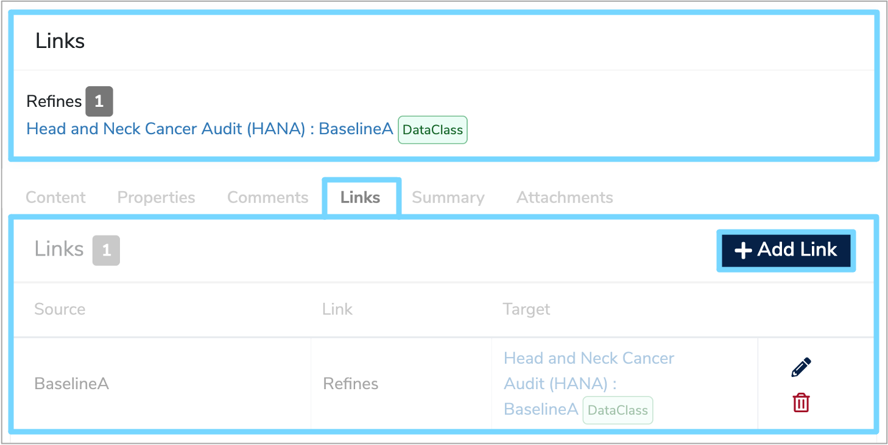

This user guide will explain the steps you need to follow to add a [Semantic link](../../glossary/semantic-links/semantic-links.md) between two descriptions of data.

---

## 1. Add a Semantic link

Firstly, navigate to the source [Data Model](../../glossary/data-model/data-model.md), [Data Class](../../glossary/data-class/data-class.md) or [Data Element](../../glossary/data-element/data-element.md) that you want to create the link from. Select the relevant data item in the **Model Tree** to display the details panel on the right. 

Any existing **Semantic links** are summarised in the **'Links'** table below the details panel. To add, edit or remove a **Semantic link**, select the **'Links'** tab, which will also display a list of existing **Semantic links**.

Click the **'+ Add Link'** button at the top right of the **'Links'** table which will add a new row. 

Complete the fields as described below:

* **Source**  
	This is the **Data Model**, **Data Class** or **Data Element** which you are linking from.

* **Link**  
	From the dropdown menu, select the type of **Semantic link** between **'Refines'** or **'Does Not Refine'**. 
	
	A **'Refines'** link is used when the description of the source **'Refines'** that of the target. In other words, everything that is true about the target description is also true about the source description, with the source description often adding more information or context.
	
	A **'Does Not Refine'** link is used when the description of the source is not intended to refine that of the target.
	
* **Target**  
	Select the target description that you want to link to. 
	
	To do this, click **'Add target'** which will open up a seperate box. Choose whether the target is a **Data Model** or a **Data Class** and then select the relevant item from the **Model Tree**. 
	
	This will automatically populate the **'Target'** field and once completed, click the green tick to save and a green notification box should appear at the bottom right of your screen confirming that the **'Link saved successfuly'**.
	
<iframe src="https://player.vimeo.com/video/521098461" width="640" height="397" frameborder="0" allow="autoplay; fullscreen" allowfullscreen></iframe>
	
--- 

## 2. Delete a Semantic link

To delete an existing **Semantic link**, navigate to the relevant link in the **'Links'** tab underneath the details panel. 

Click the **'Delete'** bin icon where you will then be asked to confirm the change. Click the green tick and a green notification box should appear at the bottom right of your screen confirming that the **'Link deleted successfuly'**.

---

## 3. Edit a Semantic link

To edit an existing **Semantic link**, navigate to the relevant link in the **'Links'** tab underneath the details panel. 

Click the **'Edit'** pencil icon which will allow you to change the **'Link'** and **'Target'** columns. Click the green tick to the right to confirm your changes and a green notification box should appear at the bottom right of your screen confirming that the **'Link updated successfuly'**.

---