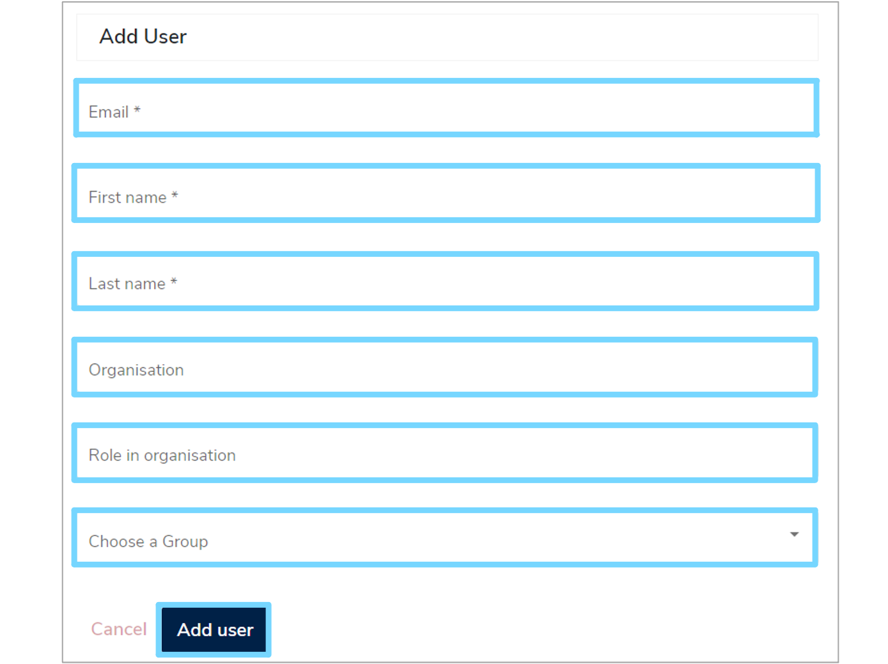

This user guide will walk you through all the options and settings that are available to adminsitrators on **Mauro Data Mapper**.

---
## 1. Dashboard

To access your admin dashboard, log in to **Mauro Data Mapper** and click the white arrow by your user profile to the right of the menu header. From the dropdown menu under **'Admin settings'** select **'Dashboard'**.

Your dashboard displays two tabs. One shows your **'Active sessions'** and the other shows the **'Plugins and Modules'** in the repository. 

--- 

## 2. Model management

As an administrator, you can delete several elements such as [Data Models](../../glossary/data-model/data-model.md) and [Terminologies](../../glossary/terminology-data-type/terminology-data-type.md). 

To do this, select **'Model management'** from the user profile dropdown menu. Select the relevant options to filter elements by type and status and the **Model Tree** displayed at the bottom of the page will automatically filter. 

Once you've found the element you wish to delete, click the checkbox until a green tick appears. You can do this for multiple elements and a summary list will be displayed on the right. Here, you will then have the option to either **'Delete Permanently'** or **'Mark as Deleted'**.

---

## 3. Emails

To access your emails, select **'Emails'** from the user profile dropdown menu. This will take you to your inbox where you can compose, edit and delete messages. 

---

## 4. Manage users 

As an administrator you can add, activate and deactive users. Firstly, select **'Manage users'** from the user profile dropdown menu. This will navigate you to a full list of all the users within the repository. Each user's full name, email, organisation, role, any groups they are associated with as well as the status of their account will be displayed. 

To order the list, you can click the small arrow to the right of each column heading. This will display the list in chronological order according to that category. To order from A-Z click the arrow until it points up. To order from Z-A click the arrow until it points down.

You can also filter the user list, by clicking the filter symbol, to the right of **'repository'**. This will display three boxes at the top of the list where you can then enter either a **'Name'**, **'Email'**, or **'Organisation'** to filter the list by.

### 4.1 Add a new user

To add a new user click the **'+Add user'** button at the top right of the **'Manage users'** page. This will bring up an **'Add User'** form which you will need to complete. 

Enter the email address, first name, last name, organisation and role for the new user. 

You then need to add the user to the correct group to define what permissions they should have. To do this, click the **'Choose a Group'** box and select the relevant group from the dorpdown menu. 

Once all the fields have been completed, click **'Add user'** and a green notification box should appear at the bottom right of your screen confirming that the **'User saved successfully'**. 

### 4.2 Reset password

To reset a user's password, click the **'Actions'** button to the right of the relevant row and select **'Reset password'** from the dropdown menu. 

A green notification box will appear at the bottom right of your screen, confirming that a **'Reset password email sent successfully'**. The user can then follow the instructions in the email to reset their password. 

### 4.3 Activate or Deactivate a user

The details of whether a user's account is **'Active'** or **'Disabled'** is displayed in the **'Status'** column.

To activate a user's account, click the **'Actions'** button to the right of the relevant user and select **'Activate'** from the dropdown menu. A green notification box will appear at the bottom right of your screen confirming that the **'User details updated successfully'**. The status of the user will now change to **'Active'**. 

To deactivate a user's account, click the **'Actions'** button to the right of the relevant user and select **'Deactivate'** from the dropdown menu. A green notification box will appear at the bottom right of your screen confirming that the **'User details updated successfully'**. The status of the user will now change to **'Disabled'**. 

---

## 5. Pending users

To approve or reject users, select **'Pending users'** from the user profile dropdown menu. This will navigate you to a list of all the users that are waiting for approval. 

To approve or reject a user, click the **'Actions'** button to the right of the relevant user and select either **'Approve user'** or **'Reject user'** from the dropdown menu. A green notification box will appear at the bottom right of your screen confirming the change. 

---

## 6. Manage groups

As an administrator you can also add, edit and delete groups. To do this, select **'Manage groups'** from the user profile dropdown menu. This will navigate you to a list of all the groups currently stored in the repository.

To order the list, click the small arrow to the right of **'Name'**. This will display the list in chronological order from A-Z when the arrow points up and from Z-A when the arrow points down.

You can also filter the user list, by clicking the filter symbol to the right of **'repository'**. This will display a **'Name'** box at the top of the list where you can then enter a group name and the list will automatically filter.

### 6.1 Add a group

To add a new group, click the **'+Add'** button at the top right of the **'Manage groups'** page. Enter the **'Name'** and **'Description'** of the new group and click **'Save group'**. A green notifiction box will appear at the bottom right of your screen confirming that the **'Group saved successfully'**. 

### 6.2 Edit a group

To edit a group, click the **'Actions'** button to the right of the relevant group and select **'Edit group'** from the dropdown menu.

This will take you to a summary page of the group, where you can amend the name and description. Make sure to click **'Save group'** to save any changes.

Also displayed is a list of members, which can be found under the **'Members'** tab. Here, you can see the status, details and role of each member. You can aslo delete members by clicking the red bin icon to the right of the relevant row. Any past amendments to the group can be viewed under the **'History'** tab.

### 6.2 Delete a group

To delete a group, click the **'Actions'** button to the right of the relevant row and select **'Delete group'**. A green notification box will appear at the bottom right of your screen to confirm that the **'Group deleted successfully'**.

---

## 7. Configuration

As an administrator you can edit the various email templates associated with **Mauro Data Mapper** including:

* Admin confirm user registration email
* Admin registered user email
* User invited to edit email
* User invited to view email
* User self registered email
* Forgotten password email
* Reset password email

To access these templates, select **'Configuration'** from the user profile dropdown menu. If you make any changes remember to press **'Save email configuration'** at the bottom of the page. 

You can also rebuild the Lucene Search Index by clicking the **'Lucene'** tab and then the **'Rebuild index'** button. 

---
