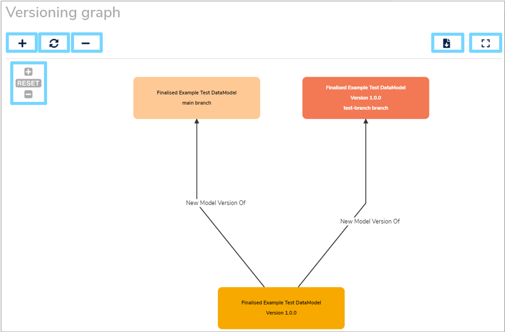

This user guide explains how to create a new draft of a **Finalised** [Data Model](../../glossary/data-model/data-model.md) by either creating a new **Version**, a new **Branch** or a new **Fork**. It also explains how to view a merge graph of a model. 

---

## 1. Overview

When a **Data Model** is [finalised](../../glossary/finalise/finalise.md) it cannot be modified any further in that state. It represents the final state/contents of that model for a particular version.

To find out how to **Finalise** catalogue items, visit our ['Finalising Data Models' user guide](../finalising-data-models/finalising-data-models.md).

If you want to edit a **Finalised** model, you will need to create a new **draft** which you can then work on. There are three ways to create a new draft:

1. Create a new **Version**
2. Create a new **Branch**
3. Create a new **Fork**

Selecting the right method depends on what you want to achieve:

* Create a new **Version** if:
    * You are a single-person team making edits
    * You want to make changes to a model in a linear fashion
    * You want a simpler workflow i.e. not requiring merging of branches
    
* Create a new **Branch** if:
    * You work in a multi-person team who are making edits at the same time
    * You eventually plan on merging all branches back together into the **main** branch to finalise
    * You want to review everyone's changes before they get merged into the **main** branch   
     
* Create a new **Fork** if:
    * You plan to take the model in a new direction. For example, under a new authority or if you want to use an existing model as the starting point for a new model
    * You do **not** plan on merging this continuation back into the original workflow

---

## 2. Criteria

The following catalogue items can be put into a **draft** state:

* Data Models
* Terminologies
* Code Sets
* Reference Data Models
* Versioned Folders

Any of the catalogue items above can be used to create a new **draft**, so long as they are:

1. Already **Finalised**
2. Have a version number

---

### 2.1 Creating a draft of a Versioned Folder

When creating a new draft of a **Versioned Folder**, every model within this folder will also be put into a draft state as well. 

This is shown by **'Draft'** highlighted in yellow to the right of the model's name in the details panel.  

However, a **Data Model** within a **Versioned Folder** cannot be individually put into a draft state as it is version controlled by it's parent folder. Therefore, only when the **Versioned Folder** is put into a draft state will the model within it become a draft too. 

---

## 3. Creating a new draft

To create a new draft, first select the relevant catalogue item in the **Model Tree**. As mentioned above, make sure that this item has already been **Finalised**. Once the item's details panel is displayed on the right, click the three vertical dot menu at the top right of the details panel and select **'Create a New Version'** from the dropdown menu.

A **'New version'** form will appear which you will need to complete. When selecting the type of new version that you want to create, there are three **'Actions'** to choose from in the dropdown menu. These are: **'New Version'**, **'New Branch'** or a **'New Fork'**.

 
If you want to create a **'New Version'**, select this option from the dropdown menu and then click **'Create'**. A green notification box should appear at the bottom right of your screen confirming that the **'New version created successfully'**.

If you want to create a **'New Branch'**, select this option from the dropdown menu. Enter a new **'Branch name'** which helps describe it and then click **'Create'**.  A green notification box should appear at the bottom right of your screen confirming that the **'New branch created successfully'**.

When creating a new **Branch**, if a **main** branch doesn't already exist, then this will automatically be created as well. The **main** branch acts as the **main line**, or **trunk** of the changes made to a model.

If you want to create a **'New Fork'**, select this option from the dropdown menu. Then enter a **'New label'** for the model and click **'Create'**.  A green notification box should appear at the bottom right of your screen confirming that the **'New fork created successfully'**.

Once completed, the new item will then be displayed in the **draft** state.

---

## 4. Merge graph

To help you visualise and track **Versions**, **Branches** and **Forks**, Mauro has the ability to illustrate the relationships between each version of a model via a **merge graph**.

To access this **merge graph**, select a catalogue item that is in a draft state in the **Model Tree**. Once the item's details panel is displayed on the right, click the three vertical dot menu at the top right of the details panel. Select **'Merge'** from the dropdown menu and then **'Show merge graph'** from the secondary dropdown menu. 

A **'Versioning graph'** window will then appear. This illustrates the different versions of the model throughout it's history and how all the versions link together.

You can zoom in or out by using the **'+'** and **'-'** buttons at the top left of the window, or within the graph itself. You can refresh the graph by selecting the circular arrows or the **'RESET'** button at the top left. 

You can also download a copy of the graph or view it in full screen using the buttons at the top right of the window.

The various colours of the version boxes represent different states of the model:

* **Dark orange**  
	The current version/branch of the model being viewed
	
* **Yellow**  
	Finalised version of a model

* **Light yellow**  
	Draft branch of a model
	
* **Dark blue**  
	Fork of a model

---