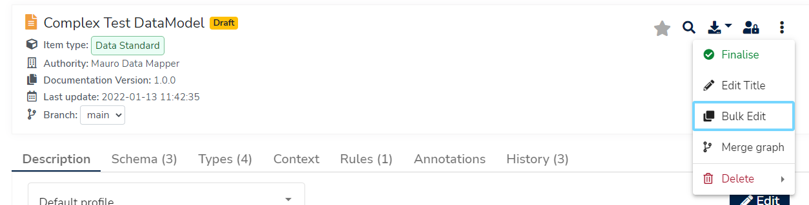
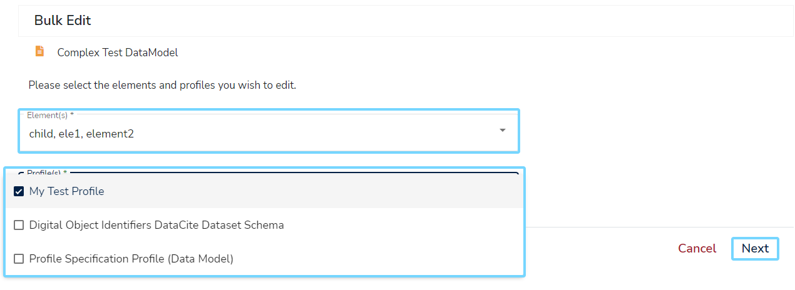
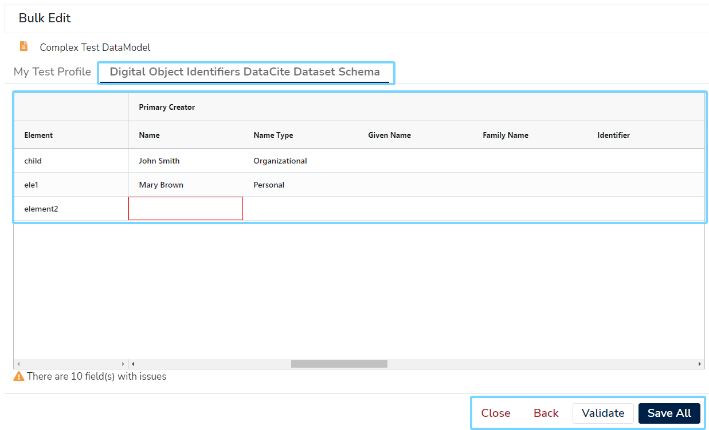
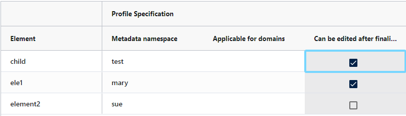
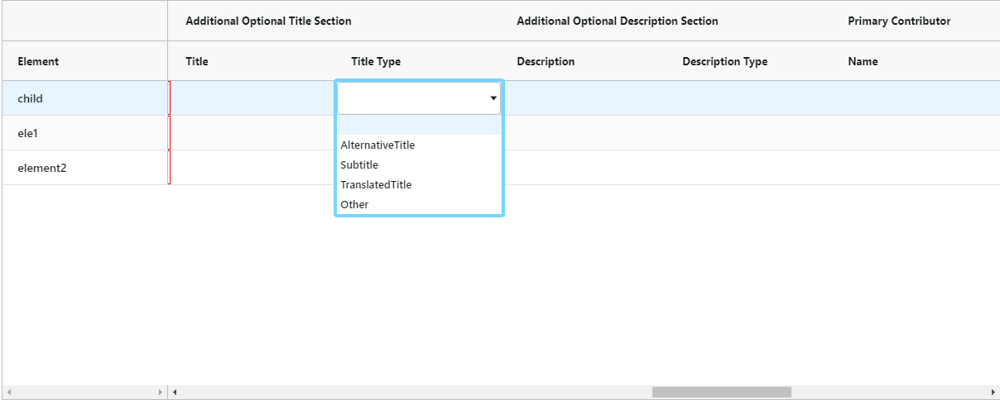
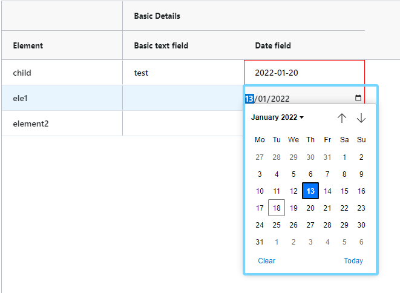
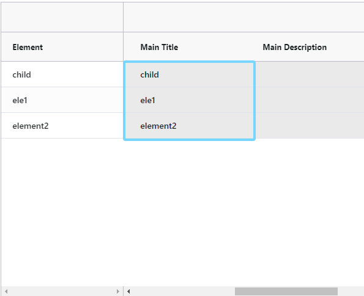
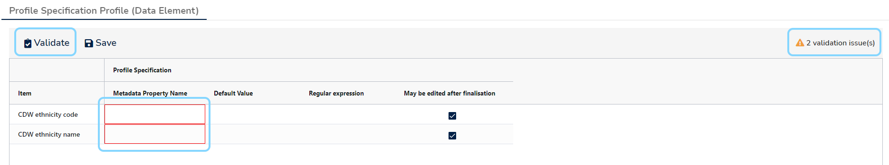
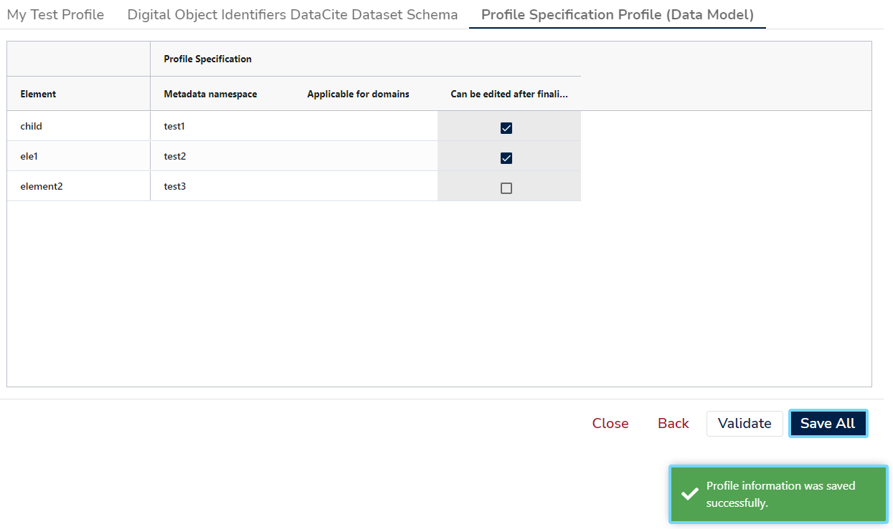

This user guide will explain how to modify more than one catalogue item at once using [Profiles](../../glossary/profile/profile.md). 

!!! Note
    Currently only [Data Elements](../../glossary/data-element/data-element.md) may be updated using the built-in bulk editor. More catalogue item types will be supported in the future.

## 1. Select a Data Model

Select a **Data Model** currently in a **draft** state from the **Model Tree**. Once the item's details panel is displayed on the right, click the three vertical dot menu at the top right of the details panel. Select **'Bulk Edit'** from the dropdown menu.

## 2. Select Elements and Profiles

Before proceeding to the bulk editor, you must first select your **Data Elements** and the **Profiles** to edit. Clicking on each dropdown field will display a multi-select option list, where more than one element/profile may be selected. Select all the elements/profiles you require, then click the **'Next'** button to continue.

!!! Information
    At least one element and profile must be selected before you can continue.

## 3. Bulk editing

The next screen will display a tab for each chosen profile. Inside each tab will be:

1. An editable grid listing each element along with each profile field.
2. Possibly a validation label stating how many validation issues were found in the grid.

For all open tabs, there will also be buttons to validate the current grids, save all changes currently made, or go back to the element/profile selection screen.

Simply click on any grid cell to display an editing cursor, type in the value, and either click away from that cell or press the **'Enter'** key to accept that change.

Here are some other useful tips and information:

### Cell values

Mostly you will be editing text cells, though **Profiles** do support other types of data, which the bulk editor can also support.

!!! Note
    The different data types supported is currently limited, though further support will come in the future.

For example:

* Checkboxes to support **boolean** types:

* Select lists to support **enumerations**:

* Calendar pickers to support **dates**:

Some cells may also appear uneditable, this will be because of the way the **Profile** works - some profile fields can be configured to infer metadata from other parts of the model.

### Validation

When you click on the **'Validate'** button, the **Profiles** as currently edited will be verified by Mauro. Any issues found will be highlighted with a red border around the appropriate cells, and an issue total will state how many issues were found altogether.

!!! Information
    Validating profiles may show issues, but this will not prevent you from **saving** your changes - this action merely acts as a warning to the editor.

## 4. Save your changes

Once you are happy with the changes you have made to every **Profile**, click on the **'Save All'** button. A message will appear to show the operation was successful, and you may continue making more changes, or click the **'Close'** button to go back to the model.

