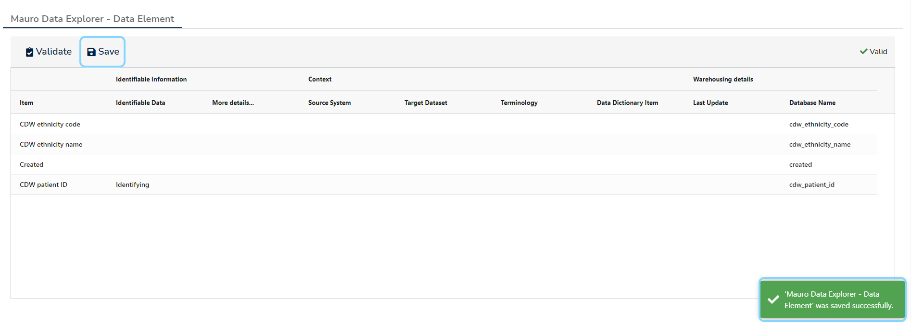

This user guide will explain how to modify more than one catalogue item at once using [Profiles](../../glossary/profile/profile.md). 

The Mauro Data Mapper bulk editor can support editing the following top-level domains:

1. [Data Models](../../glossary/data-model/data-model.md)
2. [Data Classes](../../glossary/data-class/data-class.md)
3. **Terminologies**
4. **Code Sets**

From these, the following child items may be edited:

1. [Data Types](../../glossary/data-type/data-type.md)
2. [Data Classes](../../glossary/data-class/data-class.md)
3. [Data Elements](../../glossary/data-element/data-element.md)
4. **Terms**

## 1. Select a Model

Select a model currently in a **draft** state from the **Model Tree**. Once the item's details panel is displayed on the right, click the three vertical dot menu at the top right of the details panel. Select **'Bulk Edit'** from the dropdown menu.

## 2. Selectng Items and Profiles

Before proceeding to the bulk editor, you must first select your item(s) and the **Profiles** to edit. First choose which **domain type** to use for the items; only one child domain type can be edited at a time, and the available options will depend on which top-level model you chose.

Selecting a domain type will then search for possible catalogue items of that type under the model. Click on one or more items from the list to select which items to edit. There are also ways of selecting (or clearing) all items and filtering to aid navigation if the list is large.

Finally, select one of more **Profiles** to edit against these items. Most profiles are located due to their domain type or via the Mauro configuration you have (for example, profiles may be imported via plugins, or dynamically created by yourself). A special profile in this list is the **"Default profile"** - this provides the same fields as you would find when editing a catalogue item on its own, such as **Description**, **Aliases**, and so on.

Click on the **Next** button to continue.

!!! Information
    At least one item and profile must be selected before you can continue.

## 3. Bulk editing

The next screen will display a tab for each chosen profile. Inside each tab will be:

1. An editable grid listing each element along with each profile field.
2. The ability to validate and save your changes within that tab/profile.
3. A visual count of how many current validation issues were found, or a visual cue stating the profiles are valid.

Any validation errors found will be highlighted.

Simply click on any grid cell to display an editing cursor, type in the value, and either click away from that cell or press the **'Enter'** key to accept that change.

Here are some other useful tips and information:

### Profile field descriptions

Some profile fields may describe what they are. Hover your mouse cursor over a column heading and a tooltip may appear to provide further information.

### Cell values

Mostly you will be editing text cells, though **Profiles** do support other types of data, which the bulk editor can also support.

!!! Note
    The different data types supported is currently limited, though further support will come in the future.

For example:

* Text areas for editing large sections of **text**, such as descriptions. It is posible to edit large text fields using a simple pop-up editor, or by clicking the **Pop-out** button to use full editing tools:

* Checkboxes to support **boolean** types:

* Select lists to support **enumerations**:

* Calendar pickers to support **dates**:

Some cells may also appear uneditable, this will be because of the way the **Profile** works - either because the profilee field is read-only, or some profile fields can be configured to infer metadata from other parts of the model.

### Validation

When you click on the **'Validate'** button, the **Profiles** as currently edited will be verified by Mauro. Any issues found will be highlighted with a red border around the appropriate cells, and an issue total will state how many issues were found altogether.

!!! Information
    Validating profiles may show issues, but this will not prevent you from **saving** your changes - this action merely acts as a warning to the editor.

## 4. Save your changes

Once you are happy with the changes you have made in a profile tab, click on the **'Save'** button. A message will appear to show the operation was successful, and you may continue making more changes, or click the **'Close'** button to go back to the model.

