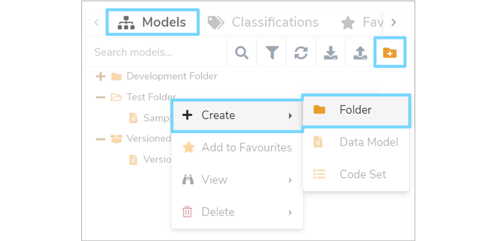
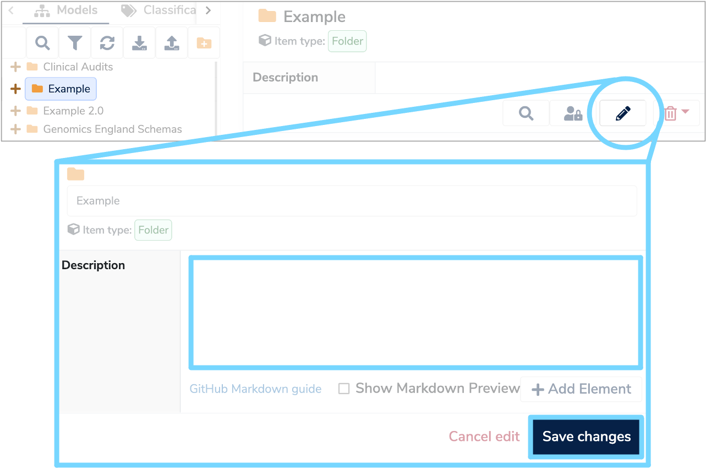
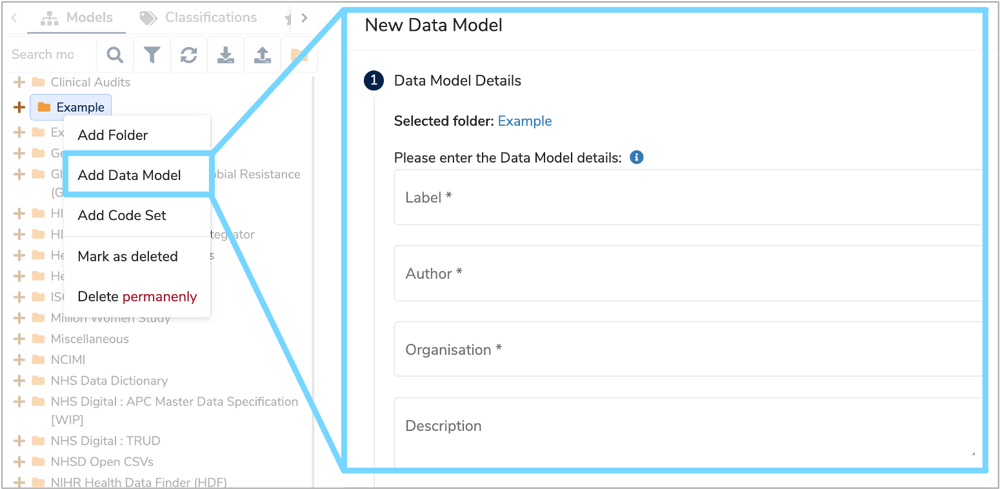
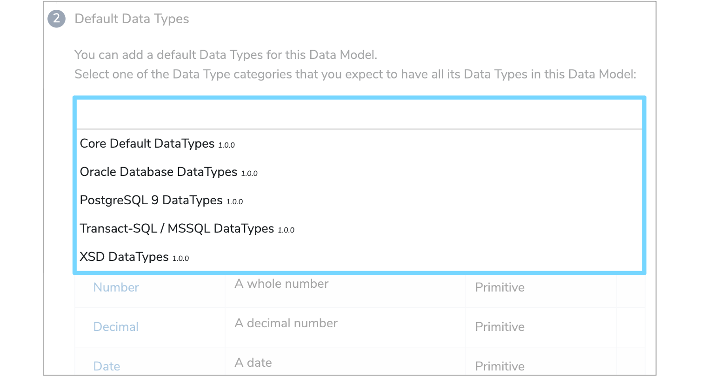
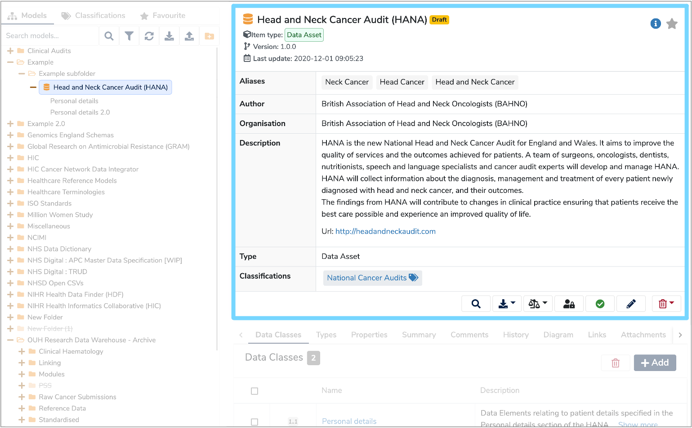

This user guide will explain the steps you need to follow to create a new [Data Model](../../glossary/data-model/data-model.md). 

---
## 1. Create a new folder
**Data Models** are stored in their own folders and subfolders which are displayed in the **Model Tree**. Therefore, to create a new **Data Model**, first you need to either create a new folder, or add a subfolder.

Ensure the **'Models'** tab is selected above the **Model Tree**. To create a new top-level folder click the **'Create a new Folder'** icon at the top right of the  **Model Tree**. To create a new subfolder, right click on an existing folder and select **'+ Create'** and then **'Folder'** from the dropdown menu.

A **'Create a new Folder'** dialogue box will appear. Enter a name for the folder and tick **'Version control this folder'** if you wish to create a [Versioned Folder](../../glossary/versioned-folder/versioned-folder.md). Once complete, click **'Add folder'** to save your changes.

The **'Version control this folder'** option will only appear if adding to the top level of the **Model Tree** or under another folder. **Versioned folders** cannot be created under other **Versioned folders**.

---

##  2. Add Data Model

To add a **Data Model**, right click the relevant folder and select **'Add Data Model'**. A **'New Data Model'** form will appear on the right. 

---

##  3. Complete New Data Model form

### 3.1 Complete Data Model Details

Please complete both the mandatory and optional fields of the **'New Data Model'** form. The defintions of each field are detailed below:

* [Label](../../glossary/label/label.md)  
	Enter a unique name for the **Data Model** and include any version information, as two **Data Models** cannot share the same **Label**.
	
* **Author**  
	Use this field to record the name(s) of the authors who are creating and maintaining this **Data Model**.

* **Organisation**  
	Type the name of the organisation responsible for the **Data Model**, or the underlying data.

* **Description**  
	Enter a detailed description in either plain text or html. Include any important contextual details relating to the **Data Model**.

* **Select a Data Model Type**  
	Select whether the **Data Model** is a [Data Asset](../../glossary/data-asset/data-asset.md) or a [Data Standard](../../glossary/data-standard/data-standard.md) from the dropdown menu. 
	A **Data Asset** is a collection of existing data, such as a database or a completed form. While a **Data Standard** is a specification template to collect new data, such as a form or schema.

* **Classifications**  
	Select any relevant **Classifications** (also known as tags) from the dropdown menu. You can select as many **Classifications** as you like. 

Once all the fields have been populated click **'Next Step'** to complete the **'Default Data Types'** section of the form. 
	
### 3.2 Select Default Data Types

Select the relevant set of **'Default Data Types'** from the dropdown menu. These will be imported into your **Data Model**. You should select the category that includes all the [Data Types](../../glossary/data-type/data-type.md) that you will likely have within your **Data Model**, however if you are unsure at this stage, then leave this field blank and import them later on.

---

## 4. Submit Data Model
Once completed, click **'Submit Data Model'** and your new **Data Model** will be added. When selected in the **Model Tree** the details of the **Data Model** will now be displayed on the right.

---