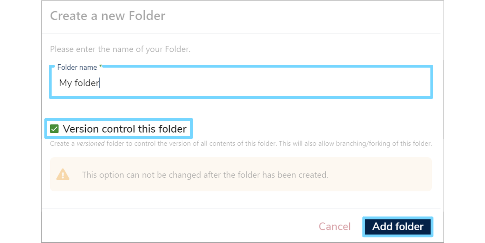

This user guide will explain the steps you need to follow to create a new [Data Model](../../glossary/data-model/data-model.md). 

---
## **1. Create a new folder**
[Data Models](../../glossary/data-model/data-model.md) are stored in their own folders and subfolders which are displayed in the **Model Tree**. Therefore, to create a new [Data Model](../../glossary/data-model/data-model.md), first you need to either create a new folder, or add a subfolder.

To create a new folder click the **'Create a new Folder'** icon at the top right of the  **Model Tree**. Enter a **'Folder name'** and click **'Add folder'**. The new folder should now appear in the **Model Tree**. 

To create a new subfolder, right click on the existing folder and select **'Add Folder'**. Enter a **'Folder name'** and click **'Add folder'**. The new subfolder should now appear in the **Model Tree**.

 

To add a short description to the folder, select the folder in the **Model Tree** and its details will then be displayed on the right. Click the pencil **'Edit'** button and enter a description into the box. Once completed, click **'Save changes'** and the description will now display whenever the folder is selected.

---

## **2. Add Data Model**
To add a [Data Model](../../glossary/data-model/data-model.md), right click the relevant folder and select **'Add Data Model'**. A **'New Data Model'** form will appear on the right. 

---

##  **3. Complete New Data Model form**

### **3.1 Complete Data Model Details**

Please complete both the mandatory and optional fields of the New Data Model form. The defintions of each field are detailed below:

* [Label](../../glossary/label/label.md)  
	Enter a unique name for the [Data Model](../../glossary/data-model/data-model.md)  and include any version information, as two [Data Models](../../glossary/data-model/data-model.md) cannot share the same [Label](../../glossary/label/label.md).
	
* **Author**  
	Use this field to record the name(s) of the authors who are creating and maintaining this [Data Model](../../glossary/data-model/data-model.md).

* **Organisation**  
	Type the name of the organisation responsible for the [Data Model](../../glossary/data-model/data-model.md), or the underlying data.

* **Description**  
	Enter a detailed description of the [Data Asset](../../glossary/data-asset/data-asset.md) or [Data Standard](../../glossary/data-standard/data-standard.md) in either plain text or html. Include any important contextual details relating to the [Data Model](../../glossary/data-model/data-model.md).

* **Select a Data Model Type**  
	Select whether the [Data Model](../../glossary/data-model/data-model.md) is a [Data Asset](../../glossary/data-asset/data-asset.md) or a [Data Standard](../../glossary/data-standard/data-standard.md) from the dropdown menu. A [Data Asset](../../glossary/data-asset/data-asset.md) is a collection of existing data, such as a database or a completed form. While a [Data Standard](../../glossary/data-standard/data-standard.md) is a specification template to collect new data, such as a form or schema.

* **Classifications**  
	Select any relevant **Classifications** (also known as tags) from the dropdown menu. You can select as many **Classifications** as you like. 

Once all the fields have been populated click **'Next Step'** to complete the **Default Data Types** section of the form. 
	
### **3.2 Select Default Data Types**

Select the relevant set of **'Default Data Types'** from the dropdown menu. These will be imported into your [Data Model](../../glossary/data-model/data-model.md). You should select the category that includes all the **Data Types** that you will likely have within your [Data Model](../../glossary/data-model/data-model.md), however if you're unsure at this stage, then leave this field blank and import them later on.

---

## **4. Submit Data Model**
Once completed, click **'Submit Data Model'** and your new [Data Model](../../glossary/data-model/data-model.md) will be added. When selected in the **Model Tree** the details of the [Data Model](../../glossary/data-model/data-model.md) will now be displayed on the right.

---