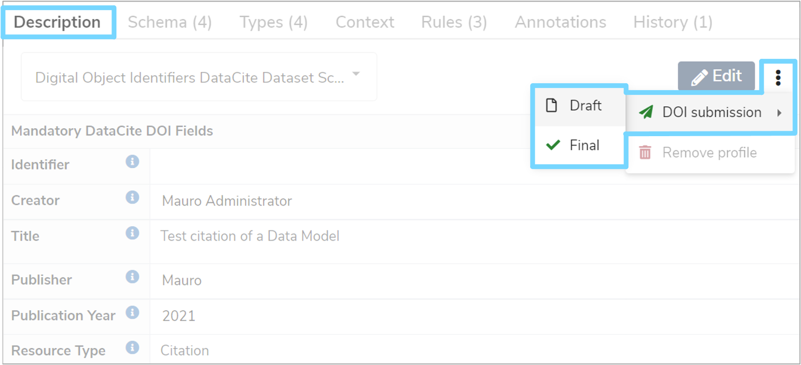

This user guide explains how to set-up the [Mauro Digital Object Identifier plugin](../../plugins/doi.md) to allow you to use, edit and remove DOI profiles. You will also find out how to create, submit and retire profile names. 

---

## 1. Overview

Using an optional plugin for Mauro, it is possible to submit Mauro catalogue items from your catalogue to a [Digital Object Identifie (DOI)](https://www.doi.org/) system. This allows persistent, unique identifiers to be recorded in a DOI system to act as network links back to your Mauro catalogue items. The benefits are that the catalogue item may change over time, but the DOI name will remain fixed, always resolving back to the correct catalogue item, making them very useful for citations.

The Mauro plugin for managing DOI names connects to the [DataCite](https://datacite.org/) system to create and manage DOIs with **DataCite Fabrica**.

DOI names can only be applied to **public** and **finalised** Mauro catalogue items, to ensure that their contents remain fixed in time. The following catalogue items can have DOI names attached to them:

* [Data Model](../../glossary/data-model/data-model.md)
* [Data Class](../../glossary/data-class/data-class.md)
* [Data Element](../../glossary/data-element/data-element.md)
* [Data Type](../../glossary/data-type/data-type.md)
* Code Set
* Terminology
* Term
* Reference Data Model
* [Versioned Folder](../../glossary/versioned-folder/versioned-folder.md)

---

## 2. Administrator setup

!!! Note
	This section applies to administrators of Mauro only.

There are a number of steps an administrator must carry out before users can submit DOI names.

### 2.1 Install the plugin

The Mauro Digital Object Identifier plugin must be installed on the Mauro instance. See the [instructions for installing plugins](https://maurodatamapper.github.io/installing/docker/#additional-backend-plugins), as well as the [GitHub repo README file](https://github.com/MauroDataMapper-Plugins/mdm-plugin-digital-object-identifiers).

### 2.2 Enable the feature

As this is an optional feature, the user interface will not show DOI profiles and features by default. To allow DOI submission to be used, you will first need to click the white arrow next to your user icon and then select **'Configuration'** from the dropdown menu. 


This will bring up the **'Configuration'** panel. Click the **'Properties'** tab and then click **'+Add'**.


An **'Add Property'** form will appear which you will need to complete. Click the **'Select the property to add'** box and select **'feature.use_digital_object_identifiers'** from the dropdown menu, which will automatically fill in additional fields. Select **'Yes'** from the **'Value'** dropdown menu and then click the **'Add property'** button. A green notification box will appear at the bottom right of your screen confirming that the **'Property was saved successfully'**.


### 2.3 DataCite membership

In order to create DOIs you will need to be a member (regular, or consortium-based) of DataCite. Please read the [Become a Member](https://datacite.org/become.html) DataCite pages to understand how to do this.

### 2.4 Mauro configuration

Once enabled and your DataCite API is configured, there are some additional API properties to configure in Mauro before using the plugin. These can be found in the **Configuration** > **Properties** administration table, under the **Digital Object Identifier Properties** group.


* **username** - the username to connect to the DataCite API for authentication.
* **password** - the password to connect to the DataCite API for authentication.
* **prefix** - the unique prefix identifier representing this organisation. DataCite will provide this.
* **endpoint** - the base URL to the DataCite API.

Initially, the plugin will automatically add these with the value of "NOT_SET"; change these values once you have them available.

One final API property to ensure is set is the **Site URL** under the **Site** group. The **Site URL** property is used by the plugin to submit to DataCite, so that all links to the requested DOI get redirected back to the correct Mauro instance.

!!! Warning
	It is important to set the **Site URL** property, otherwise the Digital Object Identifier (DOI) plugin will be unable to submit profiles to DataCite correctly.


---

## 3. Using the profile

Assuming all the setup steps were carried out above, catalogue items should now be able to use a new [profile](../../../tutorials/properties-profiles/) called **'Digital Object Identifiers DataCite Dataset Schema**'.

### 3.1 Add the profile

!!! Note 
	The DOI profile can only be added by editors of Mauro, and only when the catalogue item is in a **draft** state (not **finalised**). If the profile has not been created before the catalogue item is **finalised**, there is another opportunity to edit the profile before submitting for a DOI name, as explained below.

To add the DOI profile to the catalogue item, first select the catalogue item in the **Model Tree** that you wish to modify. Once that item's details panel is displayed on the right of your screen, select the **'Description'** tab. 

Expand the **'Default profile'** list and click **'Add new profile...'**. Select **'Digital Object Identifiers DataCite Dataset Schema**' and click **'Save Changes'**. This will display the full DOI profile fields to enter. You can enter values into the fields now, or click **'Save'** to store the partially complete profile.

### 3.2 Editing the profile

The DOI profile will present a number of fields which will be recorded as metadata against the catalogue item. These profile field values will also be submitted to the DOI system when a DOI name is requested, so it is important to ensure that the values entered into the profile are as accurate as possible.

The profile fields are grouped into a number of sections:

1. Predefined/Supplied Fields
2. Primary Creator
3. Additional Mandatory Fields
4. Additional Optional Title Section
5. Additional Optional Description Section
6. Primary Contributor
7. Additional Optional Fields

The **Predefined/Supplied Fields** are special, read-only fields in the profile. These are used and modified internally by Mauro to track important details about the DOI name, such as the state, identifier, and so on. These are provided in read-only view to the user but are automatically controlled during DOI submission.

There are a number of sections and fields in the profile, though only a few a strictly mandatory to submit to the DOI system (marked with a "*" symbol next to their field name). Clicking on the help icons next to each field name will provide a description of what the field represents.

The profile will appear in read-only form when viewing the catalogue item. If you want to edit the profile, first make sure the **'Digital Object Identifiers DataCite Dataset Schema'** profile is selected in the profile selection list and then click the **'Edit'** button. 


This will bring up an **'Edit Profile'** form which you will then be able to make changes to. Once you have finished, click **'Save'**. 

!!! Information 
	You are able to save changes to a profile without ensuring that the profile is fully valid. For example, some fields may say **'This field is mandatory'**, but changes can be saved temporarily without such fields being filled in. To test that the profile is valid, click on the **'Validate'** button, then review any validation alerts that appear in each field.
	
	

### 3.4 Remove the profile

If you decide against using the DOI profile, it can be removed from the catalogue item. Once again, make sure that the **'Digital Object Identifiers DataCite Dataset Schema'** profile is selected in the profile selection list. Then click the three vertical dot menu to the right of the **'Edit'** button and then select **'Remove profile'** from the dropdown menu.


A notification box will then appear asking if you are sure you want to remove this profile. Click **'Yes, remove'** and the profile will then be removed along with all the metadata stored for that profile. A notification box will appear at the bottom right of your screen, confirming that the profile was successfully removed. 


---

## 4. Submit and create a DOI name

The **'Identifier'** profile field will store the DOI name once the catalogue item has been submitted to the DOI system, for instance `10.1109/5.771073`. To store this DOI name, the catalogue item must first be submitted to the DOI system. 

To do this, select the relevant catalogue item from the **Model Tree** that you want to submit. The item must be [finalised](../../finalising-data-models/finalising-data-models/) and [publicly readable](../../permissions/permissions/#5-manage-user-and-group-access) to anyone. Once the details panel has appeared on the right of your screen, click the **'Description'** tab to view the profiles. Then click the three vertical dot menu to the right of the **'Edit'** button and select **'DOI submission'** from the dropdown menu. 



You will then have two possible states to generate the DOI name:

* **Draft**  
	Allows for the profile fields to be modified whilst still obtaining a DOI name. Suitable for making edits to the profile whilst it is work-in-progress

* **Final**  
	Fixes the DOI name and the metadata associated with it in the DOI system. The profile is finalised and cannot be modified further
	
!!! Information
	The **'Digital Object Identifiers DataCite Dataset Schema'** profile does not need to be selected to carry out this step, nor does it have to be created yet. Mauro will automatically handle the creation of the DOI profile if it does not already exist.

Before submitting, an **'Edit Profile'** form will appear which will allow you to review the profile fields and make any necessary changes before submitting to the DOI system. 

!!! Information
	It is recommended to use the **Validate** button to ensure that all profile fields are valid before submitting.

Once you are happy with the profile, click the **'Submit'** button and a green notification box will appear at the bottom right of your screen to confirm the change and the **'Identifier'** field will be populated with the newly created DOI name.

You may continue making changes to any **Draft** DOI profiles by repeating the same steps above. However, once changing to the **Final** state, you will have one last opportunity to review/modify the profile before it is fixed in place forever.


---

## 5. Retire a DOI name

Once a DOI name is recorded in the profile, it is possible to retire that DOI name. When a DOI name is retired, any network links back to that catalogue item will no longer work.

!!! Warning 
	Be careful when retiring DOI names - once retired, this cannot be undone.

To retire a DOI name, first select the catalogue item in the **Model Tree** with the DOI name to retire. Once the details panel has appeared on the right of your screen, click the **'Description'** tab to view the profiles. Then click the three vertical dot menu to the right of the **'Edit'** button and select **'DOI submission'** and then **'Retire'** from the dropdown menus. 


A notification box will appear asking you to confirm that you would like to retire the DOI name. Click **'Yes, retire'** and a green notification box shoud appear at the bottom right of your screen confirming that the DOI name was retired successfully. 


---

## 6. DOI name resolution

When Mauro catalogue items are submitted and recorded in the DOI system, all network links for those catalogue items are routed through the DOI system back to Mauro. All hyperlinks back to Mauro will point to:

```
https://{domain}/#/doi/{name}
```

Where `{name}` is the DOI name in question, for example:

```
https://{domain}/#/doi/10.1109/5.771073
```

Any URL in this format will automatically resolve and redirect to the correct Mauro catalogue item to view.

---