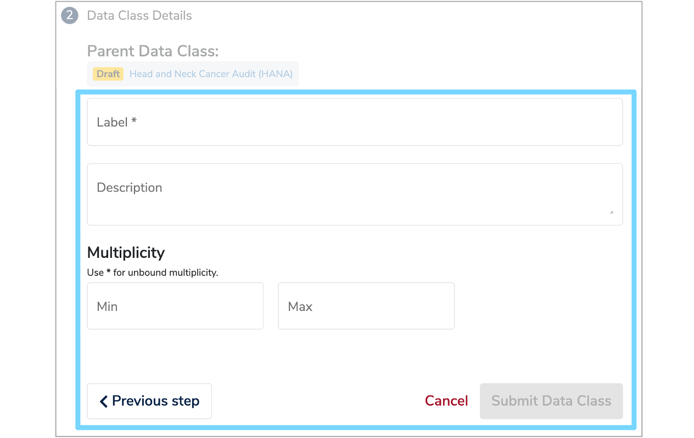

This user guide will explain the steps you need to follow to manually add a health dataset to **Mauro Data Mapper**.

---

## 1. Create a [Data Model](../../glossary/data-model/data-model.md)

Datasets are stored in their own **Data Models** within **Mauro Data Mapper**. Therefore, you first need to create a new **Data Model**. To do this, follow the steps in the ['Create a Data Model user guide'](../create-a-data-model/create-a-data-model.md).

Once you have reached step **3**, ['Complete New Data Model form'](../create-a-data-model/create-a-data-model.md#complete-new-data-model-form) you will need to select the ['Data Model Type'](../create-a-data-model/create-a-data-model.md#complete-new-data-model-form-type) as [Data Asset](../../glossary/data-asset/data-asset.md) from the dropdown menu.

Fill in the rest of the **'New Data Model'** form and submit the **Data Model** as explained in steps **3.2** and **4**.

---

## 2. Add a property

Once you've created your **Data Model**, it's important to record further characteristics of the corresponding dataset, particularly to help gateway providers when designing interfaces.

To do this, select the **Data Model** in the **Model Tree** and then click the **'Properties'** tab underneath the **Data Model** details panel. Click the **'+ Add Property'** button on the right to add a new row to the property table. 

<iframe src="https://player.vimeo.com/video/495442791" width="640" height="346" frameborder="0" allow="autoplay; fullscreen" allowfullscreen></iframe>

Complete the details of the new property as follows:

* **Namespace**  
	This will be used to select the correct profile / selection of properties.

* **Key**  
	Where an existing namespace has been chosen, select a relevant property name such as **'contact email'**.  Otherwise, enter a new property name.
	
* **Value**  
	This is the value of the given property, for example **‘enquiries-mydataset@hub.org’**.  
	You can also add a relevant element to the value of a property. Click **'+ Add Element'** in the **'Value'** column and select the element type from the menu. Search for the element you require and once selected, it will automatically import into the **'Value'** column of the properties table.     

Once you have filled in the details of the property, click the green **'Save'** tick and the new property will be added to the table. 

---

##  3. Create a [Data Class](../../glossary/data-class/data-class.md)

Each **Data Model** is made up of several **Data Classes** which is where data items are both created and managed. 

If your dataset is a collection of tables, the conventional approach is to create a new class for each table. Alternatively, you can create a set of classes to provide a more abstract account of the data set, which group and present the data differently to how it is stored and managed.
   
To create a **Data Class**, select the relevant **Data Model** in the **Model Tree** and click the **'Data Classes'** tab on the panel below the **Data Model** details. Click the **'+ Add'** button on the right and a **'New Data Class'** form will appear.

There are two ways to import a **Data Class** into a **Data Model**. You can either create a new **Data Class** or copy a **Data Class** from an existing **Data Model**. 

###  3.1 Create a New Data Class

To create a new **Data Class**, select this option in the first section of the **'New Data Class'** form and then click the **'Next step'** button.

Now you need to complete the **'Data Class Details'** section of the form as follows: 

* [Label](../../glossary/label/label.md)  
	Enter a name for the new **Data Class** which has to be unique within the **Data Model**.

* **Description**  
	Complete a description in either html or plain text which explains the types of data items grouped together within this **Data Class**. Also include contextual details which are common to the data items, to avoid having to add descriptions to each individual data item.

* [Multiplicity](../../glossary/multiplicity/multiplicity.md)  
	 The **Multiplicity** specifies the minimum and maximum number of times that the **Data Class** will appear within the **Data Model**. 
	 
	 Optional data may have a minimum **Multiplicity** of 0 and a maximum of 1, whereas mandatory data has a minimum **Multiplicity** of 1. Data which occurs any number of times is given by a **Multiplicity** of * which represents -1 internally.		

Once you have completed the **'Data Class Details'** form, click **'Submit Data Class'** and the new **Data Class** will now be permanently displayed under the **'Data Classes'** tab of the **Data Model**. You can add as many **Data Classes** as necessary.

### 3.2 Copy a Data Class 

To import **Data Classes** from an existing **Data Model**, select the **'Copy Data Classes(s) from...'** option in the first section of the **'New Data Class'** form. Select the relevant **Data Model** by either typing the name in the box or clicking the menu icon to the right of the red cross. This will display the **Model Tree** from which you can then select the relevant **Data Model**. Once selected, click **'Next step'**.

The **'Data Class Details'** section of the form will then appear, with a list of all the **Data Classes** within the selected **Data Model**. Select the **Data Classes** you wish to import and then click **'Submit Data Class'**. The selected **Data Classes** will then be imported into your original **Data Model**, with the progress illustrated by a green loading bar at the bottom of the form. 

<iframe src="https://player.vimeo.com/video/495442830" width="640" height="397" frameborder="0" allow="autoplay; fullscreen" allowfullscreen></iframe>

---

## 4. Add a Nested Data Class

A useful way of managing complex data sets is to use **Nested Data Classes** which are essentially a **Data Class** within a **Data Class**.

For example, in a webform, there may be a section called **'Contact details'**, which would be one **Data Class**. Within that section however, there may be another labelled **'Correspondence Address'**, which would be a **Nested Data Class**.  

To add a **Nested Data Class**, click the relevant **Data Class** from the **Model Tree** and click the **'Content'** tab on the panel below the model overview. Then click **'+ Add'** and select **'Add Data Class'** from the dropdown menu. Complete the **'New Data Class'** form as explained above in step ['3. Create a Data Class'](document-a-dataset.md#create-a-data-class).

---

##  5. Add [Data Elements](../../glossary/data-element/data-element.md)

Within each **Data Class** lies several **Data Elements** which are the descriptions of an individual field, variable, column or property of a data item. 

To create a **Data Element** you can use the same approach as creating a **Data Class**. Select the relevant **Data Class** in the **Model Tree** and click the **'Content'** tab on the panel below the **Data Class** details. Click the **'+ Add'** button on the right and you will be given the choice to either add a **Data Class** or a **Data Element**. Select **'Add Data Element'** and a **'New Data Element'** form will appear. 

Similar to adding a **Data Class**, there are two ways to import a **Data Element**. You can either create a new **Data Element** or copy **Data Elements** from an existing **Data Class**.

###  **5.1 Create a New Data Element**

Follow the steps in ['3.1 Create a new Data Class'](/document-a-dataset.md#create-a-new-data-class) until you have completed the **'Label'**, **'Description'** and **Multiplicity** fields for the **Data Element**. 

Each **Data Element** then needs to be assigned a relevant [Data Type](../../glossary/data-type/data-type.md). This can either be selected from an existing list, or you can add a new **Data Type**. 

#### 5.1.1 Select an existing Data Type  
	
Click the **'Search'** box and a dropdown list of existing **Data Types** will appear. Select the relevant **Data Type**. 

You can then assign several **Classifications** to the **Data Type** by selecting them from the dropdown menu. Once all fields are complete, click **'Submit Data Element'** to add the **Data Element** to the **Data Class**. Repeat this process to add other **Data Elements**.   
  

#### 5.1.2 Add a new Data Type  

To add a new **Data Type**, click **'Add a new Data Type'** on the **'Data Element Details'** form. Fill in the **Label** and **Description** fields and select the relevant **Data Type**. 

A **Data Type** can either be:  

* [Enumeration](../../glossary/enumeration-data-type/enumeration-data-type.md):  
	A constrained set of possible values. Each **Enumeration Type** defines a number of **Enumeration Values** which have a coded key and a human-readable value.   
	If **'Enumeration'** has been selected, an additional table will appear where you can add several **Enumerations** and specify a **'Group'**, **'Key'** and **'Value'**. 
	
* [Primitive](../../glossary/primitive-data-type/primitive-data-type.md):  
	Data without further details on structure or referencing. **Primitive Data Types** include **‘String’**, **‘Integer’** or **‘Date’**.

* [Reference](../../glossary/reference-data-type/reference-data-type.md):  
	Data which refers to another **Data Class** within the same **Data Model**.   
	If **Reference** has been selected, the **Reference Data Class** can be selected from a dropdown menu. 
	
* [Terminology](../../glossary/terminology-data-type/terminology-data-type.md):  
	A structured collection of **Enumeration Values** which have relationships between different data terms.   
	Similarly, if **Terminology** has been selected, the relevant category can be chosen from a dropdown menu.

You can then assign several **'Classifications'** by selecting them from the dropdown menu. 

Once all fields are complete, click **'Submit Data Element'** to add the new **Data Element** to the **Data Class**. Go back to step ['5.1 Create a new Data Element'](/document-a-dataset.md#create-a-new-data-element) and repeat the process to add other **Data Elements**.

<iframe src="https://player.vimeo.com/video/500131247" width="640" height="397" frameborder="0" allow="autoplay; fullscreen" allowfullscreen></iframe>

### 5.2 Copy a Data Element

To import a **Data Element** from an existing **Data Class**, select the **'Copy Data Element(s) from...'** option in the first section of the **'New Data Element'** form. Select the relevant **Data Class** by either typing the name in the box or clicking the menu icon to the right of the red cross. This will display the **Model Tree** from which you can select the relevant **Data Model** and **Data Class**. Once selected, click **'Next step'**.

The **'Data Element Details'** section of the form will then appear, with a list of all the **Data Elements** within the selected **Data Class**. Select the **Data Elements** you wish to import by ticking the relevant boxes and these will then appear in a **'Summary of Selected Data Elements'** table at the bottom of the form. Once you have checked this table is correct, click **'Submit Data Element'**. 

The selected **Data Elements** will then be imported into your original **Data Class**, with the progress illustrated by a green loading bar at the bottom of the form. 

---