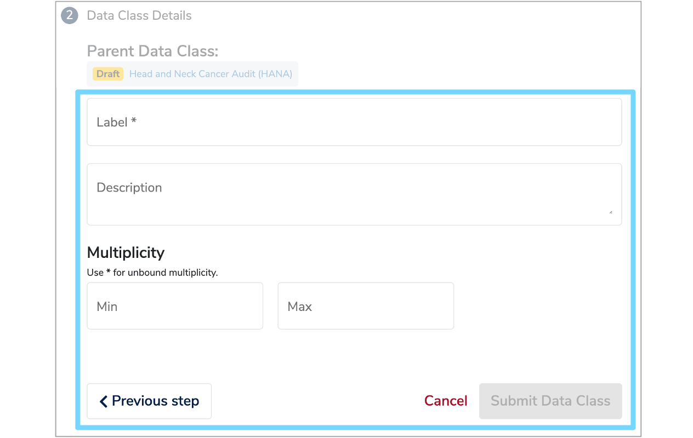
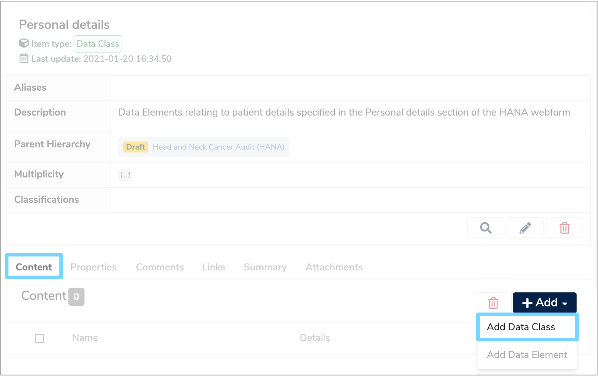
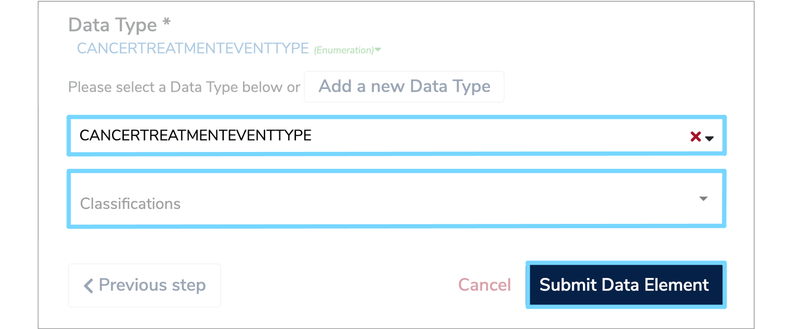
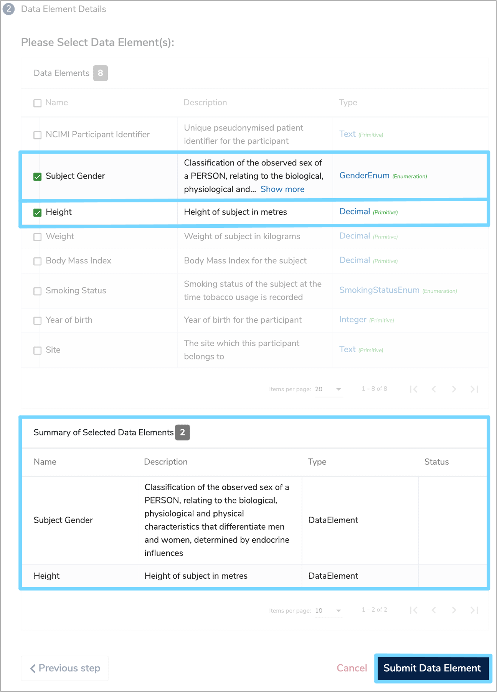

This user guide will explain the steps you need to follow to manually add a health dataset to the [Mauro Data Mapper](https://modelcatalogue.cs.ox.ac.uk/mdm-ui/#/home).

---

## **1. Create a Data Model**

Datasets are stored in their own [Data Models](../../glossary/data-model/data-model.md) within the Mauro Data Mapper. Therefore, you first need to create a new [Data Model](../../glossary/data-model/data-model.md). To do this, follow the steps in the ['Create a Data Model user guide'](../../create-a-data-model/create-a-data-model.md).

Once you have reached step **3**, ['Complete New Data Model form'](../create-a-data-model/create-a-data-model.md#complete-new-data-model-form) you will need to select the ['Data Model Type'](../create-a-data-model/create-a-data-model.md#complete-new-data-model-form-type) as [Data Asset](../../glossary/data-asset/data-asset.md) from the dropdown menu.

Fill in the rest of the **'New Data Model'** form and submit the [Data Model](../../glossary/data-model/data-model.md) as explained in steps **3.2** and **4** of the ['Create a Data Model user guide'](../../user-guides/create-a-data-model/create-a-data-model.md).

---

## **2. Add a property**

Once you've created your [Data Model](../../glossary/data-model/data-model.md), it's important to record further characteristics of the corresponding dataset, particularly to help gateway providers when designing interfaces.

To do this, select the [Data Model](../../glossary/data-model/data-model.md) in the **Model Tree** and then click the **'Properties'** tab underneath the [Data Model](../../glossary/data-model/data-model.md) details panel on the right. An **'+ Add Property'** button will then appear on the right. Click this to add a row to the property table.

<iframe src="https://player.vimeo.com/video/495442791" width="640" height="346" frameborder="0" allow="autoplay; fullscreen" allowfullscreen></iframe>

Complete the details of the new property as follows:

* **Namespace**  
	This will be used to select the correct properties by the gateway interface. Select **‘uk.ac.hdrukgateway'** from the dropdown menu.

* **Key**  
	Enter a relevant property name such as 'contact email'.
	
* **Value**  
	This is the value of the given property, for example ‘enquiries-mydataset@hub.org’.  
	You can also add a relevant element to the value of a property. Click **'+ Add Element'** in the **'Value'** column and select the element type from the menu. Search for the element you require and once selected, it will automatically import into the **'Value'** column of the properties table.     

Once you have filled in the details of the property, click the green **'Save'** tick and the new property will be added to the table in the **'Properties'** tab. 

---

##  **3. Create a [Data Class](../../glossary/data-class/data-class.md)**

Each [Data Model](../../glossary/data-model/data-model.md) is made up of several [Data Classes](../../glossary/data-class/data-class.md) which is where data items are both created and managed. 

If your dataset is a collection of tables, the conventional approach is to create a new class for each table. Alternatively, you can create a set of classes to provide a more abstract account of the data set which group and present the data differently to how it is stored and managed.
   
To create a [Data Class](../../glossary/data-class/data-class.md), select the relevant [Data Model](../../glossary/data-model/data-model.md) in the **Model Tree** and click the **'Data Classes'** tab on the panel below the [Data Model](../../glossary/data-model/data-model.md) details. Click the **'+ Add'** button on the right and a **'New Data Class'** form will appear.

There are two ways to import a [Data Class](../../glossary/data-class/data-class.md) into a [Data Model](../../glossary/data-model/data-model.md). You can either create a new [Data Class](../../glossary/data-class/data-class.md) or copy a [Data Class](../../glossary/data-class/data-class.md) from an existing [Data Model](../../glossary/data-model/data-model.md). 

###  **3.1 Create a New [Data Class](../../glossary/data-class/data-class.md)**

To create a new [Data Class](../../glossary/data-class/data-class.md), select this option in the first section of the **'New Data Class'** form and then click the **'Next step'** button.

Now you need to complete the **'Data Class Details'** section of the form as follows: 

* [Label](../../glossary/label/label.md)  
	Enter a name for the new [Data Class](../../glossary/data-class/data-class.md) which has to be unique within the [Data Model](../../glossary/data-model/data-model.md).

* **Description**  
	Complete a description in either html or plain text which explains the types of data items grouped together within this [Data Class](../../glossary/data-class/data-class.md). Also include contextual details which are common to the data items, to avoid having to add descriptions to each individual data item.

* **Multiplicity**  
	The **Multiplicity** specifies the minimum and maximum number of times that the [Data Class](../../glossary/data-class/data-class.md) will appear within the [Data Model](../../glossary/data-model/data-model.md). 
	Optional data may have a minimum **Multiplicity** of 0 and a maximum of 1, whereas mandatory data has a minimum **Multiplicity** of 1. Data which occurs any number of times is given by a **Multiplicity** of ‘*’ which represents ‘-1’ internally.		

Once you have completed the **'Data Class Details'** form, click **'Submit Data Class'** and the new [Data Class](../../glossary/data-class/data-class.md) will now be permanently displayed under the **'Data Classes'** tab of the [Data Model](../../glossary/data-model/data-model.md). You can add as many [Data Classes](../../glossary/data-class/data-class.md) as necessary.

### **3.2 Copy a [Data Class](../../glossary/data-class/data-class.md)**

To import [Data Classes](../../glossary/data-class/data-class.md) from an existing [Data Model](../../glossary/data-model/data-model.md), select the **'Copy Data Classes(s) from...'** option in the first section of the **'New Data Class'** form. Select the relevant [Data Model](../../glossary/data-model/data-model.md) by either typing the name in the box or clicking the menu icon to the right of the red cross. This will display the **Model Tree** from which you can then select the relevant [Data Model](../../glossary/data-model/data-model.md). Once selected, click **'Next step'**.

The **'Data Class Details'** section of the form will then appear, with a list of all the [Data Classes](../../glossary/data-class/data-class.md) within the selected [Data Model](../../glossary/data-model/data-model.md). Select the [Data Classes](../../glossary/data-class/data-class.md) you wish to import and then click **'Submit Data Class'**. The selected [Data Classes](../../glossary/data-class/data-class.md) will then be imported into your original [Data Model](../../glossary/data-model/data-model.md), with the progress illustrated by a green loading bar at the bottom of the form. 

<iframe src="https://player.vimeo.com/video/495442830" width="640" height="397" frameborder="0" allow="autoplay; fullscreen" allowfullscreen></iframe>

---

## **4. Add a Nested Data Class**

A useful way of managing complex data sets is to use **Nested Data Classes** which are essentially a [Data Class](../../glossary/data-class/data-class.md) within a [Data Class](../../glossary/data-class/data-class.md).

For example, in a webform, there may be a section called **'Contact details'**, which would be one [Data Class](../../glossary/data-class/data-class.md). Within that section however, there may be another labelled **'Correspondence Address'**, which would be a **Nested Data Class**.  

To add a nested Data Class, click the relevant Data Class from the Model tree and click the **'Content'** tab on the panel below the model overview. Then click **'+ Add'** and select **'Add Data Class'** from the dropdown menu. Complete the **'New Data Class'** form as explained above in step **3** ['Create a Data Class'](document-a-health-dataset.md#create-a-data-class).

---

## **5. Add Data Elements**

Within each [Data Class](../../glossary/data-class/data-class.md) lies several [Data Elements](../../glossary/data-element/data-element.md) which are the descriptions of an individual field, variable, column or property of a data item. 

To create a [Data Element](../../glossary/data-element/data-element.md)  you can use the same approach as creating a [Data Class](../../glossary/data-class/data-class.md). Select the relevant [Data Class](../../glossary/data-class/data-class.md) in the **Model Tree** and click the **'Content'** tab on the panel below the [Data Class](../../glossary/data-class/data-class.md) details. Click the **'+ Add'** button on the right and you will be given the choice to either add a [Data Class](../../glossary/data-class/data-class.md) or a [Data Element](../../glossary/data-element/data-element.md). Select **'Add Data Element'** and a **'New Data Element'** form will appear. 

Similar to adding a [Data Class](../../glossary/data-class/data-class.md), there are two ways to import a [Data Element](../../glossary/data-element/data-element.md) . You can either create a new [Data Element](../../glossary/data-element/data-element.md) or copy a [Data Elements](../../glossary/data-element/data-element.md) from an existing [Data Class](../../glossary/data-class/data-class.md).

###  **5.1 Create a New Data Element**

Follow the steps in ['3.1 Create a new Data Class'](../document-a-health-dataset/document-a-health-dataset.md#create-a-new-data-class) until you have completed the ['Label'](../../glossary/label/label.md), **'Description'** and **'Multiplicity'** fields for the [Data Element](../../glossary/data-element/data-element.md). 

Each [Data Element](../../glossary/data-element/data-element.md) then needs to be assigned a relevant **Data Type**. This can either be selected from an existing list, or you can add a new **Data Type**. 

#### **5.1.1 Select an existing Data Type**  
	
Click the **'Search'** box and a dropdown list of existing **Data Types** will appear. Select the relevant **Data Type**. 

You can then assign several **Classifications** to the **Data Type** by selecting them from the dropdown menu. Once all fields are complete, click **'Submit Data Element'** to add the [Data Element](../../glossary/data-element/data-element.md) to the [Data Class](../../glossary/data-class/data-class.md). Repeat this process to add other [Data Element](../../glossary/data-element/data-element.md).   
  

#### **5.1.2 Add a new Data Type**  

To add a new **Data Type**, click **'Add a new Data Type'** on the **'Data Element Details'** form. Fill in the ['Label'](../../glossary/label/label.md) and **'Description'** fields and select the relevant **Data Type**. 

A **Data Type** can either be:  

* **Enumeration:** A constrained set of possible values. Each **Enumeration Type** defines a number of **Enumeration Values** which have a coded key and a human-readable value.   
	If **'Enumeration'** has been selected, an additional table will appear where you can add several **Enumerations** and specify a **'Group'**, **'Key'** and **'Value'**. 
	
* **Primitive:** A string, date or integer.

* **Reference:** Data with detailed properties which is used to describe relationships between different [Data Classes](../../glossary/data-class/data-class.md) within the same [Data Model](../../glossary/data-model/data-model.md).   
	If **Reference** has been selected, the **Reference Data Class** can be selected from a dropdown menu. 
	
* **Terminology:** A structured collection of enumerated values which has relationships between different data terms.   
	Similarly, if **Terminology** has been selected, the relevant category can be chosen from a dropdown menu.

You can then assign several **'Classifications'** by selecting them from the dropdown menu. 

Once all fields are complete, click **'Submit Data Element'** to add the new [Data Element](../../glossary/data-element/data-element.md) to the [Data Class](../../glossary/data-class/data-class.md). Go back to step **5.1** ['Create a new Data Element'](../document-a-health-dataset/document-a-health-dataset.md#create-a-new-data-element) and repeat the process to add other [Data Element](../../glossary/data-element/data-element.md).

<iframe src="https://player.vimeo.com/video/500131247" width="640" height="397" frameborder="0" allow="autoplay; fullscreen" allowfullscreen></iframe>

### **5.2 Copy a Data Element**

To import [Data Element](../../glossary/data-element/data-element.md) from an existing [Data Class](../../glossary/data-class/data-class.md), select the **'Copy Data Element(s) from...'** option in the first section of the **'New Data Element'** form. Select the relevant [Data Class](../../glossary/data-class/data-class.md) by either typing the name in the box or clicking the menu icon to the right of the red cross. This will display the **Model Tree** from which you can select the relevant [Data Model](../../glossary/data-model/data-model.md) and [Data Class](../../glossary/data-class/data-class.md). Once selected, click **'Next step'**.

The **'Data Element Details'** section of the form will then appear, with a list of all the [Data Elements](../../glossary/data-element/data-element.md) within the selected [Data Class](../../glossary/data-class/data-class.md). Select the [Data Elements](../../glossary/data-element/data-element.md) you wish to import by ticking the relevant boxes and the chosen [Data Elements](../../glossary/data-element/data-element.md) will appear in a **'Summary of Selected Data Elements'** table at the bottom of the form. Once you have checked this table is correct, click **'Submit Data Element'**. 

The selected [Data Elements](../../glossary/data-element/data-element.md) will then be imported into your original [Data Class](../../glossary/data-class/data-class.md), with the progress illustrated by a green loading bar at the bottom of the form. 

---