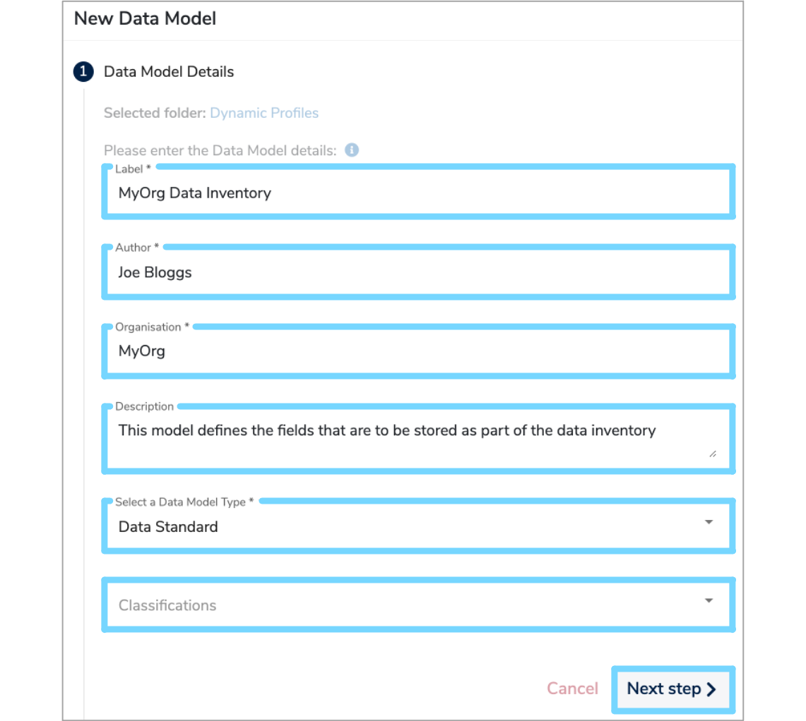
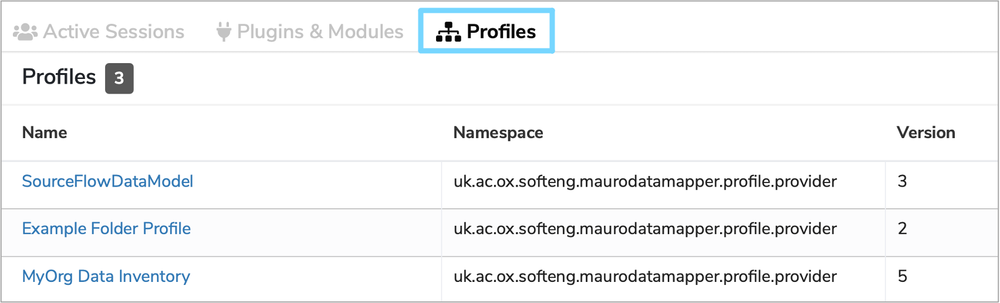

Profiles are a way to store additional information about models or their components.  You can read more about profiles in our tutorial: 
[Properties and profiles](../../tutorials/properties-profiles.md).  This user guide walks through the steps for creating and managing 'dynamic 
profiles': profiles which are defined by a model elsewhere in the system.  We begin by creating this definition model.

## 1. Creating a profile definition model

In this user guide, we'll create a dynamic profile for storing organisation data inventory information.

You may decide to create a folder specifically for storing dynamic profile models, but alternatively you may store them within the folder they'll 
be used.   [Section 6](#6-admin-dashboard-for-dynamic-profiles) describes the admin dashboard which allows these specifications to be easily found 
at a later date.

We first create a data model in the usual way (for example, right-clicking in the tree-view on the folder in which we wish the model to be created).  
Add a label, an author, and an organisation, and select 'Data Standard' as the Data Model Type.

In the next step, you must choose to import the default set of Profile Specification Data Types (see image below).  These define the supported 
basic data types for profile fields, and you'll be choosing from these when adding data elements to your profile definition model.

You can click 'Submit Data Model' to create this new data model.  In the next step you will add technical information to assist the server in 
storing properties against your profile.

## 2. Apply the Profile Specification Profile

From the description page, use the profile drop-down to select "Add new profile", and choose the "Profile Specification Profile (Data Model)", as 
shown in the image below.

This will bring up the form for editing the Profile fields, as shown below.

There are two fields for completion:

**Metadata Namespace**
: This mandatory field defines the namespace that separates the properties in this profile from others in other profiles.  You should try and 
choose a unique name here - see [this article](https://en.wikipedia.org/wiki/Namespace) for more information about namespaces - you should 
construct something based on a URL, and the purpose of this profile model. 

**Applicable for domains**
: This optional field determines which types of catalogue item can be profiled using this profile. For example, 'DataModel'.  You should separate 
multiple domains with a semi-colon (';'). Leave this field blank to allow this profile to be applicable to any catalogue item.

Click save to finish editing the dynamic profile model details.

## 3. Add classes and elements

Once you've created your profile model, you can start adding fields that will be stored for those catalogue items that use the profile.  You should 
create one or more data classes to group your data elements, and any description you give to those classes will be visible in the editing 
interface for that profile.

In this example, we'll create classes for "Basic Information", "Data Source Owner", and "Physical Location".  Create the data classes as usual, 
adding a label and description.  You do not need to add multiplicities to the classes: repeated groups are not currently supported in profile 
definitions.  The model outline is as shown below:

Within each class you can add elements for the fields you wish to store.  Again, create these in the usual way, supplying the follwoing details:

**Label**
: The name of this field in the profile.  The 'key' of properties corresponding to this field 
([See tutorial](../../../tutorials/properties-profiles)) will be derived from this name unless overridden (See [section 5](#5-customise-properties)).

**Description**
: The description of this property: this will be presented to users as they view or edit profile fields, so is a good opportunity to better 
describe the information you'd like collected, or how you expect this field to be interpreted.

**Data Type**
: For the data type you should choose one of the existing primitive types, as imported in 
[Section 1](#1-creating-a-profile-definition-model).  Alternatively, you can create a new 
[Enumeration Type](../../../glossary/enumeration-data-type/enumeration-data-type) and define a list of allowable values.

**Multiplicity**
: The multiplicity will add validation constraints to the field - i.e. `0..1` defines an optional field; `1..1` defines a mandatory field.

The screenshot below shows the process of adding a data element to one of our example classes

## 4. Customise the fields

You can further add to the definition of a property by using another profile on the Data Element - the `Profile Specification Profile (Data 
Element)` profile.  Add this to the element you've just created, and you'll be able to enter the following information:

**Metadata Property Name**
: This will override the key used to store against the property in the database, and accessible through the APIs.  You should set this field if 
your Data Element label has special characters, or if you require the APIs to provide a particular output format.

**Default Value**
: This indicates the value that will be shown in the interface when a user starts entering data for this profile

**Regular expression**
: This field allows you to specify a validation constraint against data entered for the field in question.  We use 
[standard Java syntax](https://www.w3schools.com/java/java_regex.asp) for these.

**May be edited after finalisation**
: This functionality is still under construction, but will allow this value to be edited on a profile after the containing model has been 
finalised.  This is suitable for fields such as "Contact email" which may change without affecting the semantics of the model.

## 5. Use the dynamic profile

Once you've added all required Data Classes and Data Elements, the dynamic profile will be ready to use.  It is good practise to try using it with 
a test model before finalising the specification - this will allow you to verify that the fields are defined correctly.  However, once you're 
happy with the design, you should finalise the model: modifying a profile that has data collected against it may have unexpected consequences.

You can add the profile to a data model and fill out the form provided - our example model is shown below.

If you subsequently wish to revise the profile model, you can create a new version of it.  Using the same namespace will ensure that fields are 
migrated, where possible; using a new namespace will allow the collection of new fields, with both profiles being maintained separately.

## 6. Admin dashboard for dynamic profiles

Profile specification models are normal models, and so it can be tricky to find and maintain them.  An admin dashboard has been created to help 
keep track of those models used as profile specifications: From the administrator's drop-down select "Dashboard" and use the "Profiles" tab.  This 
will show the namespace for each profile used, and provide a link to the defining model.  

In the future, we intend to add to this page details of superseded profile models, and show validation status and other hints for ensuring 
profiles are well-defined before use.

