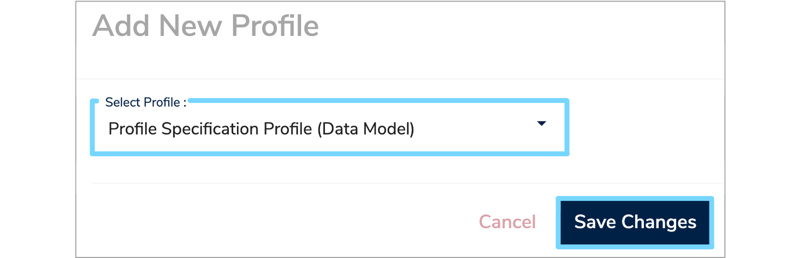

Profiles are a way to store additional information about [Data Models](../../glossary/data-model/data-model.md) or their components.  You can read more about profiles in our
[Properties and profiles tutorial](../../tutorials/properties-profiles.md).  This user guide walks through the steps for creating and managing **dynamic 
profiles**. These are profiles which are defined by a model elsewhere in the system.  The first stage is to create a definition model.

---

## 1. Creating a profile definition model

In this user guide, we'll create a dynamic profile for storing organisation data inventory information.

You may decide to create a folder specifically for storing dynamic profile models, but alternatively you may store them within the folder they'll 
be used.   [Section 6. 'Admin dashboard for dynamic profiles'](#6-admin-dashboard-for-dynamic-profiles) describes the admin dashboard which allows these specifications to be easily found 
at a later date.

First, create a **Data Model** as explained in [Section 2. 'Add Data Model'](../create-a-data-model/create-a-data-model.md#add-new-data-model) of our ['Create a Data Model' user guide](../create-a-data-model/create-a-data-model.md). Add a [Label](../../glossary/label/label.md), author and organisation. Select [Data Standard](../../glossary/data-standard/data-standard.md) from the **'Data Model Type'** dropdown and select any relevant classifications. Once completed, click **'Next step'**.

Next, you must choose to import the default set of **'Profile Specification Data Types'** from the dropdown list.  These define the supported 
basic data types for profile fields which you'll be choosing from when adding [Data Elements](../../glossary/data-element/data-element.md) to your profile definition model. Once finished, click **'Submit Data Model'** to create this new **Data Model**. 

In the next step you will add technical information to assist the server in 
storing properties against your profile.

---

## 2. Apply the Profile Specification Profile

From the description page, use the profile dropdown to select **'Add New Profile'**. Then choose **'Profile Specification Profile (Data Model)'** from the dropdown menu. 

Click **'Save Changes'** and this will bring up the form for editing the profile fields. There are two fields for completion:

* **Metadata Namespace**  
	This mandatory field defines the namespace that separates the properties in this profile from others in other profiles.  You should try and 
choose a unique name that is based on a URL and the purpose of this profile model. For more information about namespaces, see [this article](https://en.wikipedia.org/wiki/Namespace).

* **Applicable for domains**  
	This optional field determines which types of catalogue item can be profiled using this profile. For example, **'DataModel'**.  You should separate 
multiple domains with a semi-colon (';'). Leave this field blank to allow this profile to be applicable to any catalogue item. 

Click **'Save'** to finish editing the dynamic profile model details.

---

## 3. Add Data Classes and Data Elements

Once you've created your profile model, you can start adding fields that will be stored for those catalogue items that use the profile.  You should 
create one or more [Data Classes](../../glossary/data-class/data-class.md) to group your **Data Elements**. Any description you give to those **Data Classes** will be visible in the editing 
interface for that profile.

In this example, we'll create classes for **'Basic Information'**, **'Data Source Owner'**, and **'Physical Location'**.  Create each **Data Class** as explained in [ Section 3. 'Create a Data Class'](../document-a-dataset/document-a-dataset.md#create-a-data-class) of our ['Document a Dataset' user guide](../document-a-dataset/document-a-dataset.md). 

Add a **Label** and a description. You do not need to add [Multiplicities](../../glossary/multiplicity/multiplicity.md) to the classes as repeated groups are not currently supported in profile definitions. The structure of the **Data Model** (red), along with it's **Data Classes** (blue) is shown below.

Within each **Data Class** you can add **Data Elements** for the fields you wish to store.  Again, create these in the usual way, as explained in [Section 5. 'Add Data Elements'](../document-a-dataset/document-a-dataset.md#add-data-elements) of our ['Document a Dataset' user guide](../document-a-dataset/document-a-dataset.md). You will need to enter the following details for each element:

* **Label**  
	The name of this field in the profile.  The **'key'** of properties corresponding to this field 
([See tutorial](../../../tutorials/properties-profiles)) will be derived from this name unless overridden (See [Section 4. 'Customise the fields'](#4-customise-the-fields)).

* **Description**  
	The description of this property. This will be presented to users as they view or edit profile fields, so is a good opportunity to better 
describe the information you'd like collected, or how you expect this field to be interpreted.

* **Multiplicity**  
	The multiplicity will add validation constraints to the field, i.e. `0..1` defines an optional field; `1..1` defines a mandatory field.

* **Data Type**  
	For the data type you should choose one of the existing primitive types, as imported in 
[Section 1. 'Creating a profile definition model'](#1-creating-a-profile-definition-model).  Alternatively, you can create a new 
[Enumeration Data Type](../../../glossary/enumeration-data-type/enumeration-data-type) and define a list of allowable values.

---

## 4. Customise the fields

You can further add to the definition of a property by using another profile on the **Data Element** - the `Profile Specification Profile (Data 
Element)` profile.  Add this to the element you've just created and you'll be able to enter the following information:

* **Metadata Property Name**  
	This will override the key used to store against the property in the database and is accessible through the APIs.  You should set this field if 
your **Data Element** label has special characters, or if you require the APIs to provide a particular output format.

* **Default Value**  
	This indicates the value that will be shown in the interface when a user starts entering data for this profile.

* **Regular expression**  
	This field allows you to specify a validation constraint against data entered for the field in question.  We use 
[standard Java syntax](https://www.w3schools.com/java/java_regex.asp) for these.

* **May be edited after finalisation**  
	This functionality is still under construction, but ticking the box will allow this value to be edited on a profile after the containing model has been 
finalised.  This is suitable for fields such as **'Contact email'** which may change without affecting the semantics of the model.

Once completed, click **'Save'** to confirm your changes.

---

## 5. Use the dynamic profile

Once you've added all required **Data Classes** and **Data Elements**, the dynamic profile will be ready to use.  It is good practise to try using it with 
a test model before finalising the specification. This will allow you to verify that the fields are defined correctly.  However, once you're 
happy with the design, you should finalise the model as modifying a profile that has data collected against it may have unexpected consequences.

You can add the profile to a **Data Model** and fill out the form provided, as shown in the example below.

If you subsequently wish to revise the profile model, you can create a new version of it.  Using the same namespace will ensure that fields are 
migrated, where possible. Using a new namespace will allow the collection of new fields, with both profiles being maintained separately.

---

## 6. Admin dashboard for dynamic profiles

Profile specification models are normal models and so it can be tricky to find and maintain them.  An admin dashboard has been created to help 
keep track of those models used as profile specifications.

To access your admin dashboard, log in to **Mauro Data Mapper** and click the white arrow by your user profile to the right of the menu header. From the dropdown menu under **'Admin settings'** select **'Dashboard'**.

Click the **'Profiles'** tab and the namespace for each profile used along with the relevant link to the defining model will be displayed.  

To ensure profiles are well defined before use, we intend to add details of superseded profile models as well as show validation status and other hints. 

---

