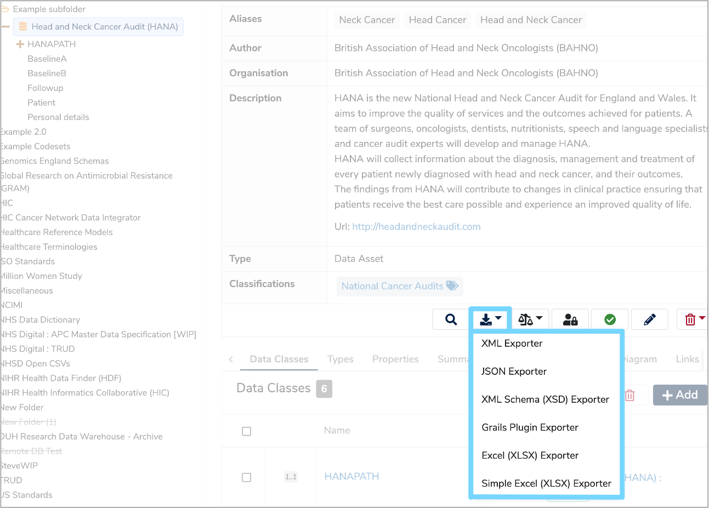
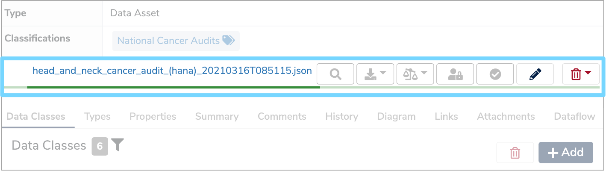
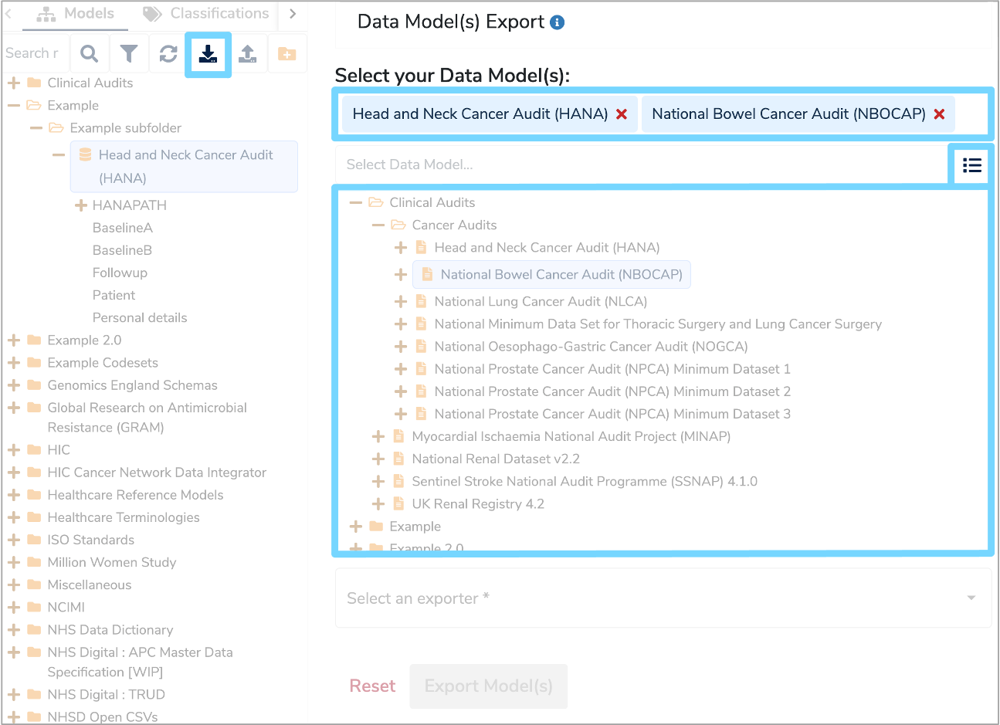
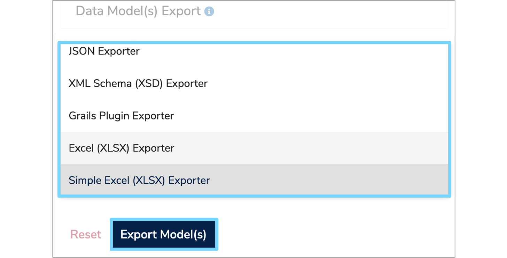

This user guide will explain how to export a [Data Model](../../glossary/data-model/data-model.md) using a variety of exporters including XML, JSON, XML Schema, Grails and Excel.

---
## 1. Export a Data Model

Select the **Data Model** you wish to export in the **Model Tree** to display it's details panel. In the icon menu at the bottom right of the details panel click the **'Export as JSON, XML...'** button. This will display a list of exporters. Select the exporter you wish to use. 

Once selected, the **Data Model** will automatically start exporting into the specificed format, with a green loading bar indicating the progress. Once exported, this progress bar will be replaced with a link to download the exported file. Click this link to download the file directly to your local machine.  

---

## 2. Export multiple Data Models

You can also export several **Data Models** together. To do this, click the **'Export DataModel(s)'** icon at the top right of the **Model Tree**. A **'Data Model(s) Export'** form will appear on the right hand side.

To select the **Data Models** you wish to export, click the menu icon to the right of the **'Select Data Model...'** box and the **Model Tree** will be displayed. Select the relevant **Data Models** and these will automatically appear in the **'Select your Data Model(s):'** field. 

Once you have selected the relevant **Data Models**, you then need to choose an exporter. Note that only **Excel (XLSX) Exporter** and **Simple Excel (XLSX) Exporter** support multiple **Data Model** exports.

Click the __'Select an exporter*'__ box and a dropdown list of all the available exporters will appear. Select the exporter you want and then click the **'Export Data Model(s)'** button. 

A green loading bar will appear and once exported a green notification box will confirm that the **'Data Model(s) exported successfully'** and a link to download the file will appear at the bottom of the form.  

---