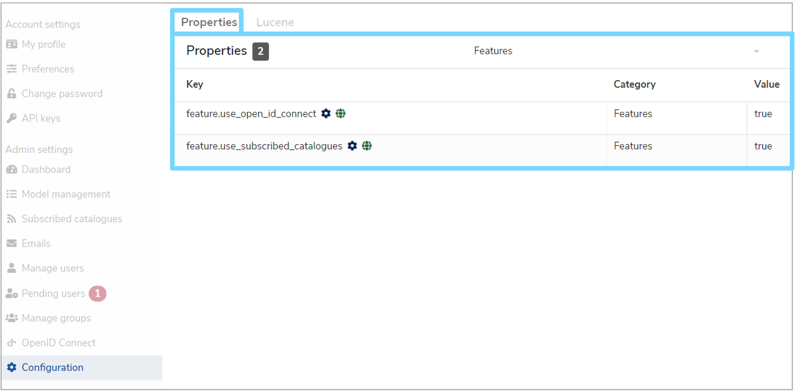
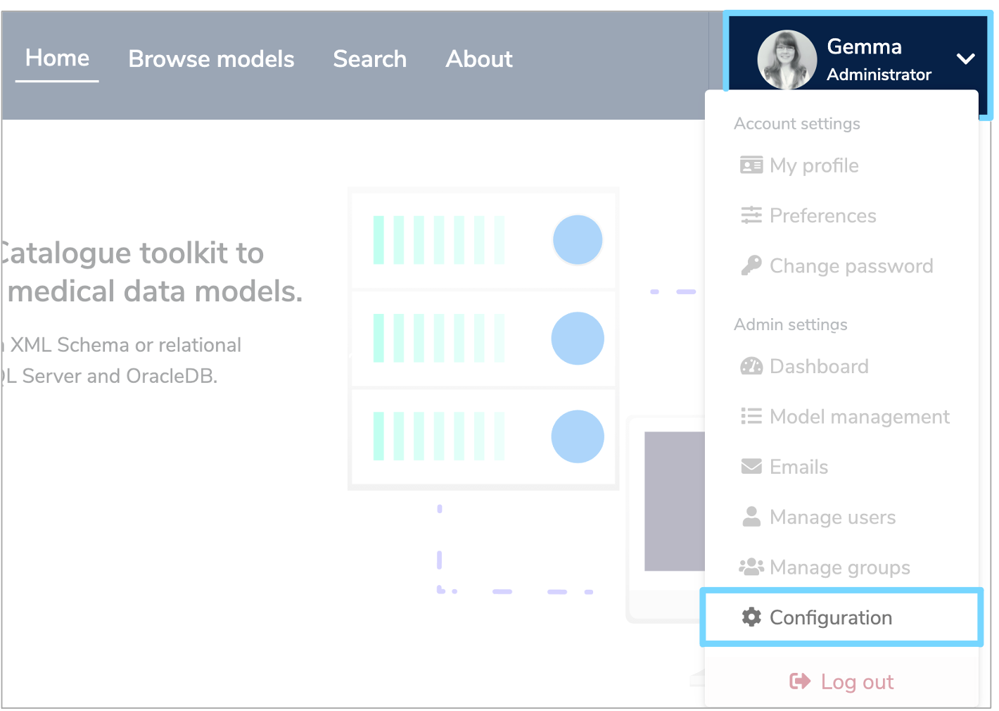
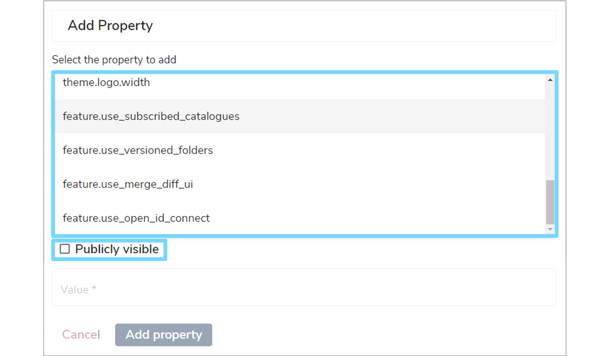
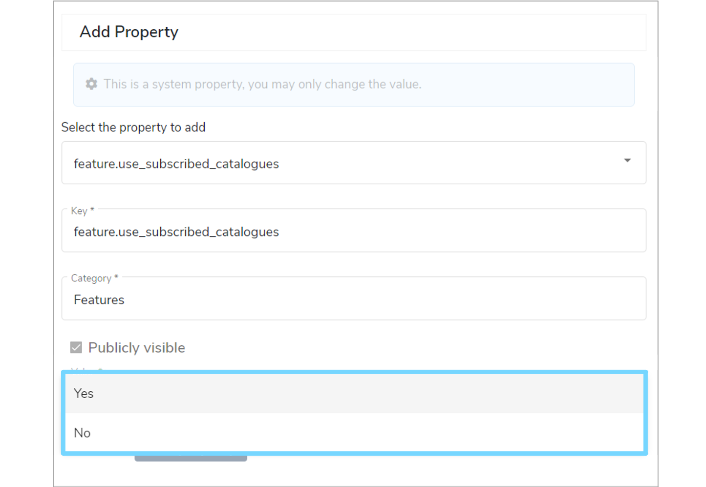

## Introduction

This user guide will walk you through the management and purpose of **feature switches**.

!!! Note
    Only administrators can view and control feature switches in the Mauro user interface.

---

## What are feature switches?

**Feature switches** in the Mauro user interface allow an administrator to control which particular feature sets are enabled and visible to users of the Mauro instance running. There are several reasons why feature switches may be used:

1. There are some feature sets in the user interface which are optional or depend on certain plugins or instance configuration to work. 
2. Some Mauro instances may not need particular functionality in daily running.
3. There may be features in active development, still experimental or subject to change.

In these cases, an administrator is able to switch on or off feature sets that are required or not needed, depending on the requirements of that Mauro instance.

---

## Administration

Feature switches can be accessed from the **'Configuration'** panel in account settings using Mauro [API properties](../../../rest-api/admin/#properties).

All feature switches are:

1. Categorised under **features**.
2. Publicly available to any user for reading (but not updating).

To add a feature switch and control feature visibility, select **'Configuration'** from the user profile dropdown menu.

Select the **'Properties'** tab and then click **'+ Add'**. An **'Add Property'** form will then appear for you to complete.

To select a property, click the **'Select the property to add'** box and a dropdown menu will appear. Select any key from the list that starts with **'feature'**. Once selected, the **'Key'** and **'Category'** fields will automatically populate. Tick the checkbox next to **'Publicly visible'** if required.

Under **'Value'**, select either **'Yes'** or **'No'** from the dropdown menu to enable or disable the feature respectively. Once completed select **'Add property'** to save your changes and a green notificaiton box should appear at the bottom right of your screen confirming that the **'Property was saved successfully'**.

---

## Available features

The table below lists all the optional features that can be controlled by feature switches.

!!! Warning
    It is advisable that any feature switches marked as **'In development'** should only be used in test environments until fully completed.

<table style="width: 100%;">
    <thead>
        <tr>
            <th style="width: 85%;"><b>Feature switch</b></th>
            <th style="width: 15%;"><b>Default value</b></th>
        </tr>
    </thead>
    <tbody>
        <tr>
            <td>
                <code>feature.use_subscribed_catalogues</code>
                

                    Enables the <a href="/user-guides/publish-subscribe/publish-subscribe">Subscribed Catalogues and Federated Data Models</a> feature set.
                

            </td>
            <td><code>true</code></td>
        </tr>
        <tr>
            <td>
                <code>feature.use_open_id_connect</code>
                

                    Enables the user interface for administrators to create/edit/remove OpenID Connect provider details to Mauro, and
                    for the login form to list these external identity providers to redirect and login.                    
                

                

                    As well as enabling this feature switch, you must also install the <a href="/installing/openid-connect/openid-connect/">Mauro OpenID Connect authentication</a>
                    plugin for the Mauro instance too.
                

            </td>
            <td><code>false</code></td>
        </tr>
        <tr>
            <td>
                <code>feature.use_digital_object_identifiers</code>
                

                    Enables the management of Digital Object Identifiers (DOIs) using a new <a href="/tutorials/properties-profiles/">profile</a> to store
                    DOI metadata and submit catalogue items to a DOI system.
                

                

                    As well as enabling this feature switch, you must also install the <a href="/user-guides/digital-object-identifiers/digital-object-identifiers/">Mauro Digital Object Identifiers</a>
                    plugin for the Mauro instance too.
                

            </td>
            <td><code>false</code></td>
        </tr>
        <tr>
            <td>
                <code>feature.use_versioned_folders</code>
                

                    Enables the ability to use <a href="/glossary/versioned-folder/versioned-folder/">Versioned Folders</a>.
                

            </td>
            <td><code>true</code></td>
        </tr>
        <tr>
            <td>
                <code>feature.use_merge_diff_ui</code>
                

                    Enables a new user interface for the management of merging data models within the Mauro user interface. See the <a href="user-guides/merging-data-models/merging-data-models/">Merging Data Models</a> user guide for more details.
                

            </td>
            <td><code>true</code></td>
        </tr>        
    </tbody>
</table>

---